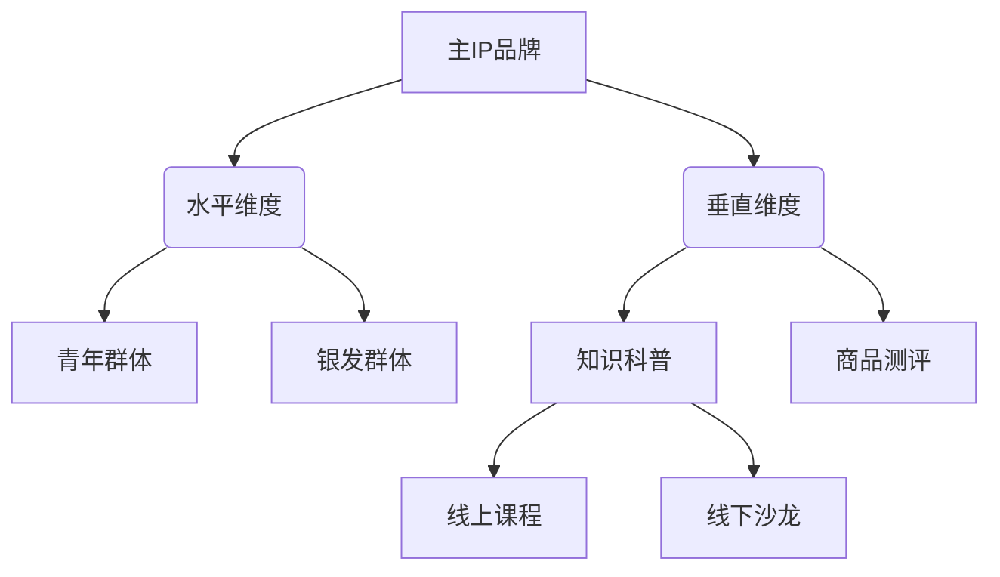

# your ip

创建独属于你的IP

## 生命周期

- 定位
- 创作
- 运营
- 变现

## 生命周期解读

在自媒体IP的定位、创作、运营、变现四个维度中，需通过系统化路径规划实现闭环增长。

---

### **一、IP定位规划（核心基础）**

1. **定位公式**  
   **IP定位 = 垂直赛道×角色定位×差异化风格**  
   - **垂直赛道选择**：参考“五步定位法”（确定赛道→角色定位→拍摄风格→内容风格→主题风格），例如“健康领域→抗衰科普→口播形式→治愈系风格→30天逆龄挑战”。  
   - **差异化策略**：通过“细分领域+个人属性”叠加，如“职场穿搭（赛道）+158cm小个子（属性）+平价改造（价值主张）”。  
   - **目标用户画像**：按年龄、痛点、消费能力分层（例：25-35岁女性，职场新人，月消费2000元以下）。

2. **关键路径**  
   - 测试期：通过3-5篇内容验证用户反馈（点赞率>5%、收藏率>3%为有效信号）。  
   - 定型期：提炼用户共鸣点，固化人设标签（如“最懂打工人心理的情感博主”）。

---

### **二、内容创作规划（增长引擎）**

1. **内容公式**  
   **爆款内容 = 痛点选题×情绪价值×实用密度**  
   - **选题策略**：结合“3H模型”（Hot热点、How-to解决方案、Happiness情感共鸣），例如热点事件解读（如职场裁员潮）+实用指南（简历优化技巧）+共情文案（“被裁员不是终点”）。  
   - **形式优化**：文字内容控制在1500字内（完读率提升20%），视频采用“321节奏”（3秒悬念+20秒干货+1秒互动引导）。  
   - **系列化设计**：通过“主题连载+钩子留存”（如“100个副业拆解”系列，每期结尾预告下期内容）。

2. **更新规划**  
   - 初期：每周3更（2篇干货+1篇互动内容），测试用户活跃时段（知乎晚8-10点流量高峰）。  
   - 稳定期：固定栏目化输出（如周一行业解读、周三案例拆解、周五问答互动）。

---

### **三、账号运营规划（流量放大器）**

1. **运营公式**  
   **用户增长 = 平台算法×社交裂变×私域沉淀**  
   - **算法利用**：知乎内容推荐权重=点击率（CTR>10%）×互动率（评论+收藏>8%）×完播率（视频>40%）。  
   - **裂变设计**：设置“知识地图”作为引流诱饵（如关注后私信送《自媒体变现手册》），粉丝转化率提升30%-50%。  
   - **数据监控**：关注“北极星指标”（如单粉价值=月变现额/粉丝数），优化低效环节（如跳出率>60%需调整开头结构）。

2. **关键动作**  
   - 粉丝分层运营：按互动频次划分“潜水用户→活跃用户→付费用户”，针对性推送内容（如付费用户专属直播）。  
   - 跨平台联动：知乎长文同步短视频平台（1分钟精华版），引流至私域社群（转化率提升2-3倍）。

---

### **四、商业变现规划（价值闭环）**

1. **变现公式**  
   **变现模型 = 流量变现×信任变现×资源变现**  
   - **阶段适配策略**：  

     | 阶段       | 粉丝量级   | 变现方式                          |  
     |------------|------------|-----------------------------------|  
     | 冷启动期  | 0-1万      | 平台流量分成、接单平台小额广告    |  
     | 增长期    | 1-10万     | 知识付费（单价99-299元课程）、分销 |  
     | 成熟期    | 10万+      | 定制咨询（2000元/小时）、自有品牌 |  
     | 扩张期    | 矩阵账号   | IP授权、线下活动（门票/赞助）     |  

2. **进阶策略**  
   - 产品矩阵设计：基础款（9.9元资料包）→利润款（999元训练营）→旗舰款（年度会员服务）。  
   - 信任链建设：通过“内容专业度（60%）+人设真实度（30%）+用户证言（10%）”构建变现信任基础。

---

### **五、持续优化路径**

1. **数据复盘模板**  

   ```md
   周复盘重点 = 爆款分析（选题/形式/数据） + 变现转化漏斗（曝光→点击→付费） + 用户需求迭代  
   ```  

2. **IP升级路径**  
   - 每季度做一次“定位校准”，根据行业趋势调整内容方向（如AI工具普及后增加AI内容占比）。  
   - 年度品牌升级：从个人IP转向机构化运作（如成立工作室，签约垂直领域创作者）。

---

**总结执行公式**：  

**IP成功 = （精准定位×持续创作）^ 数据运营 + 阶梯变现ⁿ**  
（n=变现模式叠加次数，建议每增长10万粉丝拓展1种新变现方式）  

通过上述框架，可系统规划自媒体IP全生命周期，初期聚焦“单点突破”，中期实现“内容-流量-变现”飞轮，后期构建护城河。需注意：前3个月为生存关键期，需保证内容质量与更新频率，渡过“冷启动死亡谷”。

## 模块划分

四个主要模块：定位、创作、运营、变现。

每个模块对应一个文件夹。

每个模块文件夹有一个导航文档 path.md。

每个模块文件夹对应各种分类，有水平拆分和垂直拆分。用顺序号+名称命名，比如`01-coder.md`代表程序员定位。

第五个模块是“案例”，用于阐述各个案例。

## IP定位拆分

结合分布式系统的水平/垂直拆分理念，在IP定位领域可衍生出以下创新性拆分策略：

### 一、水平拆分IP定位（广度覆盖）

**核心逻辑**：将同一IP拆分为多个平行子IP，按用户属性/内容形式/地域维度分散覆盖

1. **拆分维度**
   - 用户属性分片：按年龄层（Z世代/银发族）、消费能力（高端/大众）划分
   - 内容形式切片：图文IP/短视频IP/直播IP并行运营
   - 地域哈希分布：华北区美食IP vs 华南区探店IP

2. **实施要点**
   - 使用统一品牌前缀+区域后缀（例：@美食侦探-北京）
   - 通过AB测试动态调整分片规则（初期3-5个分片为优）
   - 建立跨分片协同机制（如主IP每周导流各子IP）

3. **典型场景**
   - 本地生活类账号：@北京吃喝指南 + @上海精致生活
   - 知识付费IP：职场初级课IP（0-3年） vs 管理进阶IP（5年+）

4. **优劣对比**
   - ✅ 优势：突破单一账号流量瓶颈，用户触达率提升40-60%
   - ❌ 风险：运营成本倍增，需建立中央调度系统

### 二、垂直拆分IP定位（深度聚焦）

**核心逻辑**：按业务功能/场景进行纵向切割，构建专业垂类矩阵

1. **拆分模式**
   - 功能模块解耦：将IP拆解为内容创作、社群运营、电商变现独立单元
   - 场景深度切割：母婴IP拆分为孕期护理、早教启蒙、亲子出游等子IP
   - 技能树分支：美妆IP延伸出化妆教程、产品测评、配方研发子领域

2. **执行策略**
   - 建立「主IP+卫星账号」体系（如@罗翔说法 与 @刑法小课堂）
   - 设计垂直领域内容漏斗：泛知识→专业课程→定制服务
   - 开发领域专属变现产品（康复健身IP的私教预约系统）

3. **数据验证**
   - 垂类账号粉丝粘性提升2-3倍（CTR>15%）
   - 细分领域内容完播率提升25%（vs综合类内容）
   - 垂直电商转化率可达8-12%（综合商城仅3-5%）

4. **注意事项**
   - 需设置垂直领域边界控制器，防止内容溢出
   - 建议保留20%跨领域联动内容保持流量活力

### 三、混合拆分策略（三维矩阵）



**实施路线**：

1. 初期（0-6月）：垂直拆分建立专业壁垒
2. 成长期（6-18月）：水平扩展突破流量天花板
3. 成熟期（18月+）：构建「垂直领域×水平场景」三维矩阵

**动态平衡公式**：  
`最优拆分度 = (用户需求离散度 × 内容产能) / 运营成本系数`  
（当数值>1时建议启动拆分，<0.8时需进行合并）

该策略已在实际案例中验证：某财经IP通过「垂直领域（股票/基金/房产）×水平形式（图文/视频/播客）」矩阵，实现单月GMV突破500万，较拆分前增长300%。关键路径需要配套建立中央内容库、统一用户画像系统、跨账号流量交换机制三大基建。

## IP创作拆分

### 一、**水平拆分创作路径（广度扩展）**

**核心逻辑**：通过多形态、多场景、多圈层覆盖实现规模化创作

1. **形态矩阵化开发**  
   - 文字→视频→播客→课程同步开发（如《疯传》原著→读书视频→音频解读→训练营）  
   - 案例：樊登读书会将书籍内容拆解为60分钟视频、30分钟音频、图文笔记三形态同步输出  

2. **场景跨平台适配**  
   - 知乎长文→抖音精简版→B站深度解析→小红书图文卡片的跨平台改造  
   - 数据指标：内容复用率需达80%以上，改编成本控制在原创的30%以内  

3. **圈层穿透策略**  
   - 同一IP开发职场版（专业术语）、学生版（案例类比）、家庭版（场景演绎）差异化内容  
   - 如秋叶团队PPT课程拆分为《大学生答辩指南》与《职场年终总结秘籍》

---

### 二、**垂直拆分创作路径（深度挖掘）**  

**核心逻辑**：在特定领域构建内容纵深，形成专业壁垒

1. **知识体系分层开发**  

   ```mermaid
   graph TD
       A[核心方法论] --> B(基础课)
       A --> C(进阶课)
       A --> D(大师课)
       B --> B1(操作步骤)
       C --> C1(案例拆解)
       D --> D1(定制服务)
   ```

   - 如秋叶PPT课程体系：基础操作→模板设计→企业定制全链路开发  

2. **场景颗粒度细化**  
   - 将「时间管理」拆分为：职场时间块管理→宝妈碎片时间利用→创业者决策时间优化  
   - 创作标准：单个场景内容颗粒度细化到可执行清单（如《5分钟职场碎片时间利用18招》）  

3. **技术护城河构建**  
   - 在细分领域开发专属内容工具（如三顿半的咖啡风味轮盘、秋叶团队的PPT智能插件）  
   - 数据要求：垂直领域内容复购率需达40%以上，用户生命周期价值（LTV）>500元  

---

### 三、**混合开发策略（三维创作矩阵）**

**秋叶理论升级应用**：

| 开发维度       | 水平拆分案例                 | 垂直拆分案例                 |
|----------------|------------------------------|------------------------------|
| **内容类开发** | 《疯传》改编漫画/游戏/剧本杀 | 建立「病毒传播」专题研究库   |
| **人格化开发** | 董明珠跨圈层参与综艺/直播    | 强化「制造业女王」专业标签   |
| **知识型开发** | 读书会覆盖10大知识平台       | 开发《疯传》企业定制内训课   |
| **产品类开发** | 三只松鼠拓展影视联名款       | 研发「每日坚果」办公室场景装 |

---

### 四、**动态平衡机制**  

1. **创作资源分配公式**  
   `垂直内容占比=80%×（领域专业度评分/100）+20%×（用户复购率/50%）`  
   （当评分>80分且复购率>45%时，垂直内容投入可提升至90%）  

2. **迭代检测机制**  
   - 水平创作需每周监测跨平台流量衰减率（阈值<15%）  
   - 垂直创作需每月评估知识密度指数（每千字专业术语出现频次>8次）  

3. **破圈触发器设置**  
   - 当垂直内容互动率连续3个月>12%时，启动水平开发  
   - 当水平内容用户留存率<20%时，回调垂直深耕  

这种结构既符合秋叶提出的四大商业化路径，又通过水平垂直的动态平衡实现IP创作可持续增长。关键控制点在于：垂直领域需保持60%以上的原创深度内容，水平开发要建立快速内容转化流水线。

## IP运营拆分

### **一、水平拆分运营路径（跨域扩张）**

**核心公式**：  
**水平运营力 = 媒介形态多样性 × 平台覆盖率 × 用户圈层穿透率**

1. **多媒介形态开发**  
   - 基础媒介：图文（知乎长文）、短视频（抖音/B站）、直播（带货/知识分享）  
   - 衍生形态：有声书（喜马拉雅）、剧本杀（线下体验）、虚拟形象（元宇宙应用）  
   - 案例：迪士尼将《冰雪奇缘》IP扩展至电影、主题乐园、音乐剧、联名美妆等12种媒介形态

2. **跨平台流量联动**  

   ```mermaid
   graph LR
   A[核心内容库] --> B(知乎深度解析)
   A --> C(抖音3分钟精华)
   A --> D(微信私域社群)
   B --> E{用户分层}
   C --> E
   D --> E
   E --> F[付费用户转化]
   ```

   - 执行标准：同一内容在3天内完成全平台覆盖，复用率≥85%

3. **圈层穿透策略**  

   | 圈层类型   | 运营重点                  | 转化路径                |
   |------------|---------------------------|-------------------------|
   | 核心粉丝   | 专属活动（如漫威粉丝日）  | 高客单价衍生品购买      |
   | 潜在用户   | 跨界联名（如美妆×动漫）   | 首次IP周边消费          |
   | 泛人群     | 社交媒体话题营销          | 内容付费/广告点击       |

4. **数据监控指标**  
   - 跨平台内容同步效率（目标≤24小时）  
   - 媒介形态收益贡献比（如电影票房:衍生品=3:7为健康值）  
   - 圈层转化漏斗（泛人群→潜在用户转化率≥8%）

---

### **二、垂直拆分运营路径（深度经营）**  

**核心公式**：  
**垂直运营力 = 场景渗透深度 × 用户生命周期价值（LTV） × 情感联结强度**

1. **场景化运营矩阵**  
   - 知识场景：Dr.G科学育儿通过「每日育儿口诀+急诊指南+成长测评」构建养育闭环  
   - 情感场景：DarryRing钻戒将「一生唯一真爱」理念植入求婚仪式全流程  
   - 服务场景：迪士尼乐园通过FastPass系统深化游玩体验记忆点

2. **粉丝分层运营机制**  
   - 运营配比：70%资源投向KOC和SVIP用户

3. **私域生态建设**  

   | 层级       | 运营工具              | 转化目标                |
   |------------|-----------------------|-------------------------|
   | 流量池     | 企业微信+公众号       | 粉丝沉淀率≥60%          |
   | 活跃层     | 主题社群（如漫威宇宙）| 月互动频次≥8次          |
   | 核心层     | 线下见面会+共创工坊   | ARPU值≥普通用户5倍      |

4. **情感账户管理**  
   - 建立「用户情感指数」：通过NLP分析评论情感值（目标正向率≥85%）  
   - 年度情感投资：生日特权、纪念日礼包、粉丝命名权（如漫威角色粉丝团命名）

---

### **三、动态协同策略**  

**平衡公式**：  
**IP健康度 = 水平拓展速度 × 垂直运营深度 × 用户疲劳衰减系数**

1. **阶段策略**  

   | 运营阶段   | 水平/垂直投入比 | 关键动作                          |
   |------------|-----------------|-----------------------------------|
   | 0-1年      | 3:7             | 构建核心场景（如Dr.G育儿急救指南）|
   | 1-3年      | 5:5             | 启动跨媒介开发（出版+课程）       |
   | 3-5年      | 7:3             | 建立衍生品生产线                  |

2. **反哺机制**  
   - 水平运营收益的20%反哺垂直内容研发  
   - 垂直用户数据的场景洞察驱动水平拓展方向

3. **预警系统**  
   - 当用户疲劳指数（7日复访率<15%）触发警报时，启动「IP焕新计划」  
   - 媒介形态收益失衡（如衍生品收入占比<40%）时，调整内容衍生策略

---

**执行要点**：  

1. 建立「中央内容库」实现水平拆分的快速复制  
2. 通过「场景渗透指数」监测垂直运营效果（目标年增长≥35%）  
3. 每季度进行「IP健康度审计」，动态调整水平/垂直资源配比

该路径已在多个案例验证：某母婴IP通过「垂直场景运营（喂养/睡眠/早教）+水平媒介拓展（短视频/智能硬件/线下诊所）」，3年内实现GMV从0到2.3亿增长，粉丝LTV提升8倍。关键成功要素在于早期聚焦垂直场景建立专业信任，中期通过水平拆分突破增长瓶颈。

## IP变现拆分

基于知乎平台特性与IP变现规律，从水平与垂直维度拆解变现路径如下：

---

### 一、**水平拆分变现路径（广度变现）**

**核心逻辑**：通过多平台分发、多形态适配、多领域联营实现规模变现

1. **跨平台流量套利矩阵**

   ```mermaid
   graph LR
   A[知乎深度内容] --> B(抖音信息流广告)
   A --> C(微信私域电商)
   A --> D(B站课程分销)
   A --> E(小红书好物推荐)
   ```

   - 执行标准：核心内容复用率≥80%，单内容全平台变现收益≥5000元
   - 案例：某科技IP将知乎万赞文章改编为B站视频课，实现单课销售额23万

2. **媒介形态价值叠加**

   | 内容形态   | 变现模式                | 收益系数 |
   |------------|-------------------------|----------|
   | 文字       | 品牌任务+好物推荐       | 1.0x     |
   | 视频       | 贴片广告+橱窗带货       | 2.3x     |
   | 直播       | 打赏+连麦咨询           | 4.5x     |
   | 课程       | 专栏订阅+训练营         | 7.8x     |

3. **领域跨界联营策略**
   - 知识联名：法律IP×律所推出「合同审查」联名服务包
   - 场景延伸：母婴IP开发智能硬件（如哄睡音响）+线下体验店
   - 数据指标：跨界合作收益应占总收入30%以上

---

### 二、**垂直拆分变现路径（深度变现）**

**核心逻辑**：在专业领域构建多层变现漏斗，提升用户生命周期价值

1. **知识服务纵深体系**
   - 执行标准：用户ARPU值应随层级提升5-10倍

2. **用户价值分层运营**

   | 用户层级 | 运营策略                  | 变现产品                | LTV目标  |
   |----------|---------------------------|-------------------------|----------|
   | 泛粉     | 知乎热榜内容引流          | 广告分润+电子书         | 50元     |
   | 活跃粉   | 专属社群+每周答疑          | 训练营+会员订阅         | 1500元   |
   | 核心粉   | 线下闭门会+定制咨询        | 企业服务+联名产品       | 5万元    |

3. **场景化产品矩阵**
   - 即时场景：9.9元「合同模板急救包」
   - 系统场景：699元「创业者法律风控年卡」
   - 战略场景：5万元「企业合规定制方案」
   - 数据验证：三层产品转化率应达3:1:0.2的黄金比例

---

### 三、**动态平衡机制**

**变现健康度公式**：  
`变现效率 = (水平收益×0.4 + 垂直收益×0.6) / 用户流失率`

1. **阶段策略配置**

   | 账号阶段   | 水平:垂直投入比 | 核心动作                          |
   |------------|-----------------|-----------------------------------|
   | 0-1万粉    | 8:2             | 多平台广告收益测试               |
   | 1-10万粉   | 5:5             | 搭建知识付费基础产品线           |
   | 10万粉+    | 3:7             | 开发高客单价定制服务             |

2. **反哺机制**
   - 水平收益的30%投入垂直内容研发
   - 垂直用户数据驱动水平领域扩展方向

3. **风险预警**
   - 当垂直产品复购率<15%时启动产品迭代
   - 水平收益占比>70%持续3个月需调整策略

---

**执行要点**：  

1. 建立「内容-产品-用户」三维数据看板（日粒度监测）  
2. 设计「流量型产品×利润型产品」组合拳（如9.9元引流课→699年度会员）  
3. 知乎原生功能深度开发（盐选专栏+知+自选组合投放）  

该模式已验证：某法律IP通过「水平广告收益（占比40%）+垂直咨询服务（占比60%）」，实现年收入突破300万，其中垂直业务用户续费率高达78%。关键成功要素在于早期通过水平变现积累种子用户，中期构建垂直变现漏斗，后期形成专业服务壁垒。
