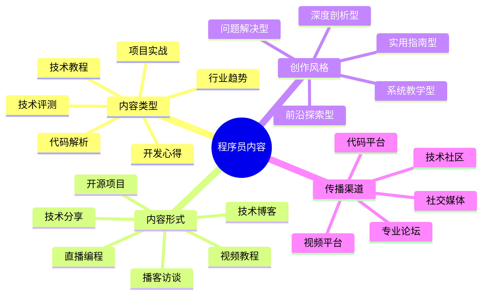

# 程序员内容创作指南

程序员IP的核心价值在于技术内容的创作与分享。本指南将帮助技术领域的创作者构建高质量的内容体系。

## 程序员内容创作公式

**技术内容 = 专业深度 × 实用价值 × 表达清晰度**

## 内容类型与策略

### 1. 技术教程类

- **核心特点**：系统化讲解技术知识，从入门到精通
- **创作策略**：
  - 设计完整学习路径，由浅入深
  - 结合实际项目案例，增强实用性
  - 提供可执行代码和练习，强化学习效果
- **优秀案例**：
  - 《Vue.js从入门到精通》系列教程
  - 《Python数据分析实战》教程

### 2. 代码解析类

- **核心特点**：深入剖析源码或算法实现原理
- **创作策略**：
  - 选择热门框架或库的核心模块进行解析
  - 使用图表可视化复杂逻辑和数据流
  - 结合实际应用场景，解释设计决策
- **优秀案例**：
  - React Fiber架构解析
  - Redis核心数据结构实现原理

### 3. 项目实战类

- **核心特点**：完整展示项目开发全流程
- **创作策略**：
  - 选择有实用价值的项目，解决真实问题
  - 记录开发过程中的决策和思考
  - 提供完整代码仓库和部署指南
- **优秀案例**：
  - 《从零搭建微服务架构》
  - 《全栈开发实战：在线教育平台》

### 4. 技术评测类

- **核心特点**：客观比较不同技术方案的优劣
- **创作策略**：
  - 设定明确的评测指标和测试方法
  - 使用数据和图表展示对比结果
  - 针对不同场景给出选择建议
- **优秀案例**：
  - 《2023前端框架性能大比拼》
  - 《5种NoSQL数据库对比分析》

### 5. 开发心得类

- **核心特点**：分享个人经验和技术成长历程
- **创作策略**：
  - 讲述真实的技术难题解决过程
  - 分享职业发展和技能提升经验
  - 结合个人故事增强情感共鸣
- **优秀案例**：
  - 《我的10年程序员成长之路》
  - 《从初级到高级工程师的跃迁》

### 6. 行业趋势类

- **核心特点**：分析技术发展方向和市场变化
- **创作策略**：
  - 跟踪技术会议和开源项目动态
  - 结合数据分析技术采用趋势
  - 提供前瞻性观点和学习建议
- **优秀案例**：
  - 《2024年Web开发趋势展望》
  - 《AI如何改变软件开发》

## 内容创作工具

- **代码展示工具**：Carbon、CodePen、GitHub Gist
- **技术图表工具**：Draw.io、Mermaid、Excalidraw
- **内容管理平台**：GitHub Pages、Notion、语雀

## 内容分发策略

1. **技术社区矩阵**：
   - 国内：掘金、SegmentFault、CSDN、知乎
   - 国外：Stack Overflow、Dev.to、Medium、Hashnode

2. **代码平台展示**：
   - GitHub仓库 + 详细README
   - 技术博客 + 开源项目联动

3. **视频平台策略**：
   - B站技术区：10-15分钟的精华内容
   - YouTube：系统化的长课程系列

## 内容创作日历

| 周期 | 内容类型 | 发布平台 | 目标 |
|------|---------|---------|------|
| 每周 | 技术文章 | 掘金/知乎 | 建立专业影响力 |
| 每月 | 视频教程 | B站/YouTube | 扩大受众群体 |
| 每季 | 开源项目 | GitHub | 展示实战能力 |
| 半年 | 系统课程 | 个人网站 | 沉淀核心资产 |

## 内容质量检查清单

- [ ] 技术准确性：概念解释是否准确，代码是否可运行
- [ ] 结构清晰度：是否有明确的大纲和进阶路径
- [ ] 实用价值：是否解决实际问题，有可操作性
- [ ] 表达清晰：是否使用图表辅助解释复杂概念
- [ ] 原创洞见：是否提供独特视角或方法论

## 内容创作误区

1. **过度追求技术深度**：忽略读者接受能力，导致内容难以理解
2. **缺乏实际案例**：纯理论讲解，缺乏实战指导
3. **更新不稳定**：无法形成稳定的内容输出节奏
4. **忽视互动反馈**：不关注读者评论和问题

## 进阶策略

- **内容矩阵构建**：围绕核心技术领域，打造从入门到精通的完整内容体系
- **社区建设**：创建技术交流群或论坛，形成粉丝社区
- **品牌合作**：与技术厂商合作，获取第一手资源和支持

## 下一步

完成内容创作规划后，请前往[程序员IP运营](../operation/01-coder.md)章节，学习如何有效传播和运营你的技术内容。 