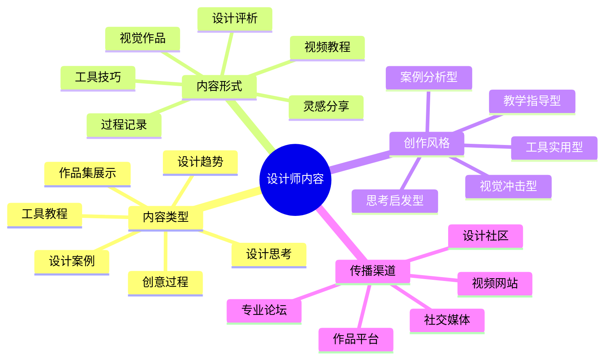

# 设计师内容创作指南

设计师IP的核心价值在于视觉创意的表达与分享。本指南将帮助设计领域的创作者构建有吸引力的内容体系。

## 设计师内容创作公式

**设计内容 = 视觉吸引力 × 创意价值 × 实用技巧**

## 内容类型与策略

### 1. 设计案例类

- **核心特点**：展示完整设计项目的过程与成果
- **创作策略**：
  - 讲述设计背景和目标受众
  - 展示从草图到成品的完整过程
  - 分享关键设计决策和修改理由
- **优秀案例**：
  - 《品牌重塑：从旧到新的视觉进化》
  - 《用户体验设计：电商App改版全过程》

### 2. 创意过程类

- **核心特点**：揭示创意思考和设计方法论
- **创作策略**：
  - 记录灵感来源和创意发散过程
  - 展示多个创意方案的对比与筛选
  - 分享设计师的思考方式和决策过程
- **优秀案例**：
  - 《从100个创意中筛选出最终方案》
  - 《设计思维：如何突破创意瓶颈》

### 3. 工具教程类

- **核心特点**：教授设计软件和工具的使用技巧
- **创作策略**：
  - 聚焦实用功能和效率提升技巧
  - 提供可下载的素材和模板
  - 展示专业设计师的工作流程
- **优秀案例**：
  - 《Figma高效原型设计工作流》
  - 《Photoshop质感修图必备技巧》

### 4. 设计趋势类

- **核心特点**：分析当前设计潮流和未来发展方向
- **创作策略**：
  - 收集多个领域的设计案例
  - 提炼共性特征和趋势规律
  - 提供实用的应用建议
- **优秀案例**：
  - 《2024年UI设计趋势预测》
  - 《后极简主义：设计语言的新变革》

### 5. 作品集展示类

- **核心特点**：精选作品集中的亮点项目
- **创作策略**：
  - 突出个人设计风格和专长领域
  - 讲述每个项目背后的故事
  - 展示解决问题的设计思路
- **优秀案例**：
  - 《我的5年设计成长之路》
  - 《从学生到资深设计师的作品进化》

### 6. 设计思考类

- **核心特点**：探讨设计哲学和方法论
- **创作策略**：
  - 结合实际案例阐述设计理念
  - 分享个人对设计的独特见解
  - 引发读者思考和讨论
- **优秀案例**：
  - 《设计即沟通：如何让设计更有说服力》
  - 《美学与功能的平衡艺术》

## 内容创作工具

- **设计展示工具**：Behance、Dribbble、ArtStation
- **过程记录工具**：Procreate、ScreenFlow、Loom
- **内容管理平台**：Instagram、Pinterest、站酷

## 内容分发策略

1. **设计社区矩阵**：
   - 国内：站酷、UI中国、花瓣网
   - 国外：Behance、Dribbble、Awwwards

2. **社交媒体策略**：
   - Instagram：精美视觉内容，9:16比例Stories展示过程
   - Pinterest：可检索的设计灵感和教程内容
   - 小红书：设计技巧和工具推荐

3. **视频平台策略**：
   - B站：10-15分钟的设计教程和速创
   - YouTube：系统化的设计课程和作品解析

## 内容创作日历

| 周期 | 内容类型 | 发布平台 | 目标 |
|------|---------|---------|------|
| 每周 | 作品展示 | Instagram/站酷 | 保持曝光度 |
| 每月 | 设计教程 | B站/YouTube | 展示专业能力 |
| 每季 | 案例解析 | Behance/知乎 | 深化专业形象 |
| 半年 | 设计集锦 | 个人网站 | 沉淀作品资产 |

## 内容质量检查清单

- [ ] 视觉吸引力：作品是否有足够的视觉冲击力
- [ ] 创意独特性：是否有原创性和差异化视角
- [ ] 叙事完整性：是否讲述了完整的设计故事
- [ ] 技术实用性：是否提供了可操作的技巧
- [ ] 专业深度：是否体现了专业的设计思考

## 内容创作误区

1. **过度追求美感**：忽略实用性和功能性
2. **缺乏设计理念**：只展示结果不分享思考
3. **内容同质化**：跟风热点缺乏个人特色
4. **忽视用户反馈**：不关注受众需求和评论

## 进阶策略

- **内容系列化**：围绕核心设计领域，打造系列化内容
- **社区建设**：创建设计交流群或工作坊，形成粉丝社区
- **跨界合作**：与其他领域创作者合作，拓展内容边界

## 下一步

完成内容创作规划后，请前往[设计师IP运营](../operation/02-designer.md)章节，学习如何有效传播和运营你的设计内容。 