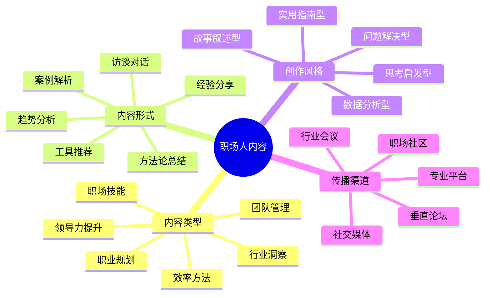

# 职场人内容创作指南

职场人IP的核心价值在于分享实用的职场经验和专业洞察。本指南将帮助职场领域的创作者构建有影响力的内容体系。

## 职场人内容创作公式

**职场内容 = 实用价值 × 经验深度 × 表达清晰度**

## 内容类型与策略

### 1. 职场技能类

- **核心特点**：提升特定职场能力的实用方法
- **创作策略**：
  - 聚焦常见职场痛点和需求
  - 提供可立即应用的技巧和工具
  - 结合真实案例展示应用效果
- **优秀案例**：
  - 《高效沟通的7个黄金法则》
  - 《如何在5分钟内做出有说服力的汇报》

### 2. 效率方法类

- **核心特点**：提高工作效率和时间管理的系统方法
- **创作策略**：
  - 介绍科学的效率提升框架
  - 分享个人实践经验和成果
  - 提供可下载的模板和工具
- **优秀案例**：
  - 《GTD工作法实战指南》
  - 《番茄工作法：如何每天多出2小时》

### 3. 行业洞察类

- **核心特点**：深度解析行业趋势和发展方向
- **创作策略**：
  - 结合数据和案例分析行业变化
  - 提供前瞻性的观点和判断
  - 分享行业内部人士的独特视角
- **优秀案例**：
  - 《2024年零售业转型关键趋势》
  - 《数字化如何重塑金融服务业》

### 4. 职业规划类

- **核心特点**：指导职业发展路径和关键决策
- **创作策略**：
  - 分析不同职业阶段的挑战和机会
  - 分享职业转型和晋升的实战经验
  - 提供自我评估和决策框架
- **优秀案例**：
  - 《从专业人才到管理者的转型指南》
  - 《如何在35岁前实现职业自由》

### 5. 团队管理类

- **核心特点**：解决团队协作和管理难题
- **创作策略**：
  - 分享实用的团队管理工具和方法
  - 分析典型团队问题的解决方案
  - 结合管理心理学提供深度洞察
- **优秀案例**：
  - 《远程团队协作的最佳实践》
  - 《如何带领一个高绩效团队》

### 6. 领导力提升类

- **核心特点**：培养领导能力和战略思维
- **创作策略**：
  - 解析成功领导者的关键特质
  - 提供领导力提升的实践方法
  - 分享决策和危机管理的案例
- **优秀案例**：
  - 《影响力领导：如何不靠职位获得支持》
  - 《战略思维：从执行者到决策者》

## 内容创作工具

- **数据分析工具**：Excel、Tableau、Google Data Studio
- **案例展示工具**：Canva、PowerPoint、Prezi
- **内容管理平台**：Notion、语雀、Trello

## 内容分发策略

1. **职场社区矩阵**：
   - 国内：脉脉、LinkedIn中国、知乎职场话题
   - 国外：LinkedIn、Medium、Substack

2. **专业平台策略**：
   - 行业垂直媒体投稿
   - 专业论坛分享和讨论
   - 企业内训和公开课

3. **社交媒体策略**：
   - 微信公众号：深度文章和系列内容
   - 小红书：图文并茂的实用技巧
   - 抖音/B站：简洁有力的方法讲解

## 内容创作日历

| 周期 | 内容类型 | 发布平台 | 目标 |
|------|---------|---------|------|
| 每周 | 实用技巧 | 公众号/知乎 | 保持曝光度 |
| 每月 | 深度分析 | LinkedIn/脉脉 | 建立专业形象 |
| 每季 | 趋势报告 | 行业媒体 | 提升影响力 |
| 半年 | 方法论总结 | 电子书/课程 | 沉淀核心资产 |

## 内容质量检查清单

- [ ] 实用性：是否提供了可立即应用的方法
- [ ] 专业度：是否体现了行业经验和洞察
- [ ] 结构性：是否有清晰的框架和步骤
- [ ] 真实性：是否基于真实经验和案例
- [ ] 差异化：是否有独特的视角或方法

## 内容创作误区

1. **过度理论化**：缺乏实践指导和落地方案
2. **经验局限性**：将个人经验过度泛化
3. **缺乏数据支持**：观点没有足够的事实基础
4. **忽视行业差异**：没有针对不同行业进行调整

## 进阶策略

- **内容矩阵构建**：围绕核心专业领域，打造从入门到精通的完整内容体系
- **社群运营**：建立职场交流社群，形成互助网络
- **线上线下结合**：通过工作坊和分享会强化线上影响力

## 下一步

完成内容创作规划后，请前往[职场人IP运营](../operation/03-professional.md)章节，学习如何有效传播和运营你的职场内容。 