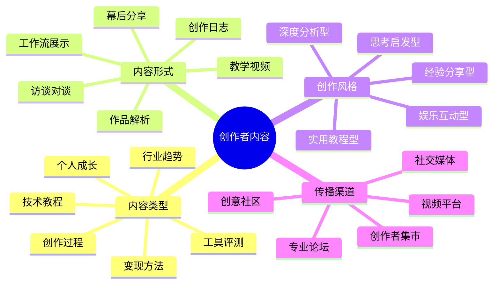

# 创作者内容创作指南

创作者IP的核心价值在于分享创作经验、技巧和思考过程。本指南将帮助各类创作者构建有吸引力的内容体系，连接同行和粉丝。

## 创作者内容创作公式

**创作者内容 = 专业深度 × 过程透明度 × 个人风格**

## 内容类型与策略

### 1. 创作过程类

- **核心特点**：展示作品从构思到完成的全过程
- **创作策略**：
  - 记录创作的各个阶段和关键决策
  - 分享失败尝试和解决方案
  - 展示最终成果与初始想法的对比
- **优秀案例**：
  - 《从草图到成品：一幅插画的诞生》
  - 《我如何在30天内完成一本小说》

### 2. 技术教程类

- **核心特点**：传授具体创作技巧和方法
- **创作策略**：
  - 分解复杂技术为易于理解的步骤
  - 提供清晰的示例和对比
  - 分享提升效率的小技巧
- **优秀案例**：
  - 《Procreate绘画技巧：从入门到精通》
  - 《5分钟学会专业级视频转场效果》

### 3. 工具评测类

- **核心特点**：评估创作工具的优缺点和适用场景
- **创作策略**：
  - 提供客观的功能对比和性能测试
  - 分享个人使用体验和技巧
  - 针对不同需求和预算给出建议
- **优秀案例**：
  - 《2024年最值得投资的5款剪辑软件对比》
  - 《数位板选购指南：从入门到专业》

### 4. 行业趋势类

- **核心特点**：分析创意行业的发展方向和机会
- **创作策略**：
  - 结合数据和案例分析趋势变化
  - 分享对新技术和平台的前瞻观点
  - 提供应对变化的实用建议
- **优秀案例**：
  - 《AI如何改变创意行业：机遇与挑战》
  - 《后疫情时代的内容创作新趋势》

### 5. 变现方法类

- **核心特点**：分享创作变现的实用策略
- **创作策略**：
  - 详细介绍不同变现模式的优缺点
  - 分享个人变现历程和数据
  - 提供具体的实施步骤和注意事项
- **优秀案例**：
  - 《我如何通过Patreon实现月收入过万》
  - 《创作者经济：7种不依赖平台的收入来源》

### 6. 个人成长类

- **核心特点**：分享创作者的成长历程和心态建设
- **创作策略**：
  - 讲述个人挑战和突破的故事
  - 分享应对创作瓶颈的方法
  - 探讨创作与生活平衡的思考
- **优秀案例**：
  - 《从0到10万粉丝：我的三年创作之路》
  - 《如何克服创作者倦怠：实用心理学方法》

## 内容创作工具

- **创作记录工具**：Notion、Day One、语雀
- **视频制作工具**：Final Cut Pro、Premiere Pro、剪映
- **图像处理工具**：Photoshop、Procreate、Canva
- **音频处理工具**：Logic Pro、Audacity、GarageBand

## 内容分发策略

1. **创意社区矩阵**：
   - 国内：站酷、花瓣、ArtStation中国区
   - 国外：Behance、Dribbble、DeviantArt

2. **视频平台策略**：
   - B站：深度教程和创作过程
   - 抖音：技巧片段和创作花絮
   - YouTube：系统课程和幕后纪录

3. **社交媒体策略**：
   - 小红书：图文教程和工具推荐
   - Instagram：作品展示和日常创作
   - Twitter：行业观点和创作者互动

## 内容创作日历

| 周期 | 内容类型 | 发布平台 | 目标 |
|------|---------|---------|------|
| 每周 | 创作技巧 | B站/小红书 | 吸引新粉丝 |
| 每月 | 作品解析 | 专业社区 | 建立专业形象 |
| 每季 | 行业趋势 | 公众号/知乎 | 提升影响力 |
| 不定期 | 创作日记 | 社交媒体 | 增强粉丝连接 |

## 内容质量检查清单

- [ ] 专业性：是否展示了专业技能和知识
- [ ] 实用性：是否提供了可操作的方法和建议
- [ ] 真实性：是否基于真实经验和案例
- [ ] 个性化：是否体现了个人风格和视角
- [ ] 视觉质量：是否有高质量的视觉呈现

## 内容创作误区

1. **过度完美主义**：追求完美导致产出效率低下
2. **盲目跟风**：缺乏个人风格和独特视角
3. **技术炫耀**：忽视内容的实用性和教育价值
4. **隐藏过程**：不愿分享真实的创作过程和挑战

## 进阶策略

- **创作者社群**：建立同行交流和互助的社群
- **联合创作**：与其他创作者合作，扩大影响力
- **创作者品牌**：构建个人品牌，超越单一平台

## 下一步

完成内容创作规划后，请前往[创作者IP运营](../operation/04-creator.md)章节，学习如何有效传播和运营你的创作者内容。 