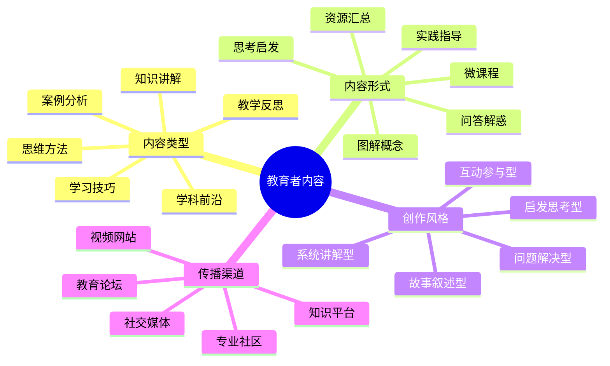

# 教育者内容创作指南

教育者IP的核心价值在于传授知识、培养能力和启发思考。本指南将帮助教育工作者构建有影响力的内容体系，实现知识的有效传播。

## 教育者内容创作公式

**教育内容 = 知识深度 × 表达清晰度 × 实用性**

## 内容类型与策略

### 1. 知识讲解类

- **核心特点**：将复杂概念简化为易于理解的内容
- **创作策略**：
  - 使用比喻和类比解释抽象概念
  - 运用视觉化工具呈现知识结构
  - 从基础到进阶构建知识体系
- **优秀案例**：
  - 《5分钟理解量子力学基本原理》
  - 《经济学核心概念图解》

### 2. 案例分析类

- **核心特点**：通过具体案例展示知识应用
- **创作策略**：
  - 选择与目标受众相关的真实案例
  - 分步骤分析问题解决过程
  - 提炼可迁移的方法和原则
- **优秀案例**：
  - 《数学思维在日常决策中的应用》
  - 《历史事件背后的心理学原理》

### 3. 思维方法类

- **核心特点**：传授思考框架和解决问题的方法
- **创作策略**：
  - 提供清晰的思维模型和步骤
  - 结合多学科知识拓展思维边界
  - 设计思维练习强化应用能力
- **优秀案例**：
  - 《批判性思维：如何避免认知偏见》
  - 《系统思考：解决复杂问题的方法论》

### 4. 学习技巧类

- **核心特点**：提供高效学习的方法和工具
- **创作策略**：
  - 基于认知科学分享学习策略
  - 提供具体可操作的学习工具
  - 分享个性化学习方法的调整思路
- **优秀案例**：
  - 《费曼学习法：如何学会任何知识》
  - 《记忆宫殿：提升记忆力的古老技巧》

### 5. 教学反思类

- **核心特点**：分享教学经验和教育思考
- **创作策略**：
  - 讲述真实教学场景和挑战
  - 分析教学方法的优缺点
  - 探讨教育理念和价值观
- **优秀案例**：
  - 《我的教学失败与成功：十年教学反思》
  - 《如何激发学生的内在学习动机》

### 6. 学科前沿类

- **核心特点**：介绍学科最新发展和研究成果
- **创作策略**：
  - 将专业研究转化为通俗易懂的内容
  - 分析前沿发展对实践的影响
  - 预测学科未来发展方向
- **优秀案例**：
  - 《人工智能如何重塑教育未来》
  - 《脑科学新发现对学习方法的启示》

## 内容创作工具

- **知识组织工具**：XMind、MindMeister、幕布
- **视觉化工具**：Canva、Piktochart、Genially
- **交互式内容工具**：H5P、Mentimeter、Kahoot
- **视频制作工具**：Camtasia、OBS、剪映

## 内容分发策略

1. **知识平台矩阵**：
   - 知乎：深度知识和专业问答
   - 得到/喜马拉雅：音频课程和知识付费
   - 小鹅通/腾讯课堂：系统化课程

2. **视频平台策略**：
   - B站：系统化知识和深度讲解
   - 抖音：知识点精华和趣味科普
   - YouTube：完整课程和系列教程

3. **社交媒体策略**：
   - 微信公众号：成体系的知识内容
   - 小红书：图文并茂的知识卡片
   - 微博：热点话题的专业解读

## 内容创作日历

| 周期 | 内容类型 | 发布平台 | 目标 |
|------|---------|---------|------|
| 每周 | 知识点解析 | B站/知乎 | 保持曝光度 |
| 每月 | 系统课程 | 知识付费平台 | 沉淀核心资产 |
| 每季 | 学科前沿 | 公众号/专业社区 | 建立专业权威 |
| 不定期 | 热点解读 | 微博/小红书 | 扩大影响力 |

## 内容质量检查清单

- [ ] 准确性：知识点是否准确无误
- [ ] 清晰度：表达是否简洁明了
- [ ] 结构性：知识框架是否清晰
- [ ] 实用性：是否可以实际应用
- [ ] 启发性：是否激发思考和探索

## 内容创作误区

1. **知识堆砌**：缺乏结构和重点的信息堆积
2. **过度学术化**：使用晦涩术语和复杂表达
3. **忽视受众基础**：未考虑学习者的知识水平
4. **缺乏互动设计**：单向灌输而非双向交流

## 进阶策略

- **知识体系构建**：围绕核心领域构建完整知识图谱
- **学习社群运营**：建立学习者社群，促进交流和实践
- **个性化学习路径**：为不同学习者设计差异化内容

## 教育内容评估框架

| 评估维度 | 关键问题 | 优化方向 |
|---------|---------|---------|
| 知识价值 | 内容是否传递了核心知识点？ | 聚焦关键概念和原理 |
| 表达效果 | 学习者是否容易理解？ | 优化语言和视觉呈现 |
| 学习体验 | 学习过程是否流畅有趣？ | 增加互动和情感连接 |
| 应用转化 | 学习者能否实际应用？ | 提供实践案例和练习 |
| 记忆保留 | 知识是否容易记忆？ | 运用记忆技巧和复习机制 |

## 下一步

完成内容创作规划后，请前往[教育者IP运营](../operation/05-educator.md)章节，学习如何有效传播和运营你的教育内容。 