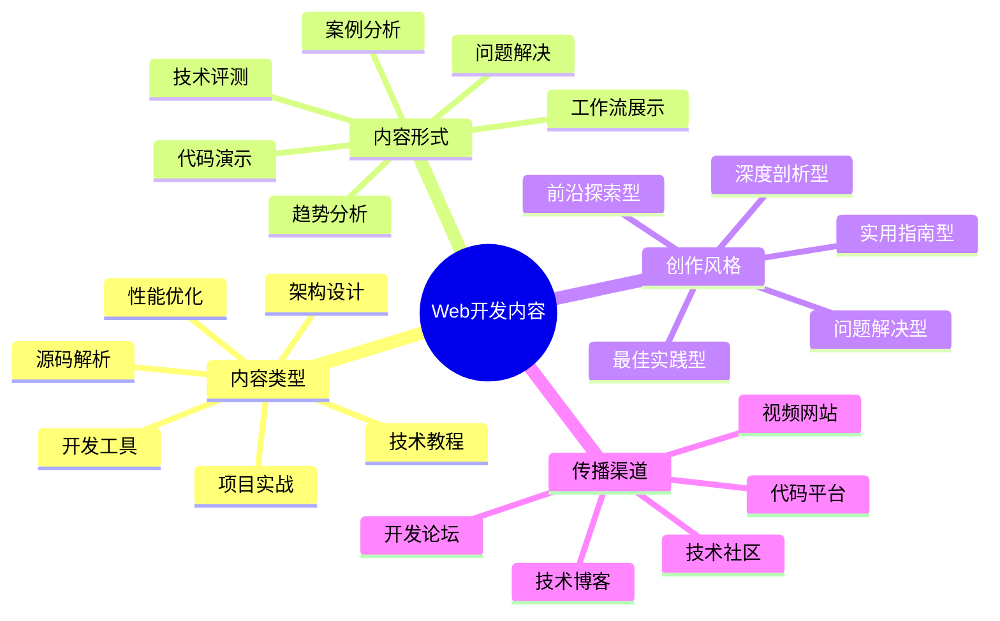

# Web开发内容创作指南

Web开发IP的核心价值在于分享实用的开发技术、解决方案和最佳实践。本指南将帮助Web开发者构建有影响力的技术内容体系。

## Web开发内容创作公式

**Web开发内容 = 技术深度 × 实用性 × 代码质量**

## 内容类型与策略

### 1. 技术教程类

- **核心特点**：系统讲解特定技术或框架的使用方法
- **创作策略**：
  - 从基础概念到高级应用逐步讲解
  - 提供可运行的代码示例和演示
  - 解释技术原理和设计思想
- **优秀案例**：
  - 《Vue3完全指南：从入门到实战》
  - 《现代CSS技术详解：Grid和Flexbox布局》

### 2. 项目实战类

- **核心特点**：通过完整项目展示技术应用
- **创作策略**：
  - 设计有实际价值的项目案例
  - 分阶段展示开发过程和关键决策
  - 提供完整源码和部署指南
- **优秀案例**：
  - 《从零开发一个在线协作工具》
  - 《7天搭建自己的博客系统》

### 3. 源码解析类

- **核心特点**：深入分析优秀开源项目的实现原理
- **创作策略**：
  - 选择广泛使用的框架或库进行解析
  - 图解核心模块和关键算法
  - 提取可借鉴的设计模式和编程技巧
- **优秀案例**：
  - 《React Hooks源码解析》
  - 《Axios请求拦截器实现原理》

### 4. 架构设计类

- **核心特点**：探讨大型应用的架构设计和技术选型
- **创作策略**：
  - 分析不同架构的优缺点和适用场景
  - 提供架构决策的思考框架
  - 分享实际项目的架构演进案例
- **优秀案例**：
  - 《大型SPA应用的微前端架构实践》
  - 《从MVC到MVVM：前端架构的演进》

### 5. 性能优化类

- **核心特点**：提供Web应用性能提升的方法和技巧
- **创作策略**：
  - 使用性能测试工具量化优化效果
  - 分析性能瓶颈的定位方法
  - 提供针对性的优化策略和代码示例
- **优秀案例**：
  - 《Web性能优化：从加载到渲染》
  - 《React应用性能优化的20个技巧》

### 6. 开发工具类

- **核心特点**：介绍提升开发效率的工具和环境配置
- **创作策略**：
  - 展示工具的实际使用场景和效果
  - 提供详细的配置和使用指南
  - 分享个性化的工作流和效率技巧
- **优秀案例**：
  - 《VS Code高效开发环境搭建》
  - 《前端自动化测试工具对比》

## 内容创作工具

- **代码展示工具**：CodePen、CodeSandbox、StackBlitz
- **技术文档工具**：VuePress、Docusaurus、GitBook
- **代码录制工具**：Asciinema、Carbon、CodeSnap
- **屏幕录制工具**：Camtasia、ScreenFlow、OBS

## 内容分发策略

1. **技术社区矩阵**：
   - 国内：掘金、SegmentFault、CSDN
   - 国外：Dev.to、Medium、Hashnode

2. **代码平台策略**：
   - GitHub：完整项目和技术文档
   - CodePen：交互式代码示例
   - NPM：开源工具和组件库

3. **视频平台策略**：
   - B站：系统教程和技术分享
   - YouTube：英文技术内容和国际受众
   - 抖音：技术小技巧和工具推荐

## 内容创作日历

| 周期 | 内容类型 | 发布平台 | 目标 |
|------|---------|---------|------|
| 每周 | 技术小技巧 | 掘金/微信 | 保持曝光度 |
| 每月 | 深度技术文章 | 个人博客/Medium | 建立专业形象 |
| 每季 | 项目实战教程 | GitHub/B站 | 沉淀核心资产 |
| 半年 | 技术趋势分析 | 行业会议/专栏 | 提升影响力 |

## 内容质量检查清单

- [ ] 技术准确性：代码和概念是否准确无误
- [ ] 实用性：是否解决实际开发问题
- [ ] 完整性：是否提供完整可运行的示例
- [ ] 可读性：代码是否遵循规范和最佳实践
- [ ] 原创性：是否提供独特的见解或方法

## 内容创作误区

1. **过度理论化**：缺乏实际应用场景和示例
2. **代码片段化**：只提供片段而非完整解决方案
3. **忽视基础解释**：假设读者已掌握所有前置知识
4. **技术堆砌**：使用过多技术而不关注实际需求

## 进阶策略

- **技术专精路线**：在特定技术领域深耕，成为专家
- **开源项目维护**：创建和维护有价值的开源项目
- **技术社区建设**：组建开发者社区，促进交流和协作

## Web开发内容差异化策略

| 内容类型 | 常见问题 | 差异化方向 |
|---------|---------|-----------|
| 入门教程 | 内容同质化严重 | 结合实际项目，注重原理解释 |
| 框架教程 | 跟随官方文档 | 深入源码，提供最佳实践 |
| 项目实战 | 脱离实际需求 | 解决真实业务问题，提供完整方案 |
| 技术评测 | 停留在表面对比 | 深入性能和适用场景分析 |

## 下一步

完成内容创作规划后，请前往[Web开发IP运营](../operation/06-web.md)章节，学习如何有效传播和运营你的技术内容。 