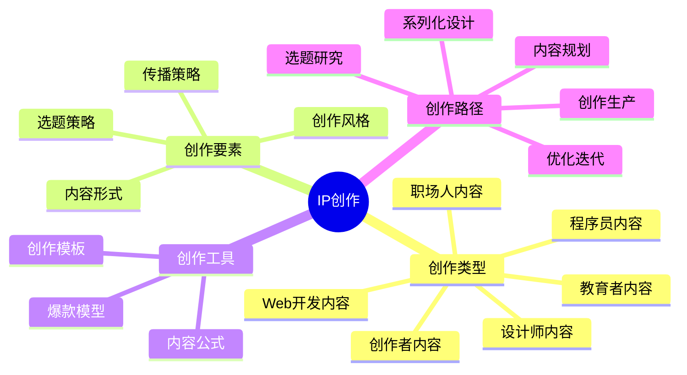

# IP创作

内容创作是IP价值传递的核心载体，优质内容能够吸引目标用户并建立信任关系。本章节将帮助你掌握系统化的内容创作方法。

## 创作公式

**爆款内容 = 痛点选题 × 情绪价值 × 实用密度**

## 创作类型

- [程序员内容创作](./01-coder.md)
- [设计师内容创作](./02-designer.md)
- [职场人内容创作](./03-professional.md)
- [创作者内容创作](./04-creator.md)
- [教育者内容创作](./05-educator.md)
- [Web开发内容创作](./06-web.md)

## 创作路径

详细了解[IP创作路径](./path.md)，掌握系统化的内容创作方法。 