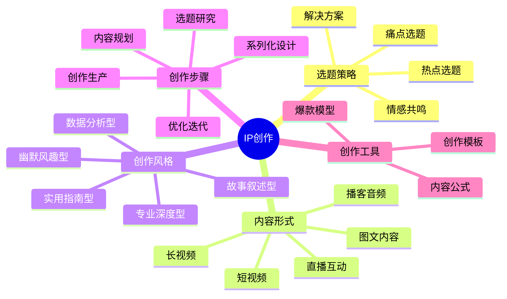

# IP创作路径

内容创作是IP价值传递的核心载体，优质内容能够吸引目标用户并建立信任关系。本章节将帮助你掌握系统化的内容创作方法。

## 创作公式

**爆款内容 = 痛点选题 × 情绪价值 × 实用密度**

## 创作步骤

1. **选题研究**：找到目标用户的核心痛点和需求
2. **内容规划**：设计内容结构和表达方式
3. **创作生产**：高效产出优质内容
4. **优化迭代**：基于数据反馈持续改进
5. **系列化设计**：构建内容矩阵和IP体系

## 创作类型

- [程序员内容创作](./01-coder.md) - 技术教程、代码解析、开发心得
- [设计师内容创作](./02-designer.md) - 设计案例、创意过程、工具技巧
- [职场人内容创作](./03-professional.md) - 职场技能、效率方法、行业洞察
- [创作者内容创作](./04-creator.md) - 创意分享、创作技巧、灵感来源
- [教育者内容创作](./05-educator.md) - 知识体系、教学方法、学习路径
- [Web开发内容创作](./06-web.md) - 前端技术、后端架构、全栈开发

## 创作工具

- [内容公式模板](./tools/content-formula.md) - 快速构建高质量内容
- [爆款内容模型](./tools/viral-content-model.md) - 提升内容传播力
- [创作效率工具](./tools/creation-efficiency-tools.md) - 提高内容产出效率

## 创作案例

查看[成功内容创作案例](../cases/content-cases.md)获取灵感和参考。

## 下一步

完成内容创作后，请前往[账号运营](../operation/path.md)章节，学习如何放大内容价值。 