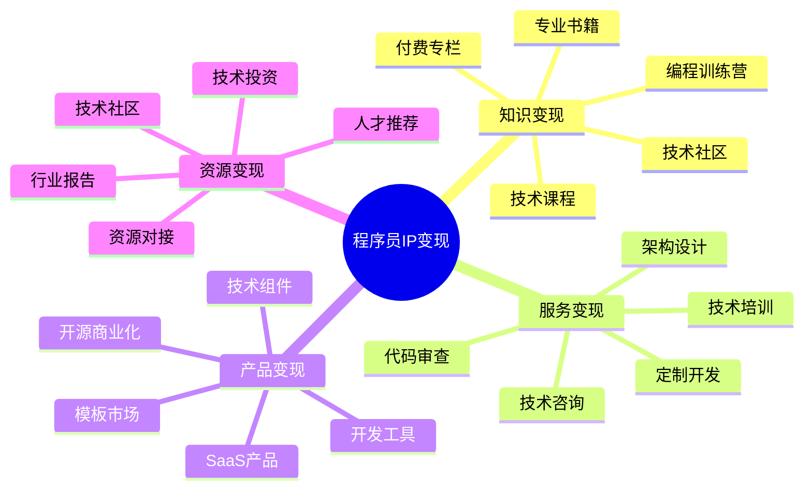

# 程序员IP变现指南

程序员IP变现是将技术专长和影响力转化为持续性收入的系统方法。本指南将帮助技术人才设计多元化的变现模式。

## 程序员IP变现公式

**技术变现价值 = 专业深度 × 影响力范围 × 商业模式设计**

## 变现模式分析

### 1. 知识变现模式

| 变现形式 | 适合人群 | 投入资源 | 收益周期 | 规模潜力 |
|---------|---------|---------|---------|---------|
| 技术课程 | 有教学能力的技术专家 | 高(内容制作) | 中长期 | 高 |
| 技术专栏 | 文字表达能力强的开发者 | 中(连续创作) | 短中期 | 中 |
| 技术电子书 | 系统化思考的架构师 | 高(一次性) | 长期 | 中 |
| 编程训练营 | 实战经验丰富的导师 | 高(设计+辅导) | 短期 | 高 |
| 会员社区 | 持续输出的技术KOL | 中(持续运营) | 长期 | 中高 |

### 2. 服务变现模式

| 服务类型 | 核心价值 | 定价策略 | 时间投入 | 边际效应 |
|---------|---------|---------|---------|---------|
| 技术咨询 | 解决方案和决策建议 | 小时计费/项目计费 | 中 | 低 |
| 代码审查 | 质量保障和最佳实践 | 代码量计费/包月 | 中低 | 低 |
| 架构设计 | 系统规划和技术选型 | 项目计费/阶段计费 | 高 | 中 |
| 技术培训 | 团队能力提升 | 人天计费/团队包价 | 中 | 中高 |
| 技术外包 | 交付完整解决方案 | 项目计费/里程碑付款 | 高 | 中 |

### 3. 产品变现模式

| 产品类型 | 目标用户 | 开发周期 | 维护成本 | 收入模式 |
|---------|---------|---------|---------|---------|
| 开源商业版 | 企业用户 | 长期 | 高 | 订阅制/服务费 |
| 开发工具 | 开发者 | 中期 | 中 | 一次性购买/订阅 |
| SaaS产品 | 特定行业用户 | 长期 | 高 | 月付/年付订阅 |
| 技术组件 | 开发团队 | 中期 | 中 | 授权费/使用量 |
| 模板市场 | 初级开发者 | 短期 | 低 | 一次性购买 |

## 产品服务设计

### 1. 知识产品矩阵

- **入门级**：技术博客、免费教程、入门电子书
- **进阶级**：专业课程、实战案例、技术专栏
- **专家级**：高级训练营、架构师课程、私教计划
- **企业级**：团队培训、定制课程、内训服务

### 2. 服务产品矩阵

- **标准服务**：固定范围的技术咨询、代码审查
- **定制服务**：个性化技术方案、专属顾问服务
- **长期服务**：技术合伙人、CTO顾问、技术导师
- **企业服务**：团队培训、技术评估、架构升级

### 3. 软件产品矩阵

- **免费版**：基础功能、社区支持
- **专业版**：高级功能、技术支持、定期更新
- **企业版**：全功能、优先支持、定制开发
- **白标版**：品牌定制、专属部署、集成服务

## 定价策略

### 1. 知识产品定价

| 产品类型 | 定价区间 | 定价因素 | 优化策略 |
|---------|---------|---------|---------|
| 技术专栏 | ¥99-499 | 内容深度、实用性 | 限时优惠、早鸟价 |
| 视频课程 | ¥199-1999 | 技术热度、系统性 | 阶段定价、套餐优惠 |
| 训练营 | ¥1999-9999 | 辅导强度、就业价值 | 分期付款、退款保障 |
| 会员制 | ¥99-499/月 | 更新频率、社群价值 | 年付折扣、终身会员 |

### 2. 服务产品定价

| 服务类型 | 定价模式 | 价格区间 | 提升策略 |
|---------|---------|---------|---------|
| 技术咨询 | 小时计费 | ¥500-2000/小时 | 专业包装、案例展示 |
| 代码审查 | 项目计费 | ¥3000-30000/项目 | 分级服务、报告深度 |
| 架构设计 | 项目计费 | ¥10000-100000/项目 | 交付物细化、增值服务 |
| 技术培训 | 天计费 | ¥5000-20000/天 | 课程定制、实战结合 |

### 3. 软件产品定价

| 产品类型 | 定价模式 | 价格策略 | 增长方法 |
|---------|---------|---------|---------|
| 开发工具 | 订阅制 | ¥99-299/月 | 功能分级、团队版本 |
| SaaS产品 | 月付/年付 | 基于用户数/功能 | 免费试用、推荐奖励 |
| 技术组件 | 授权费 | 基于规模/用途 | 集成服务、定制开发 |
| 模板市场 | 一次性购买 | ¥99-999/套 | 捆绑销售、限时折扣 |

## 变现路径规划

### 1. 起步阶段 (0-1000粉丝)

- **核心目标**：建立专业信任，积累初始用户
- **变现方式**：
  - 技术咨询服务（按小时计费）
  - 小型定制开发项目
  - 平台技术文章创作
  - 接入技术推广联盟
- **投入重点**：高质量技术内容创作，专业能力展示

### 2. 成长阶段 (1000-1万粉丝)

- **核心目标**：扩大影响力，测试产品模式
- **变现方式**：
  - 小型技术课程或专栏
  - 技术社区会员服务
  - 企业技术培训
  - 开发小型工具产品
- **投入重点**：产品打磨，用户体验优化，销售流程建设

### 3. 成熟阶段 (1万+粉丝)

- **核心目标**：建立品牌，实现规模化收益
- **变现方式**：
  - 系统化课程体系
  - 高端技术社区
  - 软件产品或SaaS服务
  - 技术大会和行业活动
- **投入重点**：团队建设，品牌塑造，多元业务协同

## 案例分析

### 案例1：从技术博主到课程体系

**人物**：前BAT高级工程师
**起点**：技术博客和开源项目
**路径**：
1. 通过技术博客和GitHub项目积累粉丝
2. 推出付费专栏和电子书
3. 开发系统化视频课程
4. 建立会员制技术社区
5. 推出高端训练营和就业班

**成果**：年收入突破百万，建立个人技术教育品牌

### 案例2：从开源作者到商业产品

**人物**：知名开源项目作者
**起点**：GitHub上的开源工具项目
**路径**：
1. 开发并维护高质量开源项目
2. 提供付费技术支持和定制开发
3. 推出开源项目的商业版本
4. 开发基于核心技术的SaaS产品
5. 获得风险投资成立公司

**成果**：实现技术创业，产品服务数千企业客户

## 变现工具与资源

- **知识变现平台**：掘金小册、极客时间、慕课网、知识星球
- **服务对接平台**：码市、程序员客栈、Upwork、Toptal
- **产品发布渠道**：GitHub Marketplace、ProductHunt、AppStore
- **社区与网络**：GitHub、Stack Overflow、V2EX、开发者大会

## 常见问题与解决方案

### 1. 技术深度与商业化平衡

- **问题**：过度商业化可能损害技术公信力
- **解决方案**：
  - 坚持提供高质量免费内容
  - 付费产品聚焦独特价值和深度内容
  - 保持技术前沿性和专业态度
  - 商业模式透明化，避免过度营销

### 2. 时间管理与精力分配

- **问题**：技术人往往难以平衡技术钻研与商业活动
- **解决方案**：
  - 建立内容复用和产品化体系
  - 合理规划固定的创作和服务时间
  - 适时引入团队协作分担工作
  - 利用工具实现部分流程自动化

### 3. 产品定价与价值传达

- **问题**：技术产品价值难以量化，定价困难
- **解决方案**：
  - 基于目标用户的价值感知定价
  - 通过案例和数据量化展示价值
  - 提供分级产品满足不同预算需求
  - 设计合理的试用和退款机制

## 下一步

完成程序员IP变现规划后，建议结合[IP定位](../position/01-coder.md)和[IP运营](../operation/01-coder.md)章节，构建完整的程序员IP商业体系。 