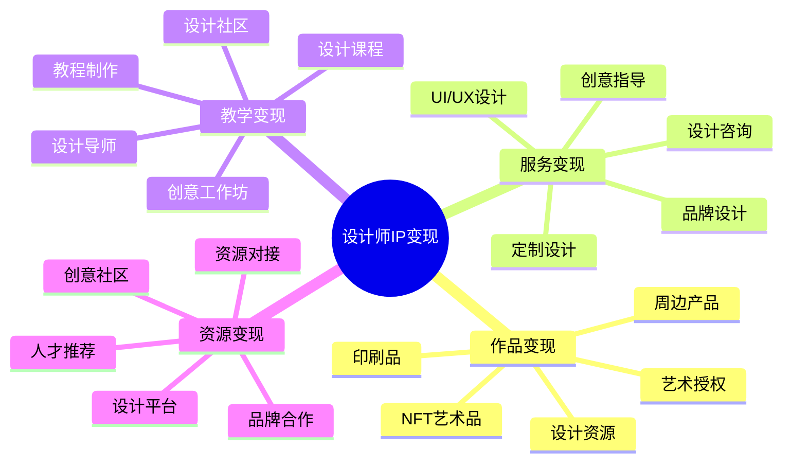

# 设计师IP变现指南

设计师IP变现是将创意能力和设计专长转化为持续性收入的系统方法。本指南将帮助设计师构建多元化的变现模式。

## 设计师IP变现公式

**设计变现价值 = 创意独特性 × 视觉表现力 × 商业应用性**

## 变现模式分析

### 1. 作品变现模式

| 变现形式 | 适合风格 | 投入资源 | 收益周期 | 规模潜力 |
|---------|---------|---------|---------|---------|
| 设计资源 | 实用型、模板型 | 中(批量创作) | 长期 | 高 |
| NFT艺术品 | 独特风格、数字艺术 | 高(创作+营销) | 短期 | 高风险高回报 |
| 印刷品 | 插画、平面设计 | 中(创作+生产) | 中期 | 中 |
| 周边产品 | 卡通、品牌化设计 | 高(设计+生产) | 中长期 | 中高 |
| 艺术授权 | 独特风格、IP形象 | 低(已有作品) | 长期 | 高 |

### 2. 服务变现模式

| 服务类型 | 核心价值 | 定价策略 | 时间投入 | 边际效应 |
|---------|---------|---------|---------|---------|
| 设计咨询 | 创意方向和策略建议 | 小时计费/项目计费 | 中 | 低 |
| 定制设计 | 独特视觉解决方案 | 项目计费/阶段计费 | 高 | 低 |
| 品牌设计 | 品牌识别和视觉系统 | 项目计费+维护费 | 高 | 中 |
| UI/UX设计 | 用户体验和界面设计 | 页面计费/项目计费 | 中高 | 中 |
| 创意指导 | 创意方向和执行指导 | 顾问费/项目费 | 中 | 中高 |

### 3. 教学变现模式

| 教学形式 | 目标学员 | 开发周期 | 维护成本 | 收入模式 |
|---------|---------|---------|---------|---------|
| 设计课程 | 设计学习者 | 长期 | 中 | 一次性购买/订阅 |
| 创意工作坊 | 设计爱好者 | 短期 | 低 | 单次收费/系列票 |
| 设计社区 | 设计学习者 | 长期 | 高 | 会员订阅/增值服务 |
| 教程制作 | 自学者 | 中期 | 低 | 单次购买/平台分成 |
| 设计导师 | 职业转型者 | 短期 | 高 | 高价私教/小班课 |

## 产品服务设计

### 1. 设计作品矩阵

- **基础级**：设计素材、模板、图标集
- **进阶级**：高级模板、主题包、插件
- **专业级**：定制设计资源、行业解决方案
- **艺术级**：限量艺术品、签名作品、收藏系列

### 2. 设计服务矩阵

- **标准服务**：固定范围的设计项目、套餐服务
- **定制服务**：个性化创意方案、专属设计服务
- **长期服务**：设计顾问、创意总监、品牌维护
- **企业服务**：品牌策略、设计系统、团队培训

### 3. 设计教学矩阵

- **入门级**：基础教程、设计原理、工具使用
- **进阶级**：专业技法、设计思维、项目实战
- **专家级**：高级工作坊、创意突破、职业指导
- **企业级**：团队培训、内训课程、设计管理

## 定价策略

### 1. 设计作品定价

| 产品类型 | 定价区间 | 定价因素 | 优化策略 |
|---------|---------|---------|---------|
| 设计素材 | ¥50-500 | 独特性、实用性 | 打包销售、会员折扣 |
| 模板套件 | ¥200-2000 | 完整度、适用范围 | 分级定价、更新服务 |
| 数字艺术品 | ¥500-无上限 | 艺术价值、限量性 | 拍卖机制、收藏价值 |
| 实体产品 | ¥100-1000 | 材质、工艺、设计 | 限量版、签名版 |

### 2. 设计服务定价

| 服务类型 | 定价模式 | 价格区间 | 提升策略 |
|---------|---------|---------|---------|
| 标志设计 | 项目计费 | ¥3000-30000 | 方案数量、修改次数 |
| UI设计 | 页面/项目 | ¥500-2000/页 | 交互复杂度、设备适配 |
| 品牌设计 | 项目+维护 | ¥10000-100000+ | 应用场景、品牌资产 |
| 创意指导 | 时间计费 | ¥1000-5000/天 | 专业背景、行业经验 |

### 3. 设计教学定价

| 教学类型 | 定价模式 | 价格策略 | 增长方法 |
|---------|---------|---------|---------|
| 在线课程 | 单次购买 | ¥199-1999 | 系列课程、进阶路径 |
| 线下工作坊 | 单次收费 | ¥500-5000 | 限量席位、实战项目 |
| 设计社区 | 会员订阅 | ¥99-299/月 | 专属内容、导师点评 |
| 一对一指导 | 小时计费 | ¥500-2000/小时 | 定制计划、阶段目标 |

## 变现路径规划

### 1. 起步阶段 (0-1000粉丝)

- **核心目标**：建立设计风格，积累初始作品
- **变现方式**：
  - 设计素材和模板销售
  - 小型设计项目接单
  - 平台设计教程创作
  - 参与设计比赛和展示
- **投入重点**：高质量作品创作，个人风格塑造

### 2. 成长阶段 (1000-1万粉丝)

- **核心目标**：扩大影响力，测试产品模式
- **变现方式**：
  - 设计资源产品化
  - 设计课程或工作坊
  - 品牌合作和定制项目
  - 设计社区会员服务
- **投入重点**：产品体系建设，服务流程优化

### 3. 成熟阶段 (1万+粉丝)

- **核心目标**：建立设计品牌，实现规模化收益
- **变现方式**：
  - 高端设计服务和咨询
  - 系统化课程和教学体系
  - 设计IP授权和衍生品
  - 设计活动和社区运营
- **投入重点**：团队建设，品牌塑造，多元业务协同

## 案例分析

### 案例1：从自由设计师到设计教育者

**人物**：资深UI设计师
**起点**：个人作品集和设计博客
**路径**：
1. 通过Dribbble和Behance展示高质量作品
2. 在设计平台销售UI套件和模板
3. 开设设计教程和在线课程
4. 建立设计学习社区和会员服务
5. 推出高端设计培训和职业指导

**成果**：年收入突破百万，建立个人设计教育品牌

### 案例2：从插画师到IP品牌

**人物**：独立插画师
**起点**：社交媒体上的个人创作
**路径**：
1. 在社交平台持续输出原创插画
2. 开设线上商店销售印刷品和周边
3. 接受品牌合作和商业插画委托
4. 开发个人IP形象和授权业务
5. 拓展到多元产品线和跨界合作

**成果**：建立个人IP品牌，实现多渠道收入

## 变现工具与资源

- **作品展示平台**：Behance、Dribbble、ArtStation、Instagram
- **资源销售平台**：Creative Market、Envato、UI8、Gumroad
- **服务对接平台**：Upwork、Fiverr、猪八戒、英集网
- **教学平台**：Skillshare、Domestika、站酷、视觉中国

## 常见问题与解决方案

### 1. 创意与商业平衡

- **问题**：过度商业化可能限制创意表达
- **解决方案**：
  - 区分商业项目和个人创作
  - 在商业项目中保留创意空间
  - 通过个人项目探索纯粹创意
  - 寻找商业价值与创意表达的结合点

### 2. 设计价值传达

- **问题**：客户难以理解设计价值，导致价格压力
- **解决方案**：
  - 清晰展示设计对业务的具体贡献
  - 通过案例展示设计前后的效果对比
  - 建立专业设计流程和交付标准
  - 提供分级服务满足不同预算需求

### 3. 版权保护与授权

- **问题**：设计作品容易被盗用或侵权
- **解决方案**：
  - 建立清晰的版权声明和使用条款
  - 使用水印和版权保护技术
  - 设计合理的授权模式和价格体系
  - 对重要侵权行为采取法律行动

## 下一步

完成设计师IP变现规划后，建议结合[IP定位](../position/02-designer.md)和[IP运营](../operation/02-designer.md)章节，构建完整的设计师IP商业体系。 