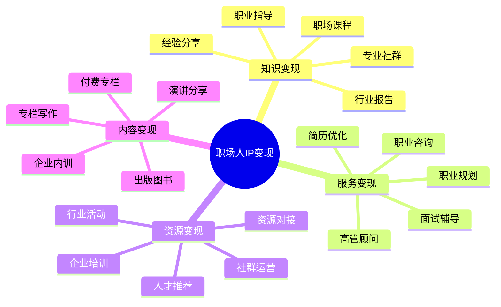

# 职场人IP变现指南

职场人IP变现是将职业经验和专业能力转化为持续性收入的系统方法。本指南将帮助职场人才设计多元化的变现模式。

## 职场人IP变现公式

**职场变现价值 = 专业深度 × 实战经验 × 人脉资源 × 表达能力**

## 变现模式分析

### 1. 知识变现模式

| 变现形式 | 适合人群 | 投入资源 | 收益周期 | 规模潜力 |
|---------|---------|---------|---------|---------|
| 职场课程 | 有教学能力的资深职场人 | 高(内容制作) | 中长期 | 高 |
| 经验分享 | 有成功案例的管理者 | 中(内容整理) | 短中期 | 中 |
| 职业社群 | 有运营能力的行业专家 | 高(持续运营) | 长期 | 中高 |
| 行业报告 | 有研究能力的分析师 | 高(研究分析) | 短期 | 中 |
| 专业书籍 | 系统思考的职场导师 | 高(一次性) | 长期 | 中高 |

### 2. 服务变现模式

| 服务类型 | 核心价值 | 定价策略 | 时间投入 | 边际效应 |
|---------|---------|---------|---------|---------|
| 职业咨询 | 职业发展建议和决策 | 小时计费/次数包 | 中 | 低 |
| 简历优化 | 求职材料专业提升 | 项目计费/套餐 | 低 | 中 |
| 面试辅导 | 面试技巧和模拟训练 | 小时计费/次数包 | 中 | 低 |
| 职业规划 | 长期职业路径设计 | 项目计费/阶段服务 | 高 | 中 |
| 高管顾问 | 高层决策和领导力 | 顾问费/长期合作 | 高 | 中高 |

### 3. 资源变现模式

| 资源类型 | 目标用户 | 运营周期 | 维护成本 | 收入模式 |
|---------|---------|---------|---------|---------|
| 人才推荐 | 企业HR、求职者 | 长期 | 中 | 佣金制/服务费 |
| 资源对接 | 创业者、企业家 | 中期 | 中 | 对接费/分成 |
| 行业活动 | 职场人、企业 | 短期 | 高 | 门票/赞助 |
| 社群运营 | 特定领域专业人士 | 长期 | 高 | 会员费/增值服务 |
| 企业培训 | 企业团队 | 中期 | 中 | 培训费/长期合作 |

## 产品服务设计

### 1. 知识产品矩阵

- **入门级**：职场指南、行业入门、基础技能
- **进阶级**：专业技能、管理方法、行业深度
- **专家级**：领导力培养、战略思维、高端社群
- **企业级**：团队建设、组织发展、企业内训

### 2. 服务产品矩阵

- **标准服务**：职业诊断、简历优化、面试准备
- **定制服务**：个性化职业规划、专属导师计划
- **长期服务**：职业发展顾问、高管教练
- **企业服务**：人才评估、团队培训、组织咨询

### 3. 资源产品矩阵

- **基础级**：行业资讯、人脉对接、求职信息
- **进阶级**：精准推荐、资源匹配、项目合作
- **高端级**：战略合作、投资对接、高管人脉
- **企业级**：企业资源整合、战略伙伴关系

## 定价策略

### 1. 知识产品定价

| 产品类型 | 定价区间 | 定价因素 | 优化策略 |
|---------|---------|---------|---------|
| 职场课程 | ¥199-1999 | 实用性、稀缺性 | 阶段定价、套餐优惠 |
| 专业社群 | ¥99-499/月 | 资源质量、互动频率 | 年付折扣、终身会员 |
| 行业报告 | ¥299-2999 | 深度、独家性 | 订阅模式、更新服务 |
| 专业书籍 | ¥69-199 | 内容价值、品牌影响力 | 预售优惠、签名版 |

### 2. 服务产品定价

| 服务类型 | 定价模式 | 价格区间 | 提升策略 |
|---------|---------|---------|---------|
| 职业咨询 | 小时计费 | ¥500-2000/小时 | 专业包装、案例展示 |
| 简历优化 | 项目计费 | ¥500-3000/份 | 分级服务、行业定制 |
| 职业规划 | 项目计费 | ¥3000-20000/项目 | 服务深度、跟踪周期 |
| 高管顾问 | 月费/季度 | ¥10000-50000/月 | 专属服务、资源整合 |

### 3. 资源产品定价

| 资源类型 | 定价模式 | 价格策略 | 增长方法 |
|---------|---------|---------|---------|
| 人才推荐 | 佣金制 | 月薪15%-30% | 精准匹配、保障服务 |
| 资源对接 | 服务费+分成 | 固定费+合作分成 | 成功案例、口碑传播 |
| 行业活动 | 门票+赞助 | 分级票价+多级赞助 | 嘉宾质量、活动体验 |
| 社群会员 | 订阅制 | ¥199-999/月 | 资源独特性、互动价值 |

## 变现路径规划

### 1. 起步阶段 (0-1000粉丝)

- **核心目标**：建立专业信任，积累初始用户
- **变现方式**：
  - 一对一职业咨询服务
  - 简历优化和面试辅导
  - 行业经验分享文章
  - 小型线上/线下分享会
- **投入重点**：专业能力展示，成功案例积累

### 2. 成长阶段 (1000-1万粉丝)

- **核心目标**：扩大影响力，测试产品模式
- **变现方式**：
  - 小型职场课程或专栏
  - 职业发展社群运营
  - 企业培训和工作坊
  - 人才推荐和资源对接
- **投入重点**：产品体系建设，服务流程优化

### 3. 成熟阶段 (1万+粉丝)

- **核心目标**：建立职场品牌，实现规模化收益
- **变现方式**：
  - 系统化课程和培训体系
  - 高端职业发展项目
  - 企业咨询和组织发展
  - 出版书籍和付费专栏
- **投入重点**：团队建设，品牌塑造，多元业务协同

## 案例分析

### 案例1：从HR到职业发展顾问

**人物**：前500强企业HR总监
**起点**：LinkedIn文章和行业分享
**路径**：
1. 通过社交平台分享招聘和职场经验
2. 提供简历优化和面试辅导服务
3. 开发职业规划课程和工具包
4. 建立职场发展会员社群
5. 推出企业人才发展咨询服务

**成果**：年收入突破百万，建立个人职业发展品牌

### 案例2：从管理者到企业教练

**人物**：资深企业中高层管理者
**起点**：管理经验和企业内训
**路径**：
1. 整理管理经验形成方法论
2. 接受企业内训和团队辅导项目
3. 开发管理者培训课程体系
4. 建立管理者社群和资源平台
5. 提供高管教练和组织发展服务

**成果**：从企业高管转型为独立顾问，收入翻倍

## 变现工具与资源

- **内容发布平台**：LinkedIn、知乎、微信公众号、得到
- **课程发布平台**：荔枝微课、腾讯课堂、知识星球、小鹅通
- **服务对接平台**：咨询猫、轻咨询、猎聘、脉脉
- **社群工具**：微信群、飞书、企业微信、Notion

## 常见问题与解决方案

### 1. 时间管理与精力分配

- **问题**：服务型业务占用大量时间，难以规模化
- **解决方案**：
  - 将一对一服务提炼为标准化产品
  - 开发数字产品减少时间依赖
  - 建立团队分担咨询和服务工作
  - 设计阶梯式服务模型和自助工具

### 2. 专业定位与市场竞争

- **问题**：职场领域竞争激烈，难以突出差异化
- **解决方案**：
  - 聚焦特定行业或职能领域
  - 结合个人独特经历形成方法论
  - 开发专有工具和框架
  - 通过真实案例和数据证明效果

### 3. 信任建立与价值传达

- **问题**：职业服务价值难以量化，客户决策周期长
- **解决方案**：
  - 展示详细的成功案例和数据
  - 提供小型试用服务降低决策门槛
  - 建立清晰的服务流程和期望管理
  - 设计阶段性成果和反馈机制

## 下一步

完成职场人IP变现规划后，建议结合[IP定位](../position/03-professional.md)和[IP运营](../operation/03-professional.md)章节，构建完整的职场人IP商业体系。 