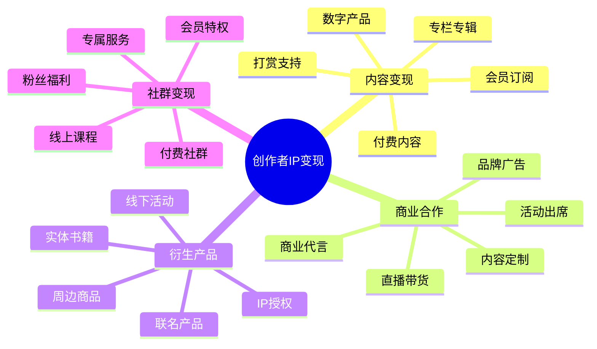

# 创作者IP变现指南

创作者IP变现是将内容创作能力和粉丝影响力转化为持续性收入的系统方法。本指南将帮助内容创作者构建多元化的变现模式。

## 创作者IP变现公式

**创作变现价值 = 内容价值 × 粉丝规模 × 粉丝粘性 × 商业转化率**

## 变现模式分析

### 1. 内容直接变现

| 变现形式 | 适合创作者 | 投入资源 | 收益周期 | 规模潜力 |
|---------|---------|---------|---------|---------|
| 会员订阅 | 持续输出的创作者 | 高(持续创作) | 长期稳定 | 高 |
| 付费内容 | 有深度内容的专业创作者 | 中(单次创作) | 中长期 | 中高 |
| 数字产品 | 实用内容创作者 | 高(一次开发) | 长期 | 高 |
| 打赏支持 | 情感连接强的创作者 | 低(维护关系) | 不稳定 | 低 |
| 专栏专辑 | 系统化内容创作者 | 高(系统创作) | 中期 | 中 |

### 2. 商业合作变现

| 合作类型 | 核心价值 | 定价策略 | 依赖因素 | 可持续性 |
|---------|---------|---------|---------|---------|
| 品牌广告 | 曝光和背书 | 按曝光量/互动量 | 粉丝规模和质量 | 中 |
| 商业代言 | 形象和影响力 | 固定费+分成 | 个人形象匹配度 | 高 |
| 内容定制 | 创意和制作能力 | 项目计费 | 创作专业度 | 中 |
| 活动出席 | 号召力和现场表现 | 出场费+差旅 | 知名度和表现力 | 中 |
| 直播带货 | 转化能力 | 基础费+销售提成 | 粉丝购买力 | 中低 |

### 3. 衍生产品变现

| 产品类型 | 目标用户 | 开发周期 | 投入成本 | 收益模式 |
|---------|---------|---------|---------|---------|
| 周边商品 | 核心粉丝 | 短期 | 中(设计+生产) | 直接销售 |
| 联名产品 | 粉丝+品牌用户 | 中期 | 低(合作开发) | 销售分成 |
| IP授权 | 企业客户 | 长期 | 低(授权管理) | 授权费+提成 |
| 实体书籍 | 广泛读者 | 长期 | 高(创作+出版) | 版税 |
| 线下活动 | 本地粉丝 | 短期 | 高(场地+运营) | 门票+周边 |

## 产品服务设计

### 1. 内容产品矩阵

- **免费内容**：日常分享、基础知识、互动内容
- **低门槛付费**：深度解析、实用指南、专题内容
- **中等付费**：系统课程、专业工具、解决方案
- **高端付费**：私享内容、定制服务、专属社群

### 2. 商业合作矩阵

- **基础合作**：内容植入、简单推广、平台任务
- **深度合作**：内容定制、系列推广、品牌大使
- **战略合作**：长期代言、联名产品、共创项目
- **资源合作**：股权合作、品牌共建、生态共创

### 3. 粉丝服务矩阵

- **普通粉丝**：免费内容、互动参与、基础社群
- **付费粉丝**：专属内容、优先回复、会员福利
- **核心粉丝**：线下见面、定制服务、共创机会
- **商业粉丝**：资源对接、商业合作、投资机会

## 定价策略

### 1. 内容产品定价

| 产品类型 | 定价区间 | 定价因素 | 优化策略 |
|---------|---------|---------|---------|
| 单篇付费 | ¥5-99 | 内容深度、独特性 | 系列打包、限时优惠 |
| 会员订阅 | ¥15-199/月 | 更新频率、内容质量 | 年付折扣、阶梯权益 |
| 数字课程 | ¥99-1999 | 专业度、系统性 | 早鸟价、分销激励 |
| 专属社群 | ¥99-999/月 | 社群资源、互动价值 | 终身会员、特权升级 |

### 2. 商业合作定价

| 合作类型 | 定价模式 | 价格区间 | 提升策略 |
|---------|---------|---------|---------|
| 内容植入 | 单次计费 | ¥2000-50000/次 | 互动承诺、效果保障 |
| 品牌代言 | 长期合作 | ¥5万-100万/年 | 多平台露出、深度合作 |
| 直播带货 | 基础费+提成 | 基础费+5%-30%提成 | 销售目标、独家优惠 |
| 定制内容 | 项目计费 | ¥5000-10万/项目 | 创意策划、版权增值 |

### 3. 衍生产品定价

| 产品类型 | 定价模式 | 价格策略 | 增长方法 |
|---------|---------|---------|---------|
| 实体周边 | 单品定价 | 成本×3-5倍 | 限量版、签名版、套装 |
| IP授权 | 授权费+分成 | 行业标准+销售分成 | 独家期限、使用范围 |
| 线下活动 | 分级票价 | ¥99-999/人 | VIP体验、专属福利 |
| 联名产品 | 产品定价+溢价 | 市场定位+IP溢价 | 限量发售、粉丝专享 |

## 变现路径规划

### 1. 起步阶段 (0-1万粉丝)

- **核心目标**：内容积累，粉丝培养
- **变现方式**：
  - 平台激励计划和流量分成
  - 小型商业推广和内容合作
  - 数字小产品和工具销售
  - 粉丝打赏和小额支持
- **投入重点**：内容质量提升，粉丝互动深化

### 2. 成长阶段 (1万-10万粉丝)

- **核心目标**：商业模式测试，变现渠道拓展
- **变现方式**：
  - 会员订阅和付费内容
  - 品牌合作和商业推广
  - 小型周边和数字产品
  - 社群运营和增值服务
- **投入重点**：产品体系建设，商业合作流程优化

### 3. 成熟阶段 (10万+粉丝)

- **核心目标**：商业体系完善，规模化收益
- **变现方式**：
  - 系统化内容产品矩阵
  - 战略级品牌合作和代言
  - IP授权和衍生品开发
  - 线上线下活动和体验
- **投入重点**：团队建设，品牌塑造，多元业务协同

## 案例分析

### 案例1：从内容创作者到知识IP

**人物**：生活方式博主
**起点**：社交平台日常分享
**路径**：
1. 通过高质量生活方式内容积累粉丝
2. 推出付费专栏和实用指南
3. 开发线上课程和会员社群
4. 接受品牌合作和商业代言
5. 推出实体书籍和周边产品

**成果**：月收入突破10万，建立个人生活方式品牌

### 案例2：从视频创作者到商业IP

**人物**：垂直领域视频创作者
**起点**：短视频平台专业内容
**路径**：
1. 创作专业领域高质量视频内容
2. 通过平台分成和广告获得初步收入
3. 开发数字产品和在线课程
4. 建立会员制和专属社群
5. 推出IP授权和联名产品

**成果**：建立完整商业体系，年收入百万以上

## 变现工具与资源

- **内容平台**：微信公众号、B站、抖音、小红书、知识星球
- **电商工具**：有赞、小鹅通、泡泡玛特IP、淘宝店铺
- **支付工具**：微信支付、支付宝、PayPal、Stripe
- **社群工具**：微信群、Discord、飞书、Notion

## 常见问题与解决方案

### 1. 商业与创作平衡

- **问题**：过度商业化可能损害内容真实性和粉丝信任
- **解决方案**：
  - 明确区分商业内容和原创内容
  - 选择与个人调性匹配的商业合作
  - 保持内容的真实性和价值输出
  - 商业合作透明化，尊重粉丝感受

### 2. 多元变现与精力分配

- **问题**：变现渠道过多导致精力分散，影响内容质量
- **解决方案**：
  - 根据发展阶段聚焦核心变现渠道
  - 建立团队分担不同变现业务
  - 设计自动化和系统化的变现流程
  - 定期评估各渠道ROI，优化资源分配

### 3. 平台依赖与风险控制

- **问题**：过度依赖单一平台带来政策和流量风险
- **解决方案**：
  - 构建多平台内容矩阵
  - 建立自有平台和私域流量池
  - 开发平台无关的收入来源
  - 保持内容和商业模式的适应性

## 下一步

完成创作者IP变现规划后，建议结合[IP定位](../position/04-creator.md)和[IP运营](../operation/04-creator.md)章节，构建完整的创作者IP商业体系。 