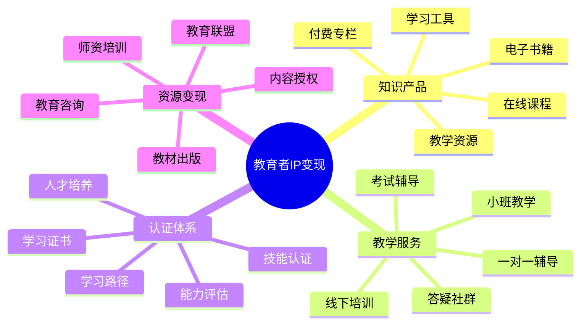

# 教育者IP变现指南

教育者IP变现是将教育专长和知识体系转化为持续性收入的系统方法。本指南将帮助教育者构建多元化的变现模式。

## 教育者IP变现公式

**教育变现价值 = 知识深度 × 教学能力 × 学习体验 × 学员转化率**

## 变现模式分析

### 1. 知识产品变现

| 变现形式 | 适合教育者 | 投入资源 | 收益周期 | 规模潜力 |
|---------|---------|---------|---------|---------|
| 在线课程 | 系统化教学的专家 | 高(内容制作) | 长期 | 高 |
| 付费专栏 | 文字表达能力强的教育者 | 中(连续创作) | 中期 | 中 |
| 电子书籍 | 知识体系完整的专家 | 高(一次性) | 长期 | 中 |
| 学习工具 | 实用方法论创造者 | 高(开发) | 长期 | 高 |
| 教学资源 | 一线教育工作者 | 中(整理优化) | 中长期 | 中 |

### 2. 教学服务变现

| 服务类型 | 核心价值 | 定价策略 | 时间投入 | 边际效应 |
|---------|---------|---------|---------|---------|
| 线下培训 | 沉浸式学习体验 | 人天/课时计费 | 高 | 中 |
| 一对一辅导 | 个性化指导和反馈 | 小时计费/包月 | 高 | 低 |
| 小班教学 | 互动学习和同伴效应 | 课程包/学期制 | 中 | 中高 |
| 答疑社群 | 持续支持和问题解决 | 会员制/包月 | 中 | 高 |
| 考试辅导 | 针对性备考和提分 | 目标制/阶段制 | 中高 | 中 |

### 3. 认证体系变现

| 认证类型 | 目标学员 | 开发周期 | 维护成本 | 收入模式 |
|---------|---------|---------|---------|---------|
| 技能认证 | 职业发展者 | 长期 | 中 | 考试费/认证费 |
| 学习证书 | 求职者/爱好者 | 中期 | 低 | 课程+证书费 |
| 能力评估 | 企业/个人 | 中期 | 中 | 评估服务费 |
| 学习路径 | 系统学习者 | 长期 | 高 | 阶段课程包 |
| 人才培养 | 企业/机构 | 长期 | 高 | 项目制/年度合作 |

## 产品服务设计

### 1. 知识产品矩阵

- **入门级**：基础课程、入门指南、概念解析
- **进阶级**：专题课程、实战案例、技能提升
- **专家级**：系统课程、方法论、高阶技能
- **定制级**：企业内训、团队培养、专属课程

### 2. 教学服务矩阵

- **大众服务**：公开课、线上答疑、学习社群
- **进阶服务**：小班课程、主题工作坊、集训营
- **高端服务**：一对一辅导、私教计划、导师制
- **机构服务**：企业培训、校企合作、机构赋能

### 3. 学习体系矩阵

- **知识地图**：学科体系、能力框架、学习路径
- **学习工具**：方法论、模板、辅助工具
- **评估系统**：测试题库、能力评估、学习反馈
- **认证体系**：等级证书、技能认证、人才标准

## 定价策略

### 1. 知识产品定价

| 产品类型 | 定价区间 | 定价因素 | 优化策略 |
|---------|---------|---------|---------|
| 入门课程 | ¥99-499 | 基础性、普及度 | 低价引流、套餐优惠 |
| 专业课程 | ¥499-1999 | 专业度、实用性 | 分期付款、阶段解锁 |
| 系统课程 | ¥1999-9999 | 系统性、完整度 | 早鸟价、学习保障 |
| 企业定制 | 1-10万/项目 | 定制度、规模 | 长期合作、增值服务 |

### 2. 教学服务定价

| 服务类型 | 定价模式 | 价格区间 | 提升策略 |
|---------|---------|---------|---------|
| 小班课程 | 课时计费 | ¥100-500/课时 | 班级规模、互动设计 |
| 一对一辅导 | 小时计费 | ¥300-2000/小时 | 导师级别、服务深度 |
| 答疑社群 | 会员制 | ¥99-499/月 | 互动频率、资源丰富度 |
| 集训营 | 项目制 | ¥3000-20000/期 | 强化效果、就业保障 |

### 3. 认证体系定价

| 认证类型 | 定价模式 | 价格策略 | 增长方法 |
|---------|---------|---------|---------|
| 技能证书 | 等级制 | 基础¥299-高级¥1999 | 等级递进、权威背书 |
| 能力评估 | 服务制 | ¥500-5000/次 | 报告深度、应用价值 |
| 学习路径 | 包年制 | ¥999-9999/年 | 全程指导、目标保障 |
| 人才培养 | 项目制 | 3-30万/项目 | 定制方案、成果导向 |

## 变现路径规划

### 1. 起步阶段 (0-1000学员)

- **核心目标**：建立教学信誉，积累初始学员
- **变现方式**：
  - 小型线上课程或讲座
  - 一对一辅导和答疑服务
  - 教学资源和工具开发
  - 平台合作课程
- **投入重点**：教学内容打磨，学习体验优化

### 2. 成长阶段 (1000-1万学员)

- **核心目标**：扩大影响力，测试产品模式
- **变现方式**：
  - 系统化课程和学习路径
  - 小班教学和集训营
  - 会员制学习社群
  - 初级认证和评估服务
- **投入重点**：产品体系建设，教学流程优化

### 3. 成熟阶段 (1万+学员)

- **核心目标**：建立教育品牌，实现规模化收益
- **变现方式**：
  - 完整的课程产品矩阵
  - 认证体系和人才标准
  - 企业培训和机构合作
  - 教育内容授权和输出
- **投入重点**：团队建设，品牌塑造，多元业务协同

## 案例分析

### 案例1：从教师到教育IP

**人物**：资深学科教师
**起点**：线下教学经验和方法论
**路径**：
1. 整理教学方法形成独特教学体系
2. 开发线上课程和学习资料
3. 建立学习社群和辅导体系
4. 推出完整的学习路径和认证
5. 发展教师培训和机构合作

**成果**：年收入突破百万，建立个人教育品牌

### 案例2：从专家到知识IP

**人物**：行业专业人士
**起点**：专业知识和实战经验
**路径**：
1. 将专业知识系统化形成课程
2. 通过平台合作扩大影响力
3. 开发实战训练营和认证项目
4. 建立专业社群和高端辅导
5. 推出企业培训和咨询服务

**成果**：从专业人士转型为教育者，收入倍增

## 变现工具与资源

- **课程平台**：腾讯课堂、网易云课堂、Udemy、Coursera
- **社群工具**：微信群、知识星球、飞书、Slack
- **内容工具**：幕布、Notion、PPT、Camtasia
- **支付系统**：小鹅通、有赞、PayPal、Stripe

## 常见问题与解决方案

### 1. 教学质量与规模平衡

- **问题**：扩大规模可能导致教学质量和体验下降
- **解决方案**：
  - 建立标准化教学流程和质量控制
  - 开发自动化学习工具和辅助系统
  - 培养助教团队分担教学和服务
  - 设计分层教学体系满足不同需求

### 2. 知识更新与内容维护

- **问题**：知识快速迭代，课程内容需要持续更新
- **解决方案**：
  - 设计模块化课程结构便于更新
  - 建立知识更新机制和版本管理
  - 提供终身学习支持和内容更新
  - 发展社区共创模式分担更新压力

### 3. 教育价值与商业平衡

- **问题**：过度商业化可能影响教育初心和公信力
- **解决方案**：
  - 保持部分免费内容和公益教育
  - 建立透明的价值传递和期望管理
  - 设计合理的价格体系和助学政策
  - 将商业成功与学员成长紧密关联

## 下一步

完成教育者IP变现规划后，建议结合[IP定位](../position/05-educator.md)和[IP运营](../operation/05-educator.md)章节，构建完整的教育者IP商业体系。 