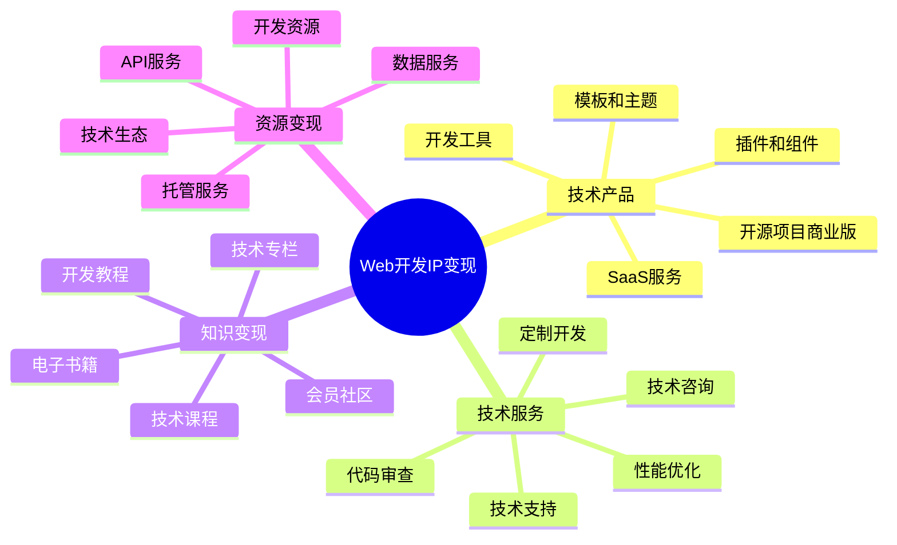

# Web开发IP变现指南

Web开发IP变现是将技术专长、开发经验和代码资产转化为持续性收入的系统方法。本指南将帮助Web开发者构建多元化的变现模式。

## Web开发IP变现公式

**技术变现价值 = 技术深度 × 解决方案质量 × 用户规模 × 商业模式效率**

## 变现模式分析

### 1. 技术产品变现

| 产品形式 | 适合开发者 | 开发周期 | 维护成本 | 规模潜力 |
|---------|---------|---------|---------|---------|
| 开源项目商业版 | 有成熟开源项目的开发者 | 中长期 | 高 | 高 |
| SaaS服务 | 解决方案型开发者 | 长期 | 高 | 极高 |
| 插件和组件 | 专注特定技术栈的开发者 | 短中期 | 中 | 中高 |
| 模板和主题 | 前端和设计能力强的开发者 | 短期 | 低中 | 中 |
| 开发工具 | 工程效率专家 | 中期 | 中 | 高 |

### 2. 技术服务变现

| 服务类型 | 核心价值 | 定价策略 | 时间投入 | 边际效应 |
|---------|---------|---------|---------|---------|
| 定制开发 | 专属解决方案 | 项目制/人天 | 高 | 低 |
| 技术咨询 | 专业建议和决策支持 | 小时计费/包月 | 中 | 中 |
| 代码审查 | 质量保障和优化 | 项目制/代码量 | 中 | 中 |
| 性能优化 | 系统效率提升 | 效果计费/项目制 | 中高 | 中 |
| 技术支持 | 问题解决和维护 | 包月/年度合同 | 中 | 高 |

### 3. 知识变现

| 内容形式 | 目标受众 | 创作周期 | 更新频率 | 收入模式 |
|---------|---------|---------|---------|---------|
| 技术课程 | 学习者/转行者 | 长期 | 中低 | 一次性/订阅 |
| 开发教程 | 实践者/自学者 | 中期 | 中 | 免费+增值 |
| 技术专栏 | 持续学习者 | 中长期 | 高 | 订阅制 |
| 电子书籍 | 系统学习者 | 长期 | 低 | 一次性 |
| 会员社区 | 深度学习者 | 持续 | 高 | 会员制 |

## 产品服务设计

### 1. 技术产品矩阵

- **基础级**：开源工具、小型插件、基础模板
- **进阶级**：高级组件、专业模板、功能扩展
- **专业级**：完整解决方案、SaaS服务、企业工具
- **定制级**：专属开发、企业定制、技术生态

### 2. 技术服务矩阵

- **入门服务**：代码诊断、问题解答、简单优化
- **标准服务**：项目开发、技术迁移、性能优化
- **高级服务**：架构设计、技术咨询、团队培训
- **战略服务**：技术规划、数字转型、技术合伙

### 3. 知识产品矩阵

- **入门知识**：基础教程、概念解析、工具指南
- **实战知识**：项目实战、问题解决、最佳实践
- **进阶知识**：高级技术、架构设计、性能优化
- **前沿知识**：新技术探索、趋势分析、实验性技术

## 定价策略

### 1. 技术产品定价

| 产品类型 | 定价模式 | 价格区间 | 优化策略 |
|---------|---------|---------|---------|
| 开源商业版 | 订阅制 | ¥99-999/月 | 功能分层、规模定价 |
| SaaS服务 | 阶梯订阅 | ¥199-9999/月 | 用量计费、增值服务 |
| 插件组件 | 一次性/订阅 | ¥99-999/个 | 捆绑销售、生态整合 |
| 模板主题 | 一次性 | ¥99-599/套 | 差异化定价、定制选项 |
| 开发工具 | 混合模式 | ¥199-1999/年 | 免费增值、团队版本 |

### 2. 技术服务定价

| 服务类型 | 定价模式 | 价格区间 | 提升策略 |
|---------|---------|---------|---------|
| 定制开发 | 项目制 | 1-50万/项目 | 价值定价、长期合作 |
| 技术咨询 | 时间制 | ¥500-2000/小时 | 专业分级、包月优惠 |
| 代码审查 | 代码量/复杂度 | ¥5000-3万/次 | 报告深度、问题价值 |
| 性能优化 | 基础费+效果费 | ¥1-10万/项目 | 效果承诺、数据证明 |
| 技术支持 | 服务级别 | ¥2000-2万/月 | 响应速度、服务范围 |

### 3. 知识产品定价

| 内容类型 | 定价模式 | 价格策略 | 增长方法 |
|---------|---------|---------|---------|
| 技术课程 | 一次性/会员 | ¥199-2999/课程 | 系列课程、学习路径 |
| 开发教程 | 免费+增值 | 免费+¥99-499/月 | 深度内容、独家资源 |
| 技术专栏 | 订阅制 | ¥99-299/月 | 持续更新、互动答疑 |
| 电子书籍 | 一次性 | ¥39-199/本 | 系列丛书、更新服务 |
| 会员社区 | 会员制 | ¥199-999/年 | 专属内容、人脉价值 |

## 变现路径规划

### 1. 起步阶段 (0-1000粉丝)

- **核心目标**：建立技术信誉，积累初始用户
- **变现方式**：
  - 小型插件和组件销售
  - 基础技术咨询和服务
  - 技术博客和教程创作
  - 平台合作和技术分享
- **投入重点**：技术能力展示，解决方案打磨

### 2. 成长阶段 (1000-1万粉丝)

- **核心目标**：扩大影响力，测试商业模式
- **变现方式**：
  - 成熟产品和SaaS服务
  - 专业技术咨询和培训
  - 系统课程和会员社区
  - 技术合作和生态建设
- **投入重点**：产品体系建设，服务流程优化

### 3. 成熟阶段 (1万+粉丝)

- **核心目标**：建立技术品牌，实现规模化收益
- **变现方式**：
  - 完整的产品和服务矩阵
  - 企业级解决方案和咨询
  - 技术社区和生态系统
  - 投资和战略合作
- **投入重点**：团队建设，品牌塑造，多元业务协同

## 案例分析

### 案例1：从开发者到产品创始人

**人物**：全栈开发者
**起点**：开源项目和技术博客
**路径**：
1. 开发开源工具解决行业痛点
2. 通过技术博客和分享扩大影响
3. 推出开源项目的商业版和SaaS服务
4. 建立技术社区和生态系统
5. 发展企业级解决方案和服务

**成果**：从个人开发者成长为科技创业者，年收入百万以上

### 案例2：从程序员到技术教育者

**人物**：资深Web开发者
**起点**：丰富的项目经验和技术积累
**路径**：
1. 整理开发经验形成技术教程
2. 通过技术分享建立个人品牌
3. 开发实战课程和学习体系
4. 建立技术社区和高端培训
5. 推出企业培训和咨询服务

**成果**：从程序员转型为技术教育者，收入倍增

## 变现工具与资源

- **产品平台**：GitHub Marketplace、WordPress插件市场、NPM、Docker Hub
- **服务平台**：Upwork、Toptal、Fiverr、码市
- **内容平台**：掘金、InfoQ、Medium、Dev.to
- **支付系统**：Stripe、PayPal、Gumroad、爱发电

## 常见问题与解决方案

### 1. 技术更新与产品维护

- **问题**：技术快速迭代，产品需要持续更新维护
- **解决方案**：
  - 采用模块化和可扩展架构
  - 建立自动化测试和持续集成
  - 明确维护周期和版本规划
  - 培养核心用户社区共同维护

### 2. 时间分配与精力平衡

- **问题**：产品开发、服务交付和内容创作需要大量时间
- **解决方案**：
  - 建立优先级系统，聚焦核心价值
  - 开发自动化工具提高效率
  - 逐步组建团队分担工作
  - 设计可复用的流程和资源

### 3. 技术深度与商业化平衡

- **问题**：过度商业化可能影响技术信誉和社区认可
- **解决方案**：
  - 保持开源贡献和技术分享
  - 清晰区分免费版和商业版边界
  - 以解决问题为核心进行商业化
  - 将商业成功回馈到技术社区

## 下一步

完成Web开发IP变现规划后，建议结合[IP定位](../position/06-web.md)和[IP运营](../operation/06-web.md)章节，构建完整的Web开发IP商业体系。 