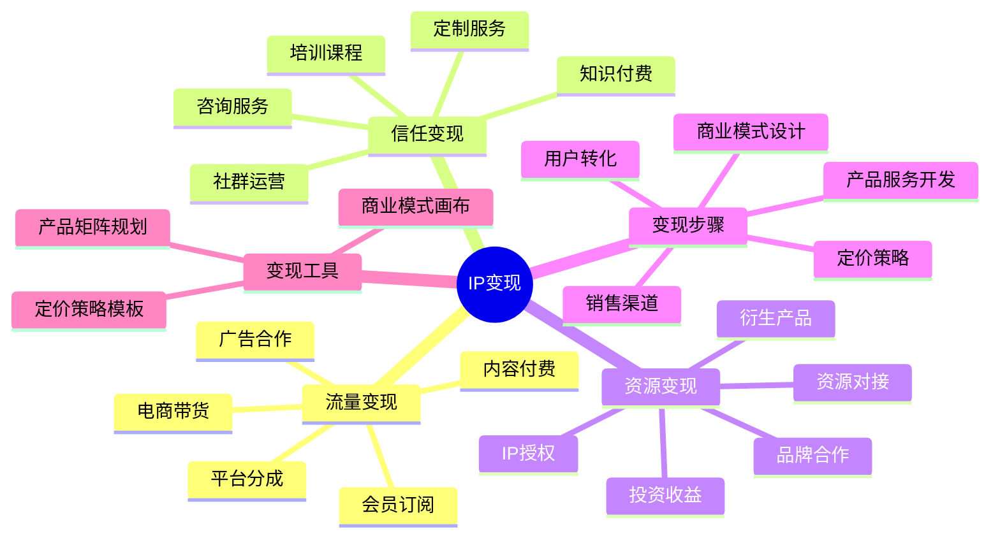

# IP变现路径

IP变现是将个人影响力转化为商业价值的关键环节，通过系统化变现策略可以实现多元化收入来源。本章节将帮助你掌握高效的IP变现方法。

## 变现公式

**商业价值 = 流量规模 × 信任深度 × 变现效率**

## 变现步骤

1. **商业模式设计**：根据IP定位选择最适合的变现模式
2. **产品服务开发**：设计符合用户需求的产品或服务
3. **定价策略**：制定合理的价格体系和销售策略
4. **销售渠道**：建立高效的销售和交付系统
5. **用户转化**：优化从免费用户到付费用户的转化路径

## 变现类型

- [程序员IP变现](./01-coder.md) - 技术课程、开发服务、技术咨询
- [设计师IP变现](./02-designer.md) - 设计作品、创意服务、设计资源
- [职场人IP变现](./03-professional.md) - 职业咨询、培训课程、企业服务
- [创作者IP变现](./04-creator.md) - 内容付费、品牌合作、粉丝经济
- [教育者IP变现](./05-educator.md) - 知识付费、教育产品、认证体系
- [Web开发IP变现](./06-web.md) - 开源商业化、技术服务、开发工具

## 变现工具

- [商业模式画布](./tools/business-model-canvas.md) - 设计完整的IP商业模式
- [产品矩阵规划](./tools/product-matrix.md) - 构建多层次产品服务体系
- [定价策略模板](./tools/pricing-strategy.md) - 制定科学的产品定价方案

## 变现案例

查看[成功IP变现案例](../cases/monetize-cases.md)获取灵感和参考。

## 下一步

完成变现规划后，恭喜你已经掌握了从IP定位、内容创作、运营到变现的完整体系。现在可以回到[首页](../index.md)查看更多资源，或开始实践你的IP打造计划。 