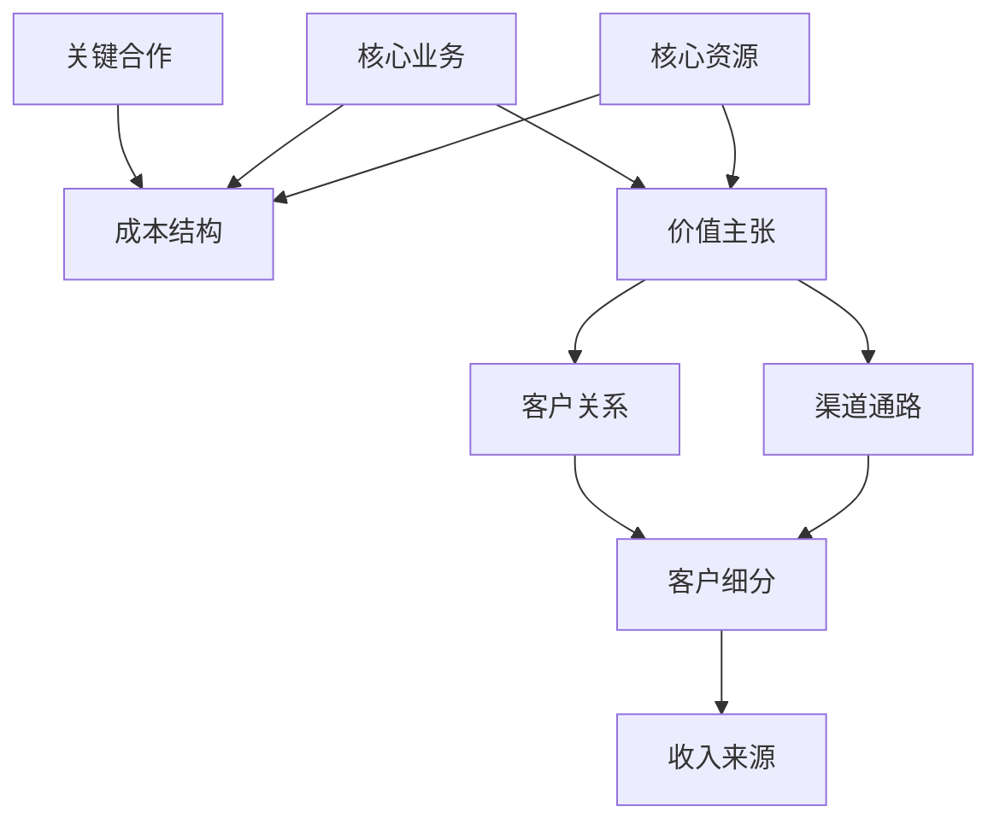

# 商业模式画布

商业模式画布是一种战略管理工具，帮助IP创作者系统化规划商业模式。通过九大核心要素的分析，你可以清晰地构建IP变现的完整商业逻辑。

## 画布九要素

## 如何使用

### 1. 客户细分

- **目标用户是谁？** - 明确你的IP服务的核心用户群体
- **用户画像** - 描述用户的人口统计特征、行为特征和心理特征
- **用户分层** - 将用户按照不同需求和支付能力进行分层

### 2. 价值主张

- **你解决了什么问题？** - 明确你的IP为用户解决的核心问题
- **你提供什么价值？** - 描述你的IP为用户带来的独特价值
- **差异化优势** - 与竞争对手相比，你的独特优势是什么

### 3. 渠道通路

- **如何触达用户？** - 列出所有可能的用户触达渠道
- **渠道效率分析** - 评估各渠道的获客成本和转化效率
- **渠道整合策略** - 如何整合多渠道形成协同效应

### 4. 客户关系

- **互动方式** - 与用户建立什么样的互动关系
- **用户生命周期** - 从获取、转化到留存的全周期管理
- **社群运营策略** - 如何通过社群深化用户关系

### 5. 收入来源

- **收入模式** - 一次性付费、订阅制、会员制等
- **定价策略** - 价格定位、梯度定价、促销策略
- **收入多元化** - 构建多元化收入来源降低风险

### 6. 核心资源

- **IP资源** - 你拥有的核心IP资源和能力
- **团队资源** - 执行团队的核心能力
- **技术资源** - 支持IP变现的技术基础设施

### 7. 核心业务

- **内容创作** - 持续产出高质量内容的机制
- **产品开发** - 将IP转化为产品的开发流程
- **用户服务** - 为用户提供持续价值的服务体系

### 8. 关键合作

- **内容合作** - 与其他创作者的合作关系
- **渠道合作** - 与平台和分发渠道的合作
- **供应商** - 支持IP变现的关键供应商

### 9. 成本结构

- **固定成本** - 维持IP运营的基础成本
- **可变成本** - 随业务规模变化的成本
- **规模经济** - 如何通过规模效应降低边际成本

## 画布模板

| 关键合作 | 核心业务 | 价值主张 | 客户关系 | 客户细分 |
|---------|---------|---------|---------|---------|
| • 内容合作 • 渠道合作 • 技术支持 | • 内容创作 • 产品开发 • 用户服务 | • 核心价值 • 问题解决 • 差异化优势 | • 互动方式 • 用户生命周期 • 社群运营 | • 目标用户 • 用户画像 • 用户分层 |
| **核心资源** | | | **渠道通路** | |
| • IP资源 • 团队资源 • 技术资源 | | | • 内容平台 • 社交媒体 • 私域流量 | |
| **成本结构** | | | **收入来源** | |
| • 内容制作成本 • 营销推广成本 • 团队运营成本 | | | • 内容付费 • 会员订阅 • 咨询服务 • 品牌合作 | |

## 应用案例

以技术博主为例：

- **客户细分**：前端开发者、初级程序员、技术管理者
- **价值主张**：简化复杂技术概念，提供实用开发技巧
- **收入来源**：技术课程、咨询服务、开发工具订阅

## 下一步

完成商业模式画布后，建议进一步规划[产品矩阵](./product-matrix.md)和[定价策略](./pricing-strategy.md)，形成完整的IP变现体系。 