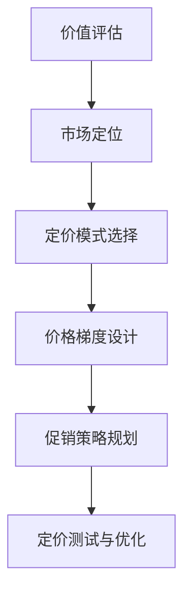

# 定价策略模板

科学的定价策略是IP变现成功的关键因素，合理的价格不仅能最大化收入，还能传递正确的价值信号，吸引理想客户。本文提供系统化的IP产品定价方法论。

## 定价策略框架

## 定价基本原则

1. **价值导向定价**：基于提供的价值而非成本定价
2. **差异化定价**：针对不同用户群体采用不同价格策略
3. **心理价格点**：利用价格心理学设置有吸引力的价格点
4. **价格一致性**：在产品矩阵中保持价格逻辑一致性
5. **定价灵活性**：保留调整价格的灵活性和空间

## 定价策略类型

### 1. 价值导向定价

- **核心思想**：基于产品为用户创造的价值定价
- **适用场景**：高价值、差异化明显的产品或服务
- **实施方法**：
  - 量化产品为用户创造的价值
  - 设定价格为创造价值的10%-30%
  - 通过案例证明投资回报率

### 2. 竞争导向定价

- **核心思想**：参考竞品价格，结合自身优势定价
- **适用场景**：市场竞争激烈，产品差异化不明显
- **实施方法**：
  - 全面分析竞品价格策略
  - 根据差异化程度定位价格区间
  - 通过附加价值提升竞争力

### 3. 渗透定价

- **核心思想**：以较低价格快速获取市场份额
- **适用场景**：新产品上市，需要快速建立用户基础
- **实施方法**：
  - 设置有吸引力的入门价格
  - 通过大量用户摊薄固定成本
  - 后期通过增值服务提升收入

### 4. 撇脂定价

- **核心思想**：以高价格获取高利润，后逐步降价
- **适用场景**：创新产品，有早期愿意高价购买的用户
- **实施方法**：
  - 初期设置较高价格
  - 吸引高价值早期采用者
  - 随时间推移逐步降低价格

### 5. 订阅定价

- **核心思想**：通过持续订阅获取稳定收入
- **适用场景**：内容更新频繁，提供持续价值的产品
- **实施方法**：
  - 设计月度/年度订阅方案
  - 提供年付优惠激励长期订阅
  - 通过持续提供价值降低取消率

## 价格梯度设计

### 基础三档价格模型

| 价格档位 | 价格比例 | 目标用户 | 产品特点 |
|---------|---------|---------|---------|
| **基础版** | 1x | 价格敏感用户 尝试用户 | 核心功能 基础支持 标准体验 |
| **专业版** | 2x-3x | 核心用户 专业用户 | 全部功能 优先支持 增强体验 |
| **旗舰版** | 5x-10x | 高端用户 企业用户 | 专属功能 VIP服务 定制体验 |

### 价格锚定技巧

1. **三选二策略**：提供三个价格选项，引导用户选择中间价格
2. **对比锚定**：通过高价产品衬托中价产品的价值
3. **价值堆叠**：清晰展示高价版本的附加价值
4. **限量版效应**：通过限量高端版本提升感知价值

## 促销策略设计

### 1. 时间限制促销

- **首发优惠**：新产品上市特惠价格
- **限时折扣**：特定时间段的价格优惠
- **倒计时策略**：设置明确截止时间制造紧迫感

### 2. 数量限制促销

- **限量版**：限制产品数量提升稀缺性
- **名额限制**：限制购买名额创造竞争感
- **阶梯定价**：早期购买者获得更低价格

### 3. 捆绑促销

- **产品捆绑**：多个产品组合销售提供折扣
- **增值捆绑**：主产品+增值服务的组合
- **交叉捆绑**：不同类型产品的组合销售

### 4. 会员专属促销

- **会员价格**：会员专享价格优惠
- **会员早鸟**：会员提前购买权益
- **会员专属**：仅对会员开放的特殊版本

## 定价心理学应用

1. **尾数定价**：使用.99或.97等尾数降低价格感知
2. **价格简化**：对高端产品使用整数价格提升品质感
3. **视觉呈现**：减小价格字体，放大价值描述
4. **分解定价**：将总价分解为"每天仅需X元"
5. **对比框架**：与日常消费品对比突出性价比

## 定价测试方法

1. **A/B测试**：测试不同价格对转化率的影响
2. **调查问卷**：收集目标用户对价格的接受度
3. **阶梯测试**：逐步提高价格测试最佳价格点
4. **付费意愿分析**：分析不同用户群体的付费意愿
5. **竞品分析**：持续监测竞品价格变化

## 定价策略模板

### 产品定价计划表

| 定价要素 | 描述 |
|---------|------|
| **产品名称** | [产品名称] |
| **目标用户** | [主要目标用户群体] |
| **核心价值** | [产品提供的核心价值] |
| **竞品价格** | [主要竞品的价格区间] |
| **定价策略** | [采用的主要定价策略] |
| **价格档位** | 基础版: ¥[价格] 专业版: ¥[价格] 旗舰版: ¥[价格] |
| **促销计划** | [计划采用的促销策略] |
| **价格测试** | [价格测试方法和指标] |

## 定价案例分析

以在线课程为例：

- **基础版**：¥199，包含核心课程内容和基础社群
- **专业版**：¥599，增加习题解析、案例分析和答疑服务
- **旗舰版**：¥1999，增加1对1辅导、项目点评和就业指导

## 下一步

完成定价策略后，建议结合[商业模式画布](./business-model-canvas.md)和[产品矩阵规划](./product-matrix.md)，形成完整的IP变现体系。定期回顾和优化定价策略，确保与市场变化和用户需求保持一致。 