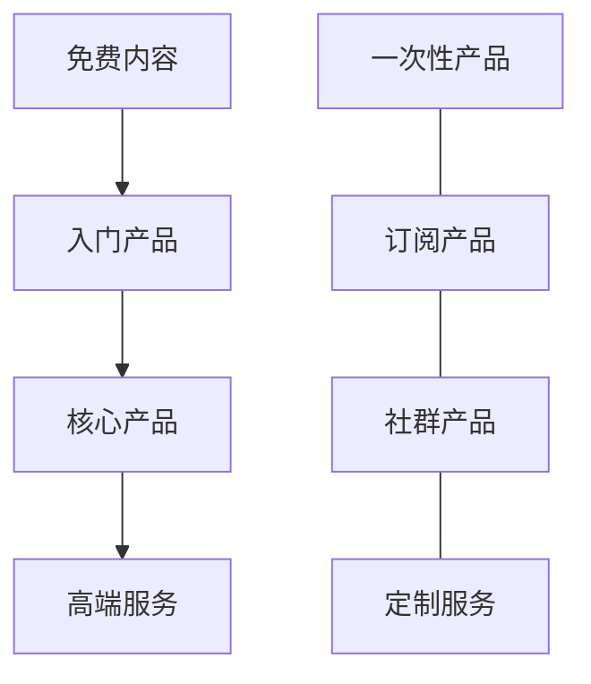

# 产品矩阵规划

产品矩阵是IP变现的核心框架，通过构建多层次、多类型的产品服务体系，可以满足不同用户需求，实现IP价值最大化。

## 产品矩阵模型

## 产品层级设计

### 1. 免费内容层

- **目的**：扩大影响力，吸引目标用户
- **形式**：博客文章、短视频、公开课、开源项目
- **特点**：高质量、高频率、易传播
- **转化路径**：引导用户关注、订阅、进入付费渠道

### 2. 入门产品层

- **目的**：实现用户首次付费转化
- **形式**：电子书、迷你课程、工具包、模板
- **价格区间**：¥9-99
- **特点**：低门槛、高性价比、即买即用
- **转化路径**：通过高满意度引导升级更高价值产品

### 3. 核心产品层

- **目的**：提供系统化解决方案，实现主要收入
- **形式**：系统课程、会员订阅、软件服务
- **价格区间**：¥199-999
- **特点**：系统性、持续价值、品质保证
- **转化路径**：通过深度服务建立信任，引导高端转化

### 4. 高端服务层

- **目的**：满足高价值用户需求，提升客单价
- **形式**：1对1咨询、定制方案、闭门社群
- **价格区间**：¥1999以上
- **特点**：高度个性化、深度服务、稀缺性
- **转化路径**：打造口碑，吸引更多高端客户

## 产品类型矩阵

### 1. 内容型产品

- **电子书/出版物**：系统化知识内容
- **音视频课程**：系统化学习体验
- **会员专栏**：持续更新的优质内容

### 2. 工具型产品

- **模板/资源包**：即用型解决方案
- **软件/插件**：提升效率的工具
- **在线应用**：解决特定问题的应用

### 3. 服务型产品

- **咨询服务**：专业问题解答
- **定制方案**：个性化解决方案
- **代理执行**：全流程问题解决

### 4. 社群型产品

- **学习社群**：共同学习成长
- **mastermind小组**：高端互助圈子
- **会员俱乐部**：特权服务与资源

## 产品矩阵规划表

| 产品层级 | 内容型产品 | 工具型产品 | 服务型产品 | 社群型产品 |
|---------|----------|----------|----------|----------|
| **免费层** | 博客文章 公开视频 | 免费工具 基础模板 | 公开问答 直播分享 | 公开社区 兴趣小组 |
| **入门层** | 电子书 迷你课程 | 工具包 资源库 | 单次咨询 问题诊断 | 学习小组 活动参与 |
| **核心层** | 系统课程 专业培训 | 高级工具 软件订阅 | 方案定制 项目辅导 | 核心社群 会员社区 |
| **高端层** | 私教课程 内部资料 | 企业级解决方案 | 1对1咨询 全程陪跑 | 高端圈子 闭门会议 |

## 产品矩阵案例

以设计师IP为例：

- **免费层**：设计教程博客、设计趋势分析视频
- **入门层**：设计模板包(¥49)、配色方案集(¥29)
- **核心层**：设计师成长系统课(¥799)、设计工具年度订阅(¥399)
- **高端层**：品牌设计咨询(¥4999)、设计总监私教(¥9999)

## 产品矩阵构建步骤

1. **用户需求分析**：明确不同层级用户的核心需求
2. **产品梯度设计**：设计从免费到高端的产品梯度
3. **价值递进关系**：确保高层级产品提供更高价值
4. **转化路径设计**：规划用户在产品矩阵中的升级路径
5. **资源分配策略**：合理分配资源，确保核心产品质量

## 下一步

完成产品矩阵规划后，建议进一步制定[定价策略](./pricing-strategy.md)，确保产品价格与价值匹配，最大化IP变现效益。也可以回到[商业模式画布](./business-model-canvas.md)检查产品矩阵是否与整体商业模式一致。 