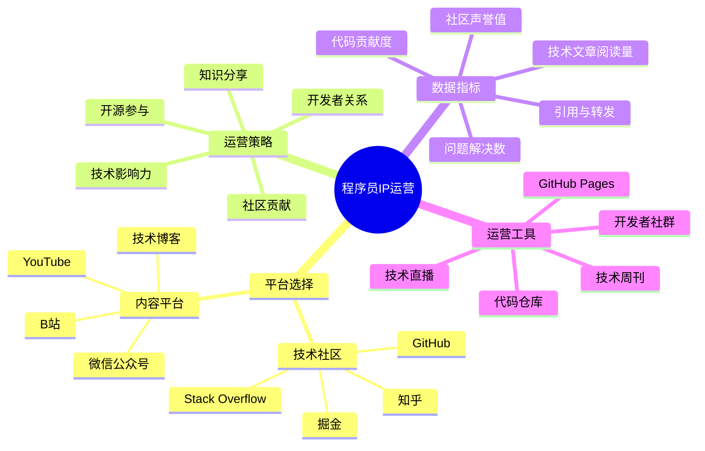

# 程序员IP运营指南

程序员IP运营是将技术专长转化为影响力和商业价值的关键环节。本指南将帮助技术人有效运营自己的个人品牌。

## 程序员IP运营公式

**技术影响力 = 专业内容 × 社区参与 × 持续贡献 × 知识传播**

## 平台选择策略

### 1. 技术社区平台

| 平台名称 | 适合人群 | 内容形式 | 运营重点 |
|---------|---------|---------|---------|
| GitHub | 开源爱好者、项目开发者 | 代码仓库、技术文档 | Star数量、Fork数、贡献度 |
| Stack Overflow | 问题解决者、技术专家 | 问答内容、技术讨论 | 回答质量、声望值 |
| 掘金 | 国内开发者、技术写作者 | 技术文章、教程 | 点赞量、评论互动 |
| 知乎 | 综合技术人、思考者 | 深度文章、技术见解 | 赞同数、关注度 |

### 2. 内容平台选择

| 平台类型 | 优势 | 适合内容 | 运营指标 |
|---------|------|---------|---------|
| 技术博客 | 专业性强、SEO效果好 | 深度技术文章、教程 | 访问量、停留时间 |
| B站 | 年轻开发者多、互动性强 | 编程教学、技术演示 | 播放量、弹幕互动 |
| YouTube | 国际化、专业度高 | 系统课程、编程直播 | 订阅量、观看时长 |
| 微信公众号 | 私域流量、用户粘性高 | 技术干货、行业见解 | 阅读量、留存率 |

## 核心运营策略

### 1. 技术内容矩阵

- **代码示例库**：构建高质量、可复用的代码示例库
- **技术教程系列**：从入门到精通的阶梯式教程
- **问题解决指南**：常见技术难题的解决方案
- **技术评测与对比**：框架、工具、语言的专业评测
- **前沿技术解读**：新技术趋势分析与实践指南

### 2. 社区影响力建设

- **开源项目贡献**：定期为知名开源项目提交代码
- **技术问答参与**：在Stack Overflow等平台解答问题
- **技术会议分享**：参与线上/线下技术大会演讲
- **技术社群运营**：创建并维护专业开发者社群
- **跨平台内容联动**：GitHub项目与技术博客的相互引流

### 3. 技术品牌塑造

- **专业领域聚焦**：在1-2个技术领域深耕
- **个人技术标签**：建立独特的技术特色和风格
- **一致性专业形象**：统一各平台的个人简介和风格
- **技术影响力指标**：设立明确的影响力增长目标
- **定期技术复盘**：每月/季度进行技术内容效果分析

## 数据驱动运营

### 1. 关键指标监控

| 指标类型 | 具体指标 | 目标值 | 提升策略 |
|---------|---------|-------|---------|
| 代码影响力 | GitHub Star数、Fork数 | 月增长10% | 优化文档、定期更新 |
| 内容传播力 | 文章阅读量、分享数 | 篇均1000+ | 标题优化、案例丰富 |
| 社区参与度 | 问题回答数、评论互动率 | 周参与5+ | 设置互动时间段 |
| 用户粘性 | 粉丝留存率、复访率 | 月留存>40% | 系列内容、定期互动 |
| 变现能力 | 技术咨询量、课程转化率 | 月环比增长5% | 展示案例、价值证明 |

### 2. 数据分析与优化

- **内容效果分析**：追踪不同类型内容的表现差异
- **用户行为分析**：了解用户浏览路径和兴趣偏好
- **平台算法适应**：根据平台推荐机制调整内容策略
- **A/B测试**：测试不同标题、发布时间的效果差异
- **竞品对标**：分析同领域优秀创作者的运营策略

## 程序员IP成长阶段

| 阶段 | 粉丝规模 | 运营重点 | 变现方式 |
|------|---------|---------|---------|
| 起步期 | 0-1000 | 内容积累、专业定位 | 技术咨询、自由接单 |
| 成长期 | 1000-1万 | 平台扩展、社区建设 | 课程售卖、付费专栏 |
| 成熟期 | 1万-5万 | 品牌建设、影响力扩大 | 技术培训、企业合作 |
| 扩张期 | 5万+ | 团队化运营、生态构建 | 技术社区、企业服务 |

## 实操指南

### 1. 第1-30天：基础建设

- 完善GitHub个人主页，优化个人介绍
- 在2-3个技术社区建立账号并完善资料
- 发布3-5篇技术文章，建立初步专业形象
- 参与开源项目，提交有价值的Pull Request

### 2. 第31-90天：内容矩阵构建

- 确定1-2个核心技术领域，开始系列内容创作
- 建立每周内容发布计划，保持更新频率
- 主动参与技术讨论，提高社区活跃度
- 开始跨平台内容分发，扩大影响范围

### 3. 第91-180天：社区影响力

- 创建个人技术项目或开源工具
- 组织线上技术分享或参与技术meetup
- 建立开发者微信群或Discord社区
- 开始技术周刊或月刊的整理与分享

### 4. 第181-365天：品牌化运营

- 建立个人技术品牌标识和统一风格
- 开发特色技术产品或服务
- 构建完整的技术内容体系
- 开始系统化的商业变现尝试

## 常见问题与解决方案

### 1. 技术内容无人问津

- **问题分析**：内容可能过于基础或过于深奥，未找准受众
- **解决方案**：
  - 研究热门技术话题和搜索趋势
  - 增加实用性和可操作性
  - 改进内容标题和开头吸引力
  - 主动在相关社区分享并请求反馈

### 2. 平台增长遇到瓶颈

- **问题分析**：内容同质化严重，缺乏差异化价值
- **解决方案**：
  - 开发独特内容角度或表达方式
  - 增加原创案例和实战经验分享
  - 尝试新兴技术领域的内容创作
  - 与其他技术创作者合作互推

### 3. 社区互动度低

- **问题分析**：内容过于单向输出，缺乏互动设计
- **解决方案**：
  - 在内容中设置问题和讨论点
  - 定期举办问答活动或技术挑战
  - 回应每一条有价值的评论
  - 创建特定话题的技术讨论组

## 工具与资源

- **内容创作**：Markdown编辑器、代码高亮工具、技术图表生成器
- **社区管理**：GitHub项目管理、Discord社区工具、微信群管理工具
- **数据分析**：Google Analytics、GitHub Insights、内容平台数据看板
- **品牌建设**：个人Logo设计、统一视觉风格、个人网站建设

## 下一步

完成程序员IP运营规划后，请前往[程序员IP变现](../monetize/01-coder.md)章节，学习如何将技术影响力转化为商业价值。 