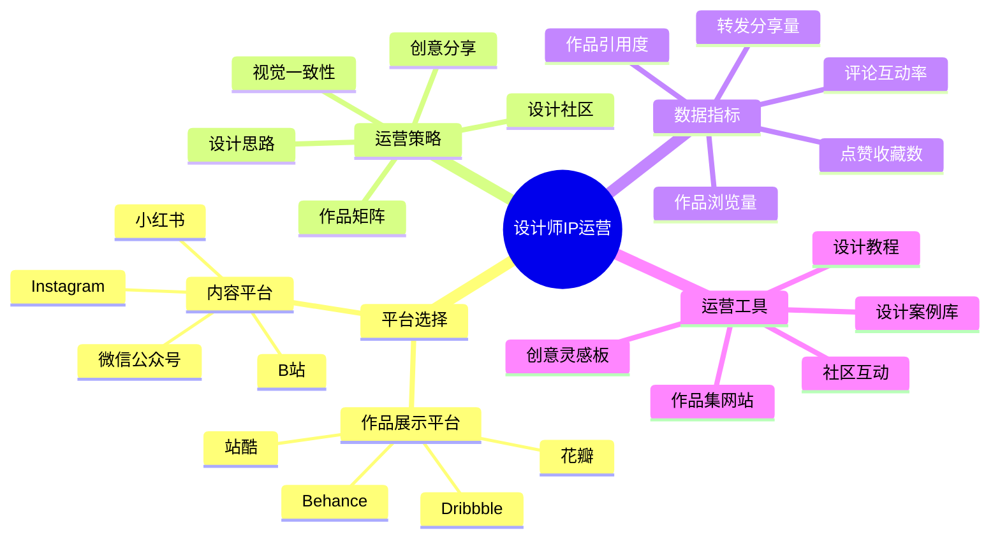

# 设计师IP运营指南

设计师IP运营是将视觉创意转化为影响力和商业价值的关键环节。本指南将帮助设计师有效运营自己的个人品牌。

## 设计师IP运营公式

**设计影响力 = 作品质量 × 展示平台 × 社区互动 × 风格一致性**

## 平台选择策略

### 1. 作品展示平台

| 平台名称 | 适合人群 | 内容形式 | 运营重点 |
|---------|---------|---------|---------|
| Behance | 专业设计师、创意总监 | 完整项目展示、案例解析 | 项目质量、细节展示 |
| Dribbble | UI/UX设计师、插画师 | 设计片段、创意概念 | 视觉吸引力、互动量 |
| 站酷 | 国内设计师、创意从业者 | 综合设计作品、求职展示 | 原创度、行业认可 |
| 花瓣 | 设计爱好者、灵感收集者 | 灵感图片、设计素材 | 分类整理、主题板块 |

### 2. 内容平台选择

| 平台类型 | 优势 | 适合内容 | 运营指标 |
|---------|------|---------|---------|
| Instagram | 国际化、视觉化强 | 作品集锦、设计日常 | 关注度、互动率 |
| 小红书 | 女性用户多、种草能力强 | 设计教程、工具推荐 | 收藏数、种草转化 |
| B站 | 年轻用户多、教程需求大 | 设计过程、软件教学 | 播放量、粉丝增长 |
| 微信公众号 | 私域流量、深度阅读 | 设计思路、行业见解 | 阅读量、转化率 |

## 核心运营策略

### 1. 设计作品矩阵

- **精品项目展示**：完整呈现设计过程和最终成果
- **设计系列创作**：围绕特定主题的系列设计作品
- **概念设计探索**：展示创意思考和设计可能性
- **实验性创作**：尝试新技术和设计趋势
- **商业案例解析**：分享真实商业项目的设计思路

### 2. 社区影响力建设

- **设计评论参与**：对优秀设计作品提供专业点评
- **设计挑战参与**：加入平台设计挑战和主题活动
- **设计资源分享**：提供模板、素材、插件等资源
- **设计社群运营**：创建并维护专业设计师社群
- **跨平台内容联动**：作品集与教程内容的相互引流

### 3. 设计品牌塑造

- **视觉风格一致性**：建立独特的设计语言和风格
- **个人设计理念**：明确表达自己的设计哲学
- **专业领域聚焦**：在1-2个设计领域深耕
- **个人标识系统**：设计专属的个人品牌标识
- **定期作品更新**：保持稳定的作品发布频率

## 数据驱动运营

### 1. 关键指标监控

| 指标类型 | 具体指标 | 目标值 | 提升策略 |
|---------|---------|-------|---------|
| 作品影响力 | 浏览量、点赞数 | 作品均值提升15% | 优化展示、标签策略 |
| 内容传播力 | 分享数、收藏数 | 月增长10% | 提升实用性、美观度 |
| 社区参与度 | 评论数、互动率 | 互动率>5% | 提问设计、回复互动 |
| 用户粘性 | 粉丝留存率、回访率 | 月留存>45% | 系列内容、定期互动 |
| 专业认可度 | 行业引用、合作邀请 | 季度增长20% | 参与设计赛事、活动 |

### 2. 数据分析与优化

- **作品表现分析**：追踪不同类型作品的表现差异
- **用户喜好分析**：了解受众对设计风格的偏好
- **平台算法适应**：根据平台推荐机制调整发布策略
- **发布时间测试**：测试不同时间段发布的效果差异
- **竞品对标**：分析同领域优秀设计师的运营策略

## 设计师IP成长阶段

| 阶段 | 粉丝规模 | 运营重点 | 变现方式 |
|------|---------|---------|---------|
| 起步期 | 0-1000 | 作品积累、风格定位 | 自由接单、素材售卖 |
| 成长期 | 1000-1万 | 平台扩展、社区建设 | 设计课程、定制服务 |
| 成熟期 | 1万-3万 | 品牌建设、影响力扩大 | 品牌合作、设计咨询 |
| 扩张期 | 3万+ | 团队化运营、生态构建 | 设计工作室、IP授权 |

## 实操指南

### 1. 第1-30天：基础建设

- 完善主要设计平台个人资料和作品集
- 选择2-3个核心平台建立账号并统一风格
- 上传8-10个高质量设计作品，建立初步作品库
- 开始参与设计社区讨论和评论互动

### 2. 第31-90天：内容矩阵构建

- 确定个人设计风格和专注领域
- 建立每周作品发布计划，保持更新频率
- 开始创作设计过程分享和教程内容
- 主动与同领域设计师建立联系

### 3. 第91-180天：社区影响力

- 发起或参与设计挑战和主题创作
- 开始设计资源分享（模板、素材、插件等）
- 建立设计师交流群或社区
- 尝试跨平台内容策略，扩大影响范围

### 4. 第181-365天：品牌化运营

- 完善个人设计品牌系统
- 开发特色设计产品或服务
- 寻求品牌合作和商业项目机会
- 开始系统化的商业变现尝试

## 常见问题与解决方案

### 1. 作品曝光度低

- **问题分析**：平台算法匹配度低或发布策略不当
- **解决方案**：
  - 优化作品标签和描述
  - 研究平台高曝光时段发布
  - 增加作品与当前设计趋势的关联
  - 主动分享到相关设计社区和群组

### 2. 风格定位不清晰

- **问题分析**：作品风格多变，缺乏识别度
- **解决方案**：
  - 梳理个人设计偏好和强项
  - 选择1-2个核心风格深耕
  - 建立个人视觉语言系统
  - 在作品集中突出展示代表作

### 3. 互动转化率低

- **问题分析**：粉丝关注但缺乏深度互动
- **解决方案**：
  - 设计互动型内容（如设计挑战）
  - 分享设计思路和决策过程
  - 定期举办问答或直播活动
  - 对评论进行及时回复和深入讨论

## 工具与资源

- **作品展示**：个人网站建设、作品集模板、展示视频制作
- **社区管理**：设计师社群工具、反馈收集系统、互动活动策划
- **数据分析**：作品表现追踪、用户行为分析、平台数据看板
- **品牌建设**：个人品牌设计、统一视觉系统、社交媒体模板

## 下一步

完成设计师IP运营规划后，请前往[设计师IP变现](../monetize/02-designer.md)章节，学习如何将设计影响力转化为商业价值。 