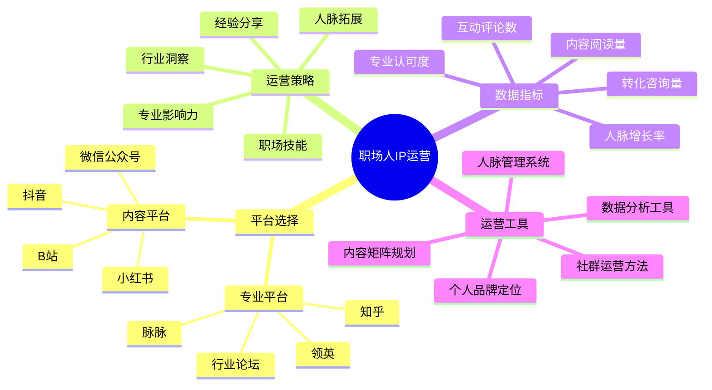

# 职场人IP运营指南

职场人IP运营是将职业经验和专业能力转化为个人影响力和商业价值的关键环节。本指南将帮助职场人有效运营自己的个人品牌。

## 职场人IP运营公式

**职场影响力 = 专业深度 × 内容输出 × 人脉广度 × 持续成长**

## 平台选择策略

### 1. 专业平台

| 平台名称 | 适合人群 | 内容形式 | 运营重点 |
|---------|---------|---------|---------|
| 领英 | 管理者、专业人士 | 专业文章、行业见解 | 人脉质量、互动深度 |
| 脉脉 | 职场人、求职者 | 职场话题、匿名讨论 | 真实性、话题参与度 |
| 知乎 | 思考者、专业分享者 | 深度回答、专栏文章 | 专业度、逻辑性 |
| 行业论坛 | 垂直领域专家 | 专业讨论、经验分享 | 持续参与、专业贡献 |

### 2. 内容平台选择

| 平台类型 | 优势 | 适合内容 | 运营指标 |
|---------|------|---------|---------|
| 微信公众号 | 沉淀性强、私域流量 | 深度文章、系统分享 | 读完率、留存率 |
| 小红书 | 女性用户多、场景化 | 职场技巧、效率方法 | 收藏率、评论互动 |
| B站 | 年轻用户、教学需求 | 技能教程、经验分享 | 完播率、粉丝增长 |
| 抖音 | 覆盖广、传播快 | 职场金句、案例解析 | 完播率、转发量 |

## 核心运营策略

### 1. 职场内容矩阵

- **专业知识分享**：行业洞察、专业技能解析
- **经验案例复盘**：真实案例分析、经验教训总结
- **职场技能提升**：效率方法、沟通技巧、领导力
- **行业趋势解读**：新趋势分析、变革机遇把握
- **职业生涯规划**：晋升路径、转型指南、成长方法

### 2. 人脉影响力建设

- **高质量互动**：与行业KOL有深度的评论互动
- **价值型分享**：在社群中提供有价值的解答
- **线上线下结合**：参与行业活动并延伸线上互动
- **人脉分层管理**：建立核心人脉、普通人脉分级系统
- **跨界资源链接**：连接不同行业资源形成互补

### 3. 职场品牌塑造

- **专业定位聚焦**：明确1-2个核心专业领域
- **个人标签体系**：建立3-5个关键个人标签
- **一致性形象**：跨平台统一的个人简介和风格
- **差异化优势**：明确自身与同领域人的差异点
- **成长故事叙述**：形成个人成长的故事化表达

## 数据驱动运营

### 1. 关键指标监控

| 指标类型 | 具体指标 | 目标值 | 提升策略 |
|---------|---------|-------|---------|
| 内容影响力 | 阅读量、互动率 | 月增长15% | 优化标题、增加案例 |
| 人脉拓展 | 新增人脉数、互动频率 | 周增长5% | 主动评论、价值回复 |
| 专业认可度 | 引用量、咨询量 | 季度增长20% | 深度内容、专业解答 |
| 转化效果 | 咨询转化率、合作达成率 | >15% | 完善服务流程 |
| 品牌提及度 | 品牌关键词提及量 | 月增长10% | 一致性输出、标签强化 |

### 2. 数据分析与优化

- **内容表现分析**：不同主题内容的表现差异
- **用户兴趣洞察**：粉丝互动热点和关注焦点
- **人脉质量评估**：人脉互动价值和转化效果
- **平台效果对比**：不同平台的ROI和增长潜力
- **竞品对标分析**：同领域优秀IP的运营策略借鉴

## 职场人IP成长阶段

| 阶段 | 粉丝规模 | 运营重点 | 变现方式 |
|------|---------|---------|---------|
| 起步期 | 0-1000 | 内容积累、人脉起点 | 兼职咨询、推荐奖励 |
| 成长期 | 1000-1万 | 平台扩展、影响力提升 | 付费咨询、内容付费 |
| 成熟期 | 1万-5万 | 品牌建设、商业模式 | 企业培训、顾问服务 |
| 扩张期 | 5万+ | 团队运营、生态构建 | 系统课程、企业服务 |

## 实操指南

### 1. 第1-30天：基础建设

- 完善领英和主要平台的个人资料
- 确定个人核心专业领域和关键标签
- 梳理并记录3-5个有代表性的职场经验
- 发布首批5-8篇核心内容建立专业形象

### 2. 第31-90天：内容矩阵构建

- 建立每周内容发布计划，保持更新频率
- 开始有针对性地拓展行业人脉关系
- 参与行业讨论，提供专业见解
- 尝试不同内容形式，找到最适合的表达方式

### 3. 第91-180天：影响力扩展

- 开始跨平台内容分发，扩大影响范围
- 主动与同领域KOL互动，提升曝光度
- 参与或组织线上/线下行业活动
- 开始构建初步的粉丝社群

### 4. 第181-365天：品牌化运营

- 系统化梳理个人IP定位和价值主张
- 开发初步的IP变现产品或服务
- 建立完整的内容创作和分发体系
- 开始有计划的商业合作尝试

## 常见问题与解决方案

### 1. 内容创作瓶颈

- **问题分析**：工作繁忙，难以持续创作高质量内容
- **解决方案**：
  - 建立内容库，利用碎片时间积累素材
  - 将日常工作经验模块化记录
  - 设计内容复用策略，一次创作多平台使用
  - 尝试不同形式，如音频分享可降低创作门槛

### 2. 专业定位模糊

- **问题分析**：覆盖领域过广，缺乏明确专业标签
- **解决方案**：
  - 进行个人SWOT分析，找出核心优势
  - 研究市场需求，选择有需求的细分领域
  - 聚焦1-2个专业方向深耕
  - 围绕核心领域构建完整知识体系

### 3. 人脉转化率低

- **问题分析**：人脉数量增长但缺乏有效互动和转化
- **解决方案**：
  - 建立人脉分级管理系统
  - 设计有针对性的互动策略
  - 提供针对性的价值和资源
  - 定期进行人脉盘点和优化

## 工具与资源

- **内容创作**：幕布(思维导图)、石墨文档(协作)、剪映(视频编辑)
- **人脉管理**：领英、Notion人脉库、滴答清单(跟进提醒)
- **数据分析**：新榜(内容分析)、WPS表格(数据追踪)、微信数据助手
- **品牌建设**：Canva(设计)、标准简历(个人主页)、GitMind(思维导图)

## 下一步

完成职场人IP运营规划后，请前往[职场人IP变现](../monetize/03-professional.md)章节，学习如何将职场影响力转化为商业价值。 