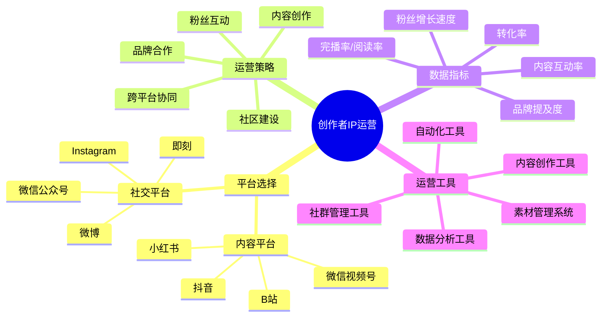

# 创作者IP运营指南

创作者IP运营是将创意内容转化为影响力和商业价值的关键环节。本指南将帮助内容创作者有效运营自己的个人品牌。

## 创作者IP运营公式

**创作影响力 = 内容质量 × 创作频率 × 粉丝互动 × 平台算法匹配度**

## 平台选择策略

### 1. 内容平台

| 平台名称 | 适合内容类型 | 用户特点 | 运营重点 |
|---------|------------|---------|---------|
| B站 | 知识、教程、二次元 | 年轻、深度、专注 | 完整内容、互动设计 |
| 抖音 | 短视频、生活分享 | 广泛、碎片化 | 开头吸引力、创意点 |
| 小红书 | 种草、生活方式 | 女性为主、场景化 | 美观排版、实用性 |
| 微信视频号 | 垂直内容、生活分享 | 私域流量、熟人社交 | 真实性、互动引导 |

### 2. 社交平台选择

| 平台类型 | 优势 | 适合内容 | 运营指标 |
|---------|------|---------|---------|
| 微博 | 热点传播、明星效应 | 观点、热点、日常 | 转发量、话题热度 |
| Instagram | 国际化、视觉化强 | 摄影、设计、生活方式 | 点赞数、保存率 |
| 微信公众号 | 沉淀性强、私域流量 | 深度文章、系统知识 | 读完率、留存率 |
| 即刻 | 兴趣社交、高质量社区 | 专业分享、兴趣话题 | 互动率、圈子影响力 |

## 核心运营策略

### 1. 内容创作策略

- **内容差异化**：找到独特的创作角度和表达方式
- **内容矩阵**：构建不同深度和形式的内容体系
- **创作节奏**：建立稳定的创作频率和发布规律
- **内容升级**：定期迭代内容形式和质量
- **爆款内容**：策划和打造周期性爆款内容

### 2. 粉丝互动策略

- **互动设计**：在内容中设置互动点和讨论话题
- **评论管理**：高效回复和引导评论区氛围
- **粉丝激励**：设计粉丝参与和贡献的激励机制
- **社群运营**：建立和维护核心粉丝社群
- **用户共创**：邀请粉丝参与内容创作过程

### 3. 跨平台协同策略

- **内容分发**：根据平台特性调整内容形式
- **平台联动**：设计跨平台引流和互动机制
- **重点平台**：选择1-2个主力平台深耕
- **内容复用**：高效的内容二次加工和利用
- **私域引导**：将公域流量引导至私域平台

## 数据驱动运营

### 1. 关键指标监控

| 指标类型 | 具体指标 | 目标值 | 提升策略 |
|---------|---------|-------|---------|
| 内容表现 | 播放量/阅读量、完播率 | 月增长20% | 优化标题和开头 |
| 互动指标 | 评论数、互动率 | 互动率>5% | 设置互动话题 |
| 粉丝增长 | 新增粉丝、粉丝留存率 | 周增长10% | 内容一致性、互动 |
| 分发效果 | 推荐量、搜索展现 | 月增长15% | 优化标签和SEO |
| 商业转化 | 点击率、转化率 | 转化率>3% | 优化引导方式 |

### 2. 数据分析与优化

- **内容效果分析**：不同类型内容的表现对比
- **发布时间测试**：测试最佳发布时间和频率
- **用户画像分析**：了解粉丝构成和兴趣偏好
- **留存漏斗分析**：找出用户流失的关键节点
- **竞品对标分析**：研究同领域优秀创作者策略

## 创作者IP成长阶段

| 阶段 | 粉丝规模 | 运营重点 | 变现方式 |
|------|---------|---------|---------|
| 起步期 | 0-5000 | 内容定位、风格建立 | 平台激励、小额打赏 |
| 成长期 | 5000-3万 | 内容矩阵、粉丝互动 | 广告分成、小型商务 |
| 成熟期 | 3万-10万 | 商业模式、团队协作 | 品牌合作、自有产品 |
| 扩张期 | 10万+ | 多元业务、IP授权 | 商业IP、产业链延伸 |

## 实操指南

### 1. 第1-30天：内容定位

- 明确创作领域和目标受众
- 研究平台算法和内容偏好
- 制作3-5个测试内容验证方向
- 建立基础创作流程和工具链

### 2. 第31-90天：内容矩阵构建

- 确定2-3个内容系列作为主力
- 建立每周内容发布计划
- 开始有意识地引导用户互动
- 测试不同内容形式的效果

### 3. 第91-180天：粉丝运营

- 开始建立初步粉丝社群
- 设计粉丝互动和激励机制
- 尝试跨平台内容协同策略
- 收集并分析用户反馈

### 4. 第181-365天：商业化尝试

- 设计初步的商业化模式
- 尝试小规模品牌合作
- 开发测试自有产品或服务
- 建立商务合作流程和标准

## 常见问题与解决方案

### 1. 创作瓶颈与倦怠

- **问题分析**：长期创作导致灵感枯竭和动力不足
- **解决方案**：
  - 建立创意收集系统，随时记录灵感
  - 设计内容模板，降低创作启动门槛
  - 安排定期休息和充电时间
  - 尝试协作创作，引入新思路

### 2. 粉丝增长遇到瓶颈

- **问题分析**：内容质量稳定但粉丝增长停滞
- **解决方案**：
  - 分析高转化内容特点并强化
  - 尝试新的内容形式和话题
  - 主动与同领域创作者互动合作
  - 优化内容SEO和标签策略

### 3. 商业变现效果不佳

- **问题分析**：有一定粉丝但变现能力弱
- **解决方案**：
  - 深入分析粉丝需求和消费能力
  - 测试不同价格点和产品形态
  - 完善从内容到产品的转化路径
  - 提升商业内容的价值展示

## 工具与资源

- **内容创作**：剪映/Final Cut Pro(视频)、Canva(设计)、Notion(内容管理)
- **数据分析**：巨量千川、小红书商业中心、星图平台、自建数据表格
- **社群管理**：微信群、飞书、Discord、运营工具宝
- **效率工具**：讯飞听见(语音转文字)、智影(AI视频)、文件夹同步工具

## 下一步

完成创作者IP运营规划后，请前往[创作者IP变现](../monetize/04-creator.md)章节，学习如何将创作影响力转化为商业价值。 