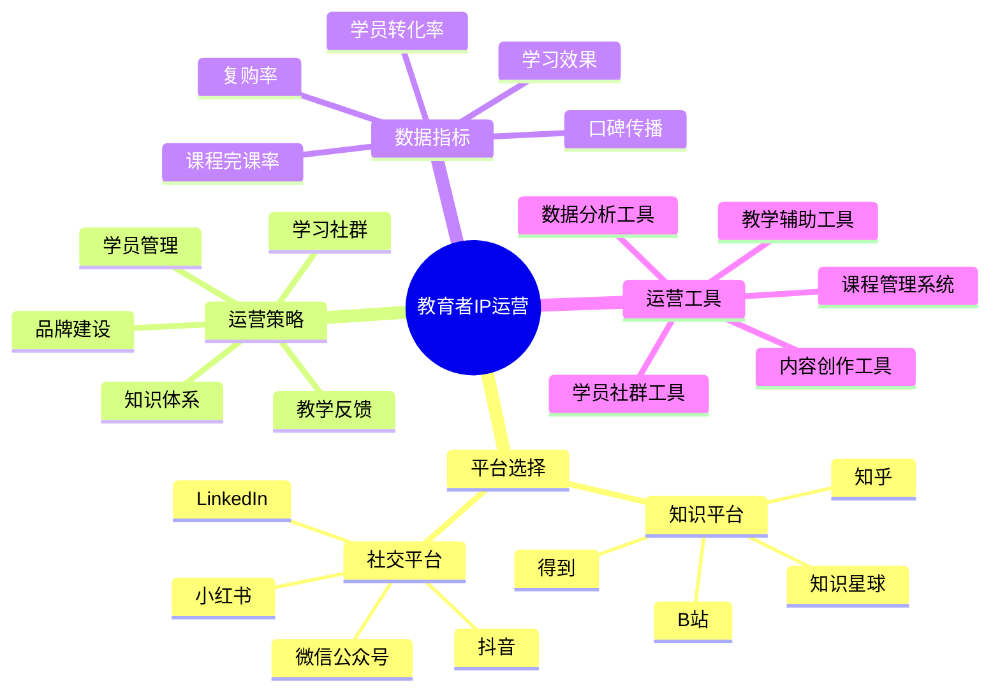

# 教育者IP运营指南

教育者IP运营是将教育专长和知识体系转化为个人影响力和商业价值的关键环节。本指南将帮助教育者有效运营自己的个人品牌。

## 教育者IP运营公式

**教育影响力 = 知识深度 × 教学能力 × 学员转化 × 口碑传播**

## 平台选择策略

### 1. 知识平台

| 平台名称 | 适合内容 | 用户特点 | 运营重点 |
|---------|---------|---------|---------|
| 知乎 | 深度解答、专栏 | 理性思考、求知欲强 | 专业性、逻辑性 |
| B站 | 视频教程、系统课程 | 年轻、学习意愿高 | 生动讲解、互动设计 |
| 得到 | 知识付费、专栏 | 职场人、高付费意愿 | 实用性、系统性 |
| 知识星球 | 私域社群、问答 | 精准垂直、高粘性 | 持续服务、深度交流 |

### 2. 社交平台选择

| 平台类型 | 优势 | 适合内容 | 运营指标 |
|---------|------|---------|---------|
| 微信公众号 | 沉淀性强、私域流量 | 系统课程、深度文章 | 读完率、转化率 |
| 小红书 | 女性用户多、场景化 | 学习方法、笔记分享 | 收藏率、评论互动 |
| 抖音 | 覆盖广、传播快 | 知识点解析、教学片段 | 完播率、关注转化 |
| LinkedIn | 职场人士、专业社交 | 行业洞察、专业分享 | 专业认可、人脉拓展 |

## 核心运营策略

### 1. 知识体系构建

- **知识地图**：构建完整的知识体系和学习路径
- **内容分层**：设计从入门到精通的内容梯度
- **知识更新**：保持知识的前沿性和时效性
- **实践结合**：将理论知识与实践案例结合
- **独特方法论**：开发个人特色的教学方法和框架

### 2. 学习社群运营

- **社群定位**：明确社群的学习目标和价值主张
- **学习氛围**：营造积极向上的学习环境
- **互助机制**：设计学员互助和共同成长的机制
- **活动设计**：定期组织学习活动和挑战任务
- **成果展示**：建立学员成果展示和分享平台

### 3. 学员管理体系

- **学员分层**：根据学习阶段和需求进行分层
- **学习路径**：设计清晰的学习进阶路径
- **反馈机制**：建立及时有效的学习反馈系统
- **激励体系**：设计学习成就和进步的激励方式
- **一对一辅导**：针对核心学员的个性化指导

## 数据驱动运营

### 1. 关键指标监控

| 指标类型 | 具体指标 | 目标值 | 提升策略 |
|---------|---------|-------|---------|
| 内容效果 | 完课率、笔记数 | 完课率>60% | 优化内容结构、增加互动 |
| 学员成长 | 技能提升、实践应用 | 80%有实质提升 | 案例教学、实战项目 |
| 社群活跃 | 日活率、互动频率 | 周活跃>50% | 话题设计、激励机制 |
| 口碑传播 | 推荐率、自发分享 | 推荐率>30% | 学习成果展示、激励分享 |
| 商业转化 | 付费率、复购率 | 转化率>10% | 价值展示、学员案例 |

### 2. 数据分析与优化

- **学习行为分析**：学员学习路径和行为模式
- **内容效果分析**：不同内容形式和主题的学习效果
- **学员画像分析**：了解学员构成和学习需求
- **流失原因分析**：找出学员流失的关键节点和原因
- **成功案例分析**：研究高成长学员的学习特点

## 教育者IP成长阶段

| 阶段 | 学员规模 | 运营重点 | 变现方式 |
|------|---------|---------|---------|
| 起步期 | 0-500 | 内容积累、教学风格 | 一对一辅导、小班课 |
| 成长期 | 500-3000 | 体系构建、社群运营 | 系统课程、会员制 |
| 成熟期 | 3000-1万 | 团队建设、品牌塑造 | 课程体系、认证体系 |
| 扩张期 | 1万+ | 生态构建、多元发展 | 教育品牌、内容授权 |

## 实操指南

### 1. 第1-30天：教育定位

- 明确教育领域和核心价值主张
- 梳理个人知识体系和教学方法
- 制作3-5个核心教学内容样本
- 搭建基础的教学工具和平台

### 2. 第31-90天：内容体系构建

- 设计完整的知识地图和学习路径
- 开发系列化的教学内容
- 建立初步的学员反馈机制
- 测试不同教学形式的效果

### 3. 第91-180天：社群建设

- 创建核心学习社群
- 设计社群学习规则和活动
- 培养种子学员和社群管理者
- 建立学习成果展示机制

### 4. 第181-365天：商业模式构建

- 设计完整的课程产品体系
- 建立学员成长的阶梯式服务
- 开发会员制和长期学习项目
- 构建教育品牌和价值体系

## 常见问题与解决方案

### 1. 学员参与度低

- **问题分析**：学员报名后参与学习的积极性不高
- **解决方案**：
  - 设计阶段性学习目标和小成就
  - 增加互动环节和实践任务
  - 建立学习伙伴和小组机制
  - 定期举办学习成果展示活动

### 2. 知识变现困难

- **问题分析**：有优质内容但转化为付费意愿低
- **解决方案**：
  - 明确展示学习价值和成果案例
  - 设计免费到付费的合理路径
  - 提供可感知的独特价值
  - 建立稀缺性和社群归属感

### 3. 教学内容同质化

- **问题分析**：内容与市场上其他教育者区分度不高
- **解决方案**：
  - 结合个人经验开发独特方法论
  - 聚焦细分领域成为专家
  - 创新教学形式和表达方式
  - 融合跨领域知识创造新价值

## 工具与资源

- **课程管理**：腾讯课堂、小鹅通、知识星球、Notion
- **内容创作**：剪映、PPT/Keynote、幕布、XMind
- **社群运营**：微信群、飞书、钉钉、Discord
- **数据分析**：腾讯分析、问卷星、Excel/Sheets、自建看板

## 下一步

完成教育者IP运营规划后，请前往[教育者IP变现](../monetize/05-educator.md)章节，学习如何将教育影响力转化为商业价值。 