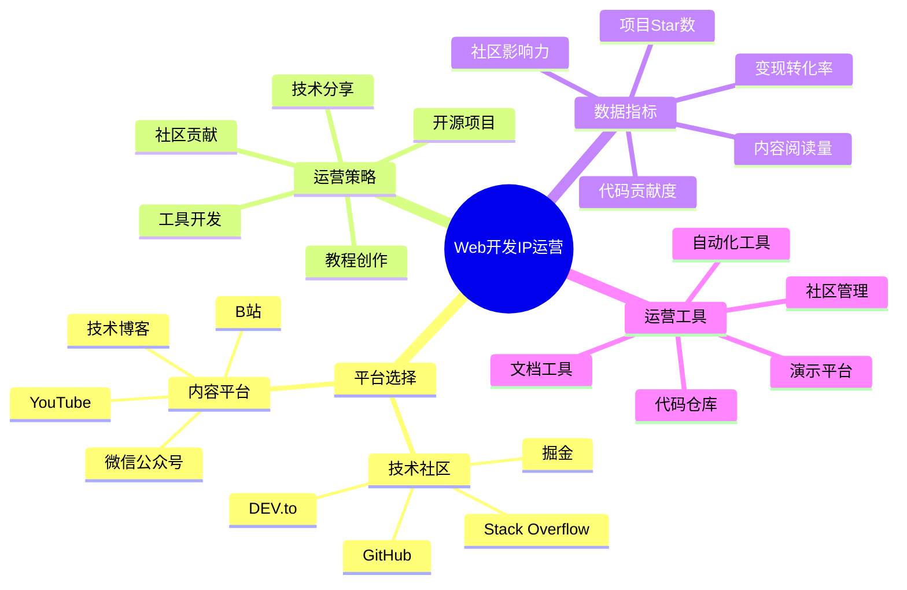

# Web开发IP运营指南

Web开发IP运营是将技术专长和开发经验转化为个人影响力和商业价值的关键环节。本指南将帮助Web开发者有效运营自己的个人品牌。

## Web开发IP运营公式

**技术影响力 = 技术深度 × 开源贡献 × 内容传播 × 社区参与**

## 平台选择策略

### 1. 技术社区

| 平台名称 | 适合内容 | 用户特点 | 运营重点 |
|---------|---------|---------|---------|
| GitHub | 开源项目、技术文档 | 全球开发者、协作导向 | 代码质量、文档完善 |
| Stack Overflow | 问题解答、技术讨论 | 问题解决导向、专业性强 | 解答质量、专业深度 |
| 掘金 | 技术文章、实践分享 | 中文开发者、前端偏多 | 实用性、创新性 |
| DEV.to | 技术博客、经验分享 | 国际开发者、社区氛围好 | 互动性、开放性 |

### 2. 内容平台选择

| 平台类型 | 优势 | 适合内容 | 运营指标 |
|---------|------|---------|---------|
| 技术博客 | 沉淀性强、SEO效果好 | 深度技术文章、系列教程 | 访问量、引用率 |
| B站 | 年轻开发者、互动性强 | 视频教程、技术演示 | 完播率、粉丝增长 |
| YouTube | 国际化、专业度高 | 系统课程、技术分享 | 观看时长、订阅数 |
| 微信公众号 | 私域流量、用户粘性高 | 技术动态、经验分享 | 读完率、留存率 |

## 核心运营策略

### 1. 开源项目策略

- **项目选择**：选择有价值且有差异化的项目方向
- **代码质量**：保持高质量的代码和完善的测试
- **文档完善**：提供详细的使用文档和示例
- **社区互动**：积极响应Issue和PR
- **版本迭代**：保持稳定的更新和迭代节奏

### 2. 技术内容策略

- **内容矩阵**：构建从入门到精通的内容体系
- **实战案例**：分享真实项目经验和解决方案
- **技术前沿**：跟踪并解读前沿技术趋势
- **工具推荐**：分享高效开发工具和方法
- **问题解析**：深入分析常见技术难题

### 3. 社区影响力建设

- **持续贡献**：定期为开源项目贡献代码
- **技术答疑**：在技术社区积极解答问题
- **技术演讲**：参与技术大会和线上分享
- **跨平台联动**：建立多平台内容分发机制
- **技术社群**：组建专业开发者社群

## 数据驱动运营

### 1. 关键指标监控

| 指标类型 | 具体指标 | 目标值 | 提升策略 |
|---------|---------|-------|---------|
| 代码影响力 | GitHub Star数、Fork数 | 月增长15% | 功能迭代、文档优化 |
| 内容影响力 | 阅读量、引用率 | 文章均值1000+ | 实用案例、深度解析 |
| 社区参与度 | 问题解答数、讨论参与 | 周参与10+ | 高质量回复、价值输出 |
| 用户增长 | 粉丝数、订阅数 | 月增长20% | 内容一致性、跨平台引流 |
| 商业转化 | 咨询量、项目合作 | 转化率>5% | 案例展示、专业定位 |

### 2. 数据分析与优化

- **项目数据分析**：Star增长趋势、Issue类型分布
- **内容效果分析**：不同主题和形式的表现差异
- **用户画像分析**：了解粉丝技术栈和需求偏好
- **平台效果对比**：各平台ROI和增长潜力
- **竞品对标分析**：同领域开发者的运营策略借鉴

## Web开发IP成长阶段

| 阶段 | 影响力规模 | 运营重点 | 变现方式 |
|------|----------|---------|---------|
| 起步期 | GitHub <500星 | 技术积累、项目打磨 | 自由接单、技术咨询 |
| 成长期 | GitHub 500-3000星 | 内容输出、社区建设 | 课程售卖、定制开发 |
| 成熟期 | GitHub 3000-10000星 | 品牌建设、团队协作 | 技术培训、企业服务 |
| 扩张期 | GitHub >10000星 | 生态构建、商业模式 | 开发者生态、SaaS产品 |

## 实操指南

### 1. 第1-30天：基础建设

- 梳理个人技术栈和专长领域
- 规划1-2个有特色的开源项目
- 完善GitHub个人主页和技术博客
- 发布3-5篇技术文章建立初步影响力

### 2. 第31-90天：内容与项目并行

- 持续迭代开源项目，完善功能和文档
- 建立每周内容发布计划，保持更新频率
- 开始在技术社区积极参与讨论
- 尝试不同内容形式，找到最适合的表达方式

### 3. 第91-180天：社区影响力

- 主动与同领域开发者建立联系
- 参与或组织线上技术分享活动
- 开始构建开发者社群
- 设计项目推广和内容分发策略

### 4. 第181-365天：商业化探索

- 基于开源项目设计商业服务
- 开发技术课程或付费专栏
- 接受有价值的技术咨询和项目合作
- 建立个人技术品牌和商业模式

## 常见问题与解决方案

### 1. 开源项目难以获得关注

- **问题分析**：项目虽有技术价值但缺乏曝光和用户
- **解决方案**：
  - 完善README和文档，突出项目价值点
  - 创建示例应用和演示视频
  - 在相关技术社区分享项目经验
  - 主动与潜在用户沟通收集反馈

### 2. 技术内容创作瓶颈

- **问题分析**：创作高质量技术内容耗时且难以持续
- **解决方案**：
  - 将日常开发问题模块化记录
  - 设计内容复用策略，一次创作多平台使用
  - 结合开源项目产出配套内容
  - 邀请社区成员共创内容

### 3. 技术与商业平衡困难

- **问题分析**：专注技术深度与商业变现存在冲突
- **解决方案**：
  - 明确区分开源贡献和商业服务
  - 设计阶梯式价值提供模式
  - 将商业服务构建在开源基础之上
  - 寻找技术价值与商业需求的结合点

## 工具与资源

- **代码管理**：GitHub、GitLab、Bitbucket
- **文档工具**：VuePress、Docusaurus、GitBook
- **内容创作**：VS Code、Markdown编辑器、OBS(录屏)
- **社区管理**：Discord、Slack、GitHub Discussions
- **自动化工具**：GitHub Actions、Netlify、Vercel

## 下一步

完成Web开发IP运营规划后，请前往[Web开发IP变现](../monetize/06-web.md)章节，学习如何将技术影响力转化为商业价值。 