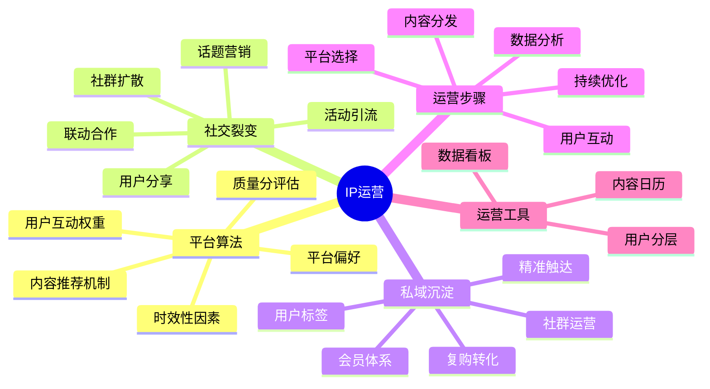

# IP运营路径

IP运营是连接内容创作与商业变现的关键环节，通过系统化运营可以实现流量增长和用户沉淀。本章节将帮助你掌握高效的IP运营方法。

## 运营公式

**用户增长 = 平台算法 × 社交裂变 × 私域沉淀**

## 运营步骤

1. **平台选择**：根据IP定位选择最适合的内容平台
2. **内容分发**：优化内容发布策略，提高平台推荐概率
3. **用户互动**：增强与粉丝的互动，提高用户粘性
4. **数据分析**：监测关键指标，优化运营策略
5. **持续优化**：根据数据反馈不断调整运营方向

## 运营类型

- [程序员IP运营](./01-coder.md) - 技术社区运营、开发者关系、技术影响力
- [设计师IP运营](./02-designer.md) - 作品展示、设计社区、创意传播
- [职场人IP运营](./03-professional.md) - 职场社群、人脉拓展、行业影响
- [创作者IP运营](./04-creator.md) - 粉丝互动、内容分发、跨平台协同
- [教育者IP运营](./05-educator.md) - 学习社群、学员管理、教学反馈
- [Web开发IP运营](./06-web.md) - 技术社区、开源项目、开发者生态

## 运营工具

- [数据看板模板](./tools/data-dashboard.md) - 监测IP运营关键指标
- [用户分层策略](./tools/user-segmentation.md) - 精细化用户运营方法
- [内容分发日历](./tools/content-calendar.md) - 规划内容发布时间和频率

## 运营案例

查看[成功IP运营案例](../cases/operation-cases.md)获取灵感和参考。

## 下一步

完成运营规划后，请前往[商业变现](../monetize/path.md)章节，学习如何将流量转化为收益。 