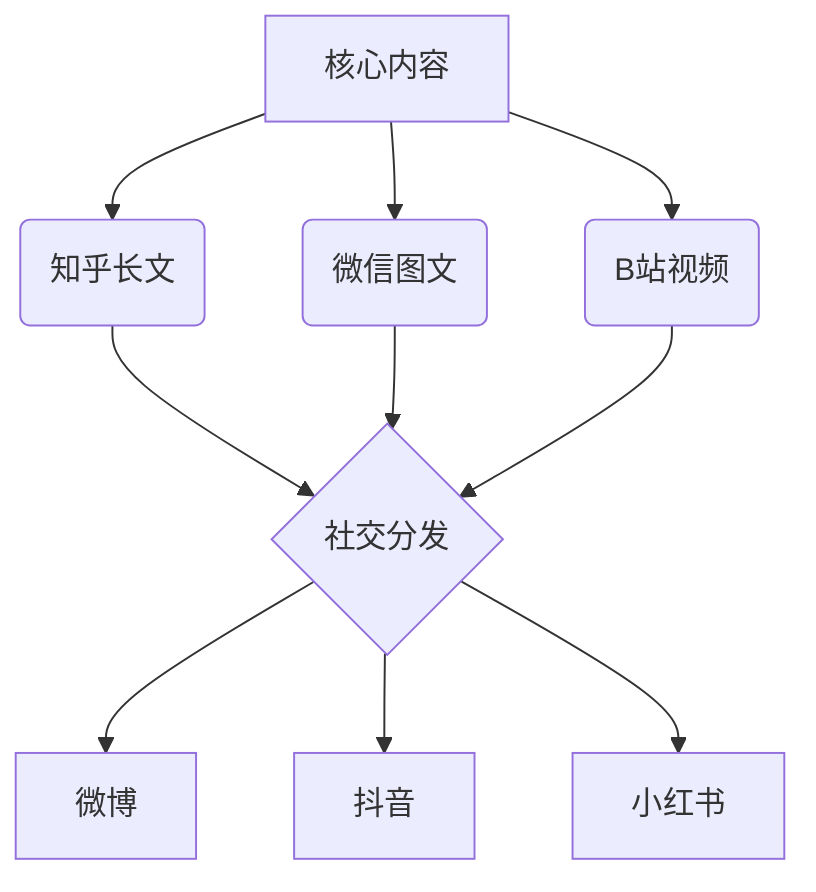

# IP内容分发日历

系统化的内容分发是IP运营的核心环节。本文档提供内容分发日历的创建方法，帮助你规划内容发布时间和频率，最大化内容价值。

## 内容分发日历的重要性

内容分发日历能够帮助你：

1. **保持发布节奏**：建立稳定的内容更新频率
2. **优化发布时机**：选择最佳时间点发布内容
3. **平衡内容类型**：合理安排不同类型的内容
4. **协调多平台**：管理跨平台内容发布策略
5. **提高团队协作**：明确创作和发布责任

## 内容分发日历框架

### 1. 年度内容主题规划

```
# 2025年内容主题规划

## Q1: 【核心技能提升】
- 1月：新年目标设定与行动计划
- 2月：核心技能深度解析
- 3月：效率提升与工作流优化

## Q2: 【行业趋势洞察】
- 4月：行业发展趋势预测
- 5月：新技术应用案例
- 6月：跨界创新与融合

## Q3: 【实战案例解析】
- 7月：经典案例复盘
- 8月：问题解决方法论
- 9月：创新实践与突破

## Q4: 【成长与规划】
- 10月：年度技能回顾与提升
- 11月：职业发展路径规划
- 12月：年度总结与新年展望
```

### 2. 月度内容分发日历

```
# 2025年3月内容分发日历：效率提升与工作流优化

## 内容主题分布
- 周1-周2：效率工具与方法
- 周3-周4：工作流程优化
- 全月：用户问题解答与互动

## 具体排期

| 日期 | 平台 | 内容类型 | 主题 | 发布时间 | 负责人 |
|------|------|---------|------|---------|-------|
| 3/1 | 知乎 | 长文 | 《效率高手的10个日常习惯》 | 20:00 | 张三 |
| 3/2 | 微信 | 图文 | 《效率工具精选：提升10倍工作效率》 | 12:00 | 李四 |
| 3/3 | B站 | 视频 | 《我的高效工作流展示》 | 18:00 | 王五 |
| 3/4 | 小红书 | 图文 | 《效率手帐整理技巧》 | 21:00 | 赵六 |
| 3/5 | 知乎 | 问答 | 《效率问题答疑专场》 | 19:00 | 张三 |
...

## 内容类型分布
- 深度内容：30%（长文、系统视频）
- 轻量内容：50%（短视频、图文卡片）
- 互动内容：20%（问答、直播、评论回复）
```

### 3. 周度执行计划

```
# 2025年3月第1周执行计划

## 周一 (3/1)
- 09:00 内容发布前审核
- 12:00 微博预热
- 20:00 知乎长文发布
- 20:30-21:30 评论互动

## 周二 (3/2)
- 10:00 数据复盘（前日内容）
- 12:00 微信图文发布
- 15:00 社群话题讨论
- 17:00 内容二次分发

## 周三 (3/3)
...

## 周内容协同
- 主题一致性：围绕"效率工具"展开
- 平台差异化：知乎深度、B站视觉、小红书实用
- 互动策略：每篇内容设置2-3个讨论点
```

## 内容分发策略

### 1. 平台特性与发布策略

| 平台 | 用户特点 | 内容偏好 | 最佳发布时间 | 更新频率 |
|------|---------|---------|------------|---------|
| 知乎 | 理性、专业 | 深度文章、专业解析 | 12:00-14:00, 20:00-22:00 | 2-3次/周 |
| 微信 | 稳定、忠诚 | 系统化内容、实用指南 | 12:00-13:00, 18:00-19:00 | 1-2次/周 |
| B站 | 年轻、互动 | 视频教程、生动展示 | 17:00-18:00, 21:00-22:00 | 1-2次/周 |
| 小红书 | 女性为主、视觉 | 图文卡片、步骤拆解 | 12:00, 21:00-22:00 | 3-5次/周 |
| 抖音 | 碎片、快节奏 | 短视频、核心观点 | 12:00, 18:00, 21:00 | 5-7次/周 |

### 2. 内容类型配比

**基础配比公式**：

- **深度内容**：20-30%（建立专业信任）
- **实用内容**：40-50%（提供直接价值）
- **互动内容**：15-20%（增强用户粘性）
- **品牌内容**：10-15%（强化个人形象）

**不同阶段调整**：

| IP阶段 | 深度内容 | 实用内容 | 互动内容 | 品牌内容 |
|--------|---------|---------|---------|---------|
| 起步期 | 40% | 50% | 10% | 0% |
| 成长期 | 30% | 45% | 15% | 10% |
| 成熟期 | 25% | 40% | 20% | 15% |
| 扩张期 | 20% | 35% | 25% | 20% |

### 3. 内容分发节奏

**发布频率建议**：

- **日常更新型**：轻量内容，每日1-2条
- **定期更新型**：中等深度，每周2-3条
- **系列更新型**：深度内容，固定日期更新
- **活动更新型**：围绕特定活动密集发布

**多平台协同**：



### 4. 内容分发优化

**算法适应策略**：

- **知乎**：高质量回答+专栏文章组合
- **微信**：固定栏目+互动引导
- **B站**：完播率优化+互动设计
- **小红书**：标签优化+美观排版
- **抖音**：开头3秒吸引+留存设计

**高效传播设计**：

- **标题优化**：核心关键词+情感触发+数字化
- **封面设计**：高对比度+文字清晰+情绪诱因
- **结构设计**：金字塔结构/倒金字塔结构
- **互动设计**：预设讨论点+问题引导+互动彩蛋

## 内容分发日历工具

### 1. 日历模板

**Excel/Sheets版**：
- [内容分发日历模板下载](https://example.com/content-calendar-template)
- 包含年度、季度、月度、周度规划表
- 自动计算内容类型占比和平台分布

**Notion版**：
- [Notion内容日历模板](https://example.com/notion-calendar)
- 支持团队协作和状态追踪
- 内容库与日历视图联动

**专业工具**：
- [Buffer](https://buffer.com)：社交媒体排期发布
- [CoSchedule](https://coschedule.com)：内容营销日历
- [Trello](https://trello.com)：看板式内容管理

### 2. 日历使用流程

1. **内容规划**：
   - 确定年度/季度主题方向
   - 设定月度内容主题
   - 规划每周内容类型分布

2. **内容排期**：
   - 根据平台特性分配内容
   - 设定最佳发布时间
   - 安排创作和审核时间

3. **执行与调整**：
   - 根据日历执行内容发布
   - 追踪内容表现数据
   - 根据数据反馈调整计划

4. **复盘与优化**：
   - 周度内容效果复盘
   - 月度内容策略调整
   - 季度内容主题优化

## 内容分发案例分享

### 技术博主内容分发案例

某技术博主通过系统化内容日历，实现了以下策略：

1. **核心内容策略**：
   - 每周一篇深度技术文章（知乎）
   - 文章拆解为3-5个短视频（B站/抖音）
   - 核心代码和方法论卡片（小红书）

2. **发布节奏**：
   - 周一：知乎深度文章（晚8点）
   - 周三：B站视频教程（晚7点）
   - 周五：实用技巧合集（中午12点）
   - 每日：1-2条社交媒体更新

3. **内容协同**：
   - 同一主题在不同平台差异化呈现
   - 各平台内容相互引流
   - 私域（微信群）进行深度讨论

结果：3个月内，全平台粉丝增长80%，内容互动率提升120%，单篇内容平均触达提升200%。

## 常见问题与解决方案

### 1. 内容创作压力大

- **问题**：日历排期满但创作力跟不上
- **解决方案**：
  - 建立内容库，提前批量创作
  - 设计内容复用矩阵，一次创作多平台使用
  - 引入UGC内容，减轻创作压力
  - 合理安排轻重内容，避免连续重度创作

### 2. 平台算法变化

- **问题**：平台算法调整导致分发效果下降
- **解决方案**：
  - 多平台布局，分散单平台风险
  - 定期研究平台官方动态和政策
  - A/B测试不同发布策略
  - 加强私域流量建设，减少平台依赖

### 3. 内容表现不一致

- **问题**：相似内容在不同平台表现差异大
- **解决方案**：
  - 针对平台特性调整内容形式
  - 分析高表现内容特点并复制
  - 测试不同发布时间和频率
  - 优化平台特定的标题和封面

## 下一步

完成内容分发日历设计后，你已经掌握了IP运营的核心工具。接下来，请回到[IP运营路径](../path.md)，了解如何将这些工具整合应用于你的IP运营体系。 