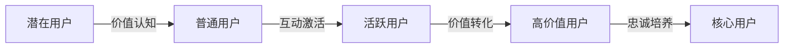

# IP用户分层策略

精细化的用户分层是高效IP运营的核心策略。本文档提供系统化的用户分层方法，帮助你针对不同用户群体制定差异化运营策略。

## 用户分层的重要性

用户分层能够帮助你：

1. **精准资源分配**：将有限资源投入到高价值用户群体
2. **提高转化效率**：针对不同用户特点设计转化路径
3. **增强用户体验**：提供符合用户需求的个性化内容
4. **提升用户价值**：系统化提升用户生命周期价值(LTV)
5. **降低运营成本**：避免无差别营销带来的资源浪费

## 用户分层模型

### 1. RFM模型（基础分层）

RFM模型是最常用的用户分层方法，基于三个维度：

- **R (Recency)**: 最近一次互动时间
- **F (Frequency)**: 互动频率
- **M (Monetary)**: 消费金额/价值贡献

#### RFM评分标准示例

| 分数 | R (最近互动) | F (互动频率) | M (价值贡献) |
|-----|------------|------------|------------|
| 5分 | 7天内 | 每周5次以上 | 1000元以上 |
| 4分 | 8-30天 | 每周2-4次 | 500-999元 |
| 3分 | 31-90天 | 每周1次 | 200-499元 |
| 2分 | 91-180天 | 每月1-2次 | 50-199元 |
| 1分 | 180天以上 | 更少 | 50元以下 |

#### RFM用户分类

| 用户类型 | RFM分数 | 特点 | 运营策略 |
|---------|--------|-----|---------|
| 核心用户 | R5F5M5/4 | 高频高价值 | VIP服务、共创计划 |
| 高价值用户 | R4/5F3/4M5 | 中频高价值 | 专属权益、深度内容 |
| 高频用户 | R5F5M2/3 | 高频中价值 | 促进转化、会员升级 |
| 潜力用户 | R4/5F3M3 | 中频中价值 | 价值教育、场景拓展 |
| 新晋用户 | R5F1/2M1/2 | 新加入低价值 | 引导激活、价值展示 |
| 流失风险 | R3F4/5M4/5 | 曾高价值近期少互动 | 唤回激活、专属优惠 |
| 休眠用户 | R1/2F1/2M3+ | 曾有价值长期无互动 | 重新激活、情感连接 |

### 2. 行为分层模型

基于用户在IP生态中的行为特征进行分层：

| 用户层级 | 行为特征 | 占比 | 运营重点 |
|---------|--------|-----|---------|
| 创作共建者 | 参与内容共创、二次传播 | 1-3% | 共创机制、IP联名 |
| 忠实拥趸 | 高频互动、全平台关注 | 5-10% | 社群运营、专属福利 |
| 付费会员 | 购买过付费内容/产品 | 10-20% | 会员权益、复购激励 |
| 活跃互动者 | 经常点赞评论分享 | 20-30% | 互动引导、付费转化 |
| 内容消费者 | 定期浏览但少互动 | 30-40% | 互动激励、价值教育 |
| 偶遇路人 | 偶尔浏览无明确互动 | 10-20% | 吸引注意、建立连接 |

### 3. 价值贡献分层

基于用户对IP的综合价值贡献进行分层：

| 价值层级 | 贡献形式 | 特点 | 运营策略 |
|---------|--------|-----|---------|
| 商业价值层 | 直接付费、带动转化 | 直接贡献收入 | 专属服务、定制方案 |
| 影响力层 | 内容传播、口碑建设 | 扩大IP影响 | KOC培养、传播激励 |
| 内容价值层 | 贡献内容、建设性反馈 | 提升内容质量 | 共创机制、反馈闭环 |
| 社群价值层 | 社群活跃、氛围营造 | 增强社群粘性 | 社群角色、活动参与 |
| 数据价值层 | 提供行为数据、测试反馈 | 优化决策依据 | 测试邀请、意见征集 |

## 用户分层实施指南

### 1. 数据收集与整合

**必要数据指标**：

- **基础数据**：注册时间、来源渠道、基本属性
- **行为数据**：浏览频率、互动类型、内容偏好
- **交易数据**：购买记录、客单价、复购率
- **社交数据**：分享行为、影响力、互动网络

**数据整合方法**：

1. 建立统一用户ID体系
2. 跨平台数据打通（如微信+小红书+知乎）
3. 设置数据同步频率（实时/日/周）
4. 确保数据安全与合规

### 2. 分层模型设计

**设计步骤**：

1. 确定分层维度（如RFM、行为、价值）
2. 设定各维度评分标准
3. 确定用户分组阈值
4. 测试分层效果并调整
5. 定期更新分层规则

**分层工具**：

- Excel/Sheets（小规模用户）
- 数据库+SQL（中等规模）
- 专业用户分层系统（大规模）

### 3. 差异化运营策略

**核心用户（1-5%）**：

- **内容策略**：专属深度内容、提前访问权
- **产品策略**：定制服务、联名产品
- **互动策略**：线下见面会、共创活动
- **权益策略**：VIP标识、专属客服

**高价值用户（5-15%）**：

- **内容策略**：高质量专业内容、案例解析
- **产品策略**：会员专享产品、优先购买权
- **互动策略**：专属社群、问答活动
- **权益策略**：成长体系、积分奖励

**活跃用户（15-30%）**：

- **内容策略**：互动型内容、实用工具
- **产品策略**：入门级产品、限时优惠
- **互动策略**：挑战活动、用户投稿
- **权益策略**：等级体系、成就激励

**普通用户（30-50%）**：

- **内容策略**：基础知识、问题解决
- **产品策略**：免费资源、低门槛体验
- **互动策略**：简单互动、投票活动
- **权益策略**：新人礼包、任务激励

**潜在用户（剩余）**：

- **内容策略**：爆款内容、价值展示
- **产品策略**：免费试用、分享获取
- **互动策略**：话题互动、内容引导
- **权益策略**：首次关注礼、邀请奖励

### 4. 用户旅程设计

为每个用户层级设计成长路径：



**用户层级提升策略**：

| 提升路径 | 关键触点 | 转化策略 | 目标转化率 |
|---------|--------|---------|----------|
| 潜在→普通 | 首次内容体验 | 价值展示、问题解决 | 20-30% |
| 普通→活跃 | 互动引导 | 互动奖励、内容共鸣 | 15-25% |
| 活跃→高价值 | 付费决策点 | 价值教育、社交证明 | 10-15% |
| 高价值→核心 | 深度体验 | 专属权益、情感连接 | 5-10% |

## 用户分层工具与模板

### 1. RFM分析模板

```
# RFM分析表格

## 评分标准
[插入上文RFM评分标准表格]

## 用户分类矩阵
| 用户ID | 最近互动 | R分 | 互动频率 | F分 | 价值贡献 | M分 | 总分 | 用户类型 |
|-------|---------|-----|---------|-----|---------|-----|-----|---------|
| 001 | 3天 | 5 | 每周8次 | 5 | 2000元 | 5 | 15 | 核心用户 |
| 002 | 15天 | 4 | 每周3次 | 4 | 800元 | 4 | 12 | 高价值用户 |
...

## 分层结果统计
| 用户类型 | 用户数 | 占比 | 价值贡献 | 价值占比 |
|---------|-------|-----|---------|---------|
| 核心用户 | 50 | 2% | 100,000元 | 40% |
...
```

### 2. 用户行为分析模板

```
# 用户行为分析表格

## 行为指标定义
| 行为类型 | 定义 | 权重 |
|---------|-----|-----|
| 内容消费 | 阅读/观看完成率 | 1 |
| 互动行为 | 点赞/评论/分享 | 2 |
| 社群参与 | 社群发言/活动 | 3 |
| 付费行为 | 购买/订阅 | 5 |
...

## 用户行为得分
| 用户ID | 内容消费 | 互动行为 | 社群参与 | 付费行为 | 总分 | 用户层级 |
|-------|---------|---------|---------|---------|-----|---------|
| 001 | 90 | 85 | 75 | 100 | 87.5 | 忠实拥趸 |
...
```

### 3. 用户分层运营日历

```
# 2025年Q1用户分层运营日历

## 1月
| 用户层级 | 周1 | 周2 | 周3 | 周4 |
|---------|-----|-----|-----|-----|
| 核心用户 | 年度VIP礼包 | 共创工作坊 | 1对1咨询 | 内容预告 |
| 高价值用户 | 会员专属内容 | 线上分享会 | 产品优惠 | 调研反馈 |
...

## 2月
...
```

## 用户分层案例分享

### 知识付费IP分层案例

某知识付费IP通过用户分层，发现：

1. 核心用户（3%）贡献了45%的收入
2. 高频低价值用户（15%）互动活跃但付费意愿低
3. 新用户首次付费转化率仅8%

基于这些发现，调整了运营策略：

1. 为核心用户推出"创作者计划"，共同开发内容
2. 为高频低价值用户设计"会员成长体系"，引导付费
3. 优化新用户首次体验，增加"小额体验产品"

结果：6个月内，付费转化率提升至15%，用户LTV提升35%。

## 常见问题与解决方案

### 1. 数据不完整或分散

- **问题**：跨平台数据难以整合，用户画像不完整
- **解决方案**：
  - 建立统一用户ID体系
  - 使用数据中台整合多渠道数据
  - 通过小程序或会员系统打通数据孤岛

### 2. 分层标准难以确定

- **问题**：不同行业、不同IP的分层标准差异大
- **解决方案**：
  - 从业务目标反推关键指标
  - 采用相对值而非绝对值评分
  - 进行A/B测试验证分层效果

### 3. 运营资源有限

- **问题**：无法为每个层级提供完全差异化的运营
- **解决方案**：
  - 优先保障核心和高价值用户体验
  - 设计自动化运营流程
  - 利用UGC内容满足长尾用户需求

## 下一步

完成用户分层策略设计后，请前往[内容分发日历](./content-calendar.md)学习如何基于用户分层进行精准内容分发。 