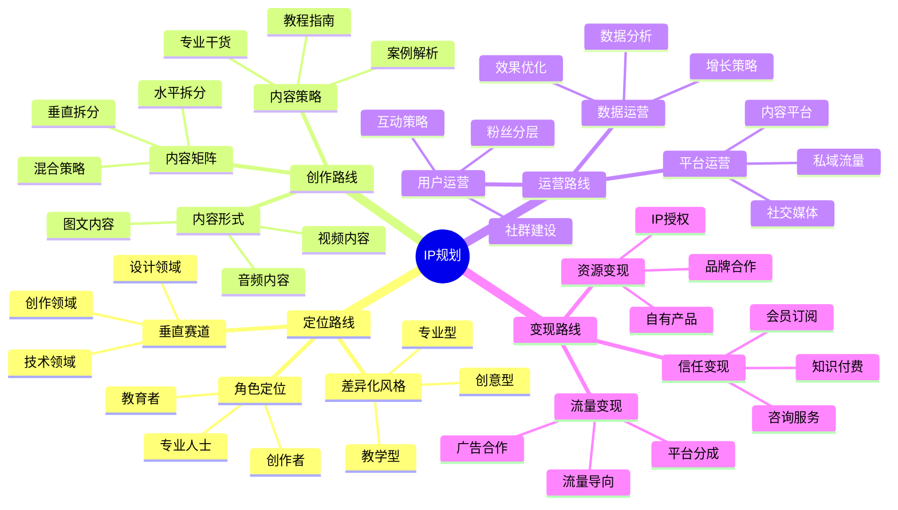

## 🧭 路径选择

### 1. [定位路线](/position/path)

- 适合阶段：IP创建初期，寻找差异化定位
- 核心公式：IP定位 = 垂直赛道×角色定位×差异化风格
- 关键要点：精准定位目标用户，建立差异化人设，形成独特价值主张

### 2. [创作路线](/content/path)

- 适合阶段：IP内容生产期，构建内容体系
- 核心公式：爆款内容 = 痛点选题×情绪价值×实用密度
- 关键要点：系统化内容创作，形成内容矩阵，建立内容生产流程

### 3. [运营路线](/operation/path)

- 适合阶段：IP成长期，扩大影响力
- 核心公式：用户增长 = 平台算法×社交裂变×私域沉淀
- 关键要点：多平台联动运营，用户分层管理，数据驱动优化

### 4. [变现路线](/monetize/path)

- 适合阶段：IP成熟期，实现商业价值
- 核心公式：变现模型 = 流量变现×信任变现×资源变现
- 关键要点：构建产品矩阵，建立信任链，多元化收入来源

## 💡 关键策略

### 1. IP定位策略

- **垂直赛道选择**：选择有增长潜力且与个人专长匹配的垂直领域
- **差异化定位**：通过"细分领域+个人属性"叠加形成独特定位
- **用户画像**：精准定义目标用户的年龄、痛点、消费能力等特征

### 2. 内容创作策略

- **选题策略**：结合"3H模型"（Hot热点、How-to解决方案、Happiness情感共鸣）
- **形式优化**：根据平台特性优化内容形式，提高完读率和互动率
- **系列化设计**：通过主题连载和钩子留存提高用户粘性

### 3. 运营增长策略

- **算法优化**：理解并利用各平台推荐算法规则，提高内容曝光
- **裂变设计**：设置知识诱饵和社交分享机制，促进用户自传播
- **私域运营**：构建私域流量池，降低获客成本，提高用户留存

### 4. 商业变现策略

- **阶段适配**：根据粉丝量级选择合适的变现方式
- **产品矩阵**：构建基础款→利润款→旗舰款的产品阶梯
- **信任链建设**：通过内容专业度、人设真实度和用户证言构建变现信任基础

## 🌟 实施建议

1. **阶段性规划**
   - 0-3个月：定位测试期，通过小批量内容验证用户反馈
   - 3-12个月：内容积累期，建立内容体系，形成初步影响力
   - 1-2年：规模化运营期，扩大平台覆盖，构建变现体系
   - 2年+：品牌化发展期，从个人IP向机构化运作升级

2. **数据驱动优化**
   - 建立周/月/季度复盘机制，分析内容效果和用户反馈
   - 关注"北极星指标"（如单粉价值=月变现额/粉丝数）
   - 通过AB测试持续优化内容形式和运营策略

3. **持续进化路径**
   - 每季度进行一次"定位校准"，根据行业趋势调整内容方向
   - 构建"内容-流量-变现"正向循环，形成可持续增长飞轮
   - 从单点突破到多维发展，逐步建立IP护城河
