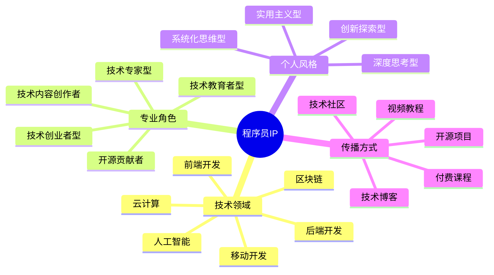

# 程序员IP定位指南

程序员IP是技术领域中的个人品牌，通过系统化定位可以在竞争激烈的技术社区中脱颖而出。本指南将帮助你打造独特的程序员IP。

## 程序员IP定位公式

**程序员IP = 技术领域 × 专业角色 × 个人风格 × 传播方式**

## 常见程序员IP类型

### 1. 技术专家型

- **定位特点**：深耕特定技术领域，以专业深度和前沿洞察为核心价值
- **典型案例**：
  - 尤雨溪（Vue.js创始人）- 前端框架专家
  - 廖雪峰 - Python/Java教育者
- **变现路径**：技术咨询、专业课程、技术书籍、企业培训

### 2. 技术教育者型

- **定位特点**：将复杂技术知识简化，专注于教学和知识传播
- **典型案例**：
  - 黑马程序员 - 编程培训
  - 程序员鱼皮 - 编程学习路径规划
- **变现路径**：在线课程、会员订阅、学习社区、教学工具

### 3. 技术创业者型

- **定位特点**：结合技术与商业视角，分享创业经验和产品开发
- **典型案例**：
  - 阮一峰 - 技术博主兼创业者
  - phodal - 全栈工程师兼技术作家
- **变现路径**：产品销售、创业咨询、投资合作、演讲分享

### 4. 技术生活方式型

- **定位特点**：展示程序员生活方式，技术与生活的平衡
- **典型案例**：
  - Easy - 程序员健身生活
  - 程序员Carl - 程序员的斜杠生活
- **变现路径**：生活方式产品推广、品牌合作、社区会员

## 程序员IP定位步骤

### 第一步：选择技术领域

| 技术领域 | 市场需求 | 竞争程度 | 发展前景 |
|---------|---------|---------|---------|
| 前端开发 | 高 | 高 | 稳定增长 |
| 后端开发 | 高 | 中 | 稳定 |
| 人工智能 | 极高 | 中高 | 快速增长 |
| 区块链 | 波动 | 中 | 不确定 |
| 云计算 | 高 | 中 | 稳定增长 |
| 网络安全 | 高 | 中低 | 稳定增长 |
| 游戏开发 | 中高 | 中 | 稳定 |

**选择建议**：
- 结合个人专业背景和兴趣
- 考虑市场需求和竞争程度
- 评估长期发展前景

### 第二步：确定专业角色

- **技术实践者**：分享实际项目经验和解决方案
- **技术教育者**：专注于知识传授和学习方法
- **技术评论家**：分析技术趋势和行业动态
- **技术管理者**：分享团队管理和项目协调经验

### 第三步：打造个人风格

- **深度思考型**：提供深入分析和原理解读
- **实用主义型**：注重实际应用和解决问题
- **创新探索型**：关注新技术和创新方法
- **系统化型**：提供完整的知识体系和学习路径

### 第四步：选择传播渠道

- **技术博客**：个人网站或平台专栏（如掘金、知乎）
- **视频平台**：B站、YouTube技术教程
- **社交媒体**：Twitter、微博技术分享
- **开源社区**：GitHub项目和技术文档
- **技术社区**：Stack Overflow、V2EX等平台参与

## 程序员IP差异化策略

1. **技术深度差异化**：在细分领域达到专家级水平
2. **表达方式差异化**：开发独特的讲解方式（如图解编程）
3. **内容形式差异化**：创新内容形式（如编程漫画、代码音乐）
4. **人格特质差异化**：展示真实个性（幽默、严谨、思辨等）
5. **用户群体差异化**：专注服务特定人群（如转行人士、女性程序员）

## 程序员IP成长路径

| 阶段 | 粉丝规模 | 重点任务 | 变现方式 |
|------|---------|---------|---------|
| 起步期 | 0-5000 | 内容积累、定位测试 | 接单、广告分成 |
| 成长期 | 5000-50000 | 内容体系化、社区建设 | 课程、咨询、赞助 |
| 成熟期 | 5万+ | 品牌化运营、团队扩展 | 付费社区、企业合作 |
| 扩张期 | 20万+ | 多平台矩阵、商业模式升级 | 自有产品、投资收益 |

## 案例分析：程序员鱼皮

### 定位要素
- **技术领域**：全栈开发、项目实战
- **专业角色**：技术教育者、学习引路人
- **个人风格**：亲和力强、系统化思维
- **传播渠道**：B站视频、GitHub开源项目

### 成功因素
1. 针对编程学习者痛点，提供完整学习路径
2. 开源项目与教学内容结合，提供实战价值
3. 建立学习者社区，形成正向反馈循环
4. 多元化变现模式：课程、社群、咨询

## 行动计划

1. **第1-30天**：确定技术领域和角色定位
   - 分析个人技术优势
   - 研究市场需求和竞争情况
   - 确定初步定位和差异化点

2. **第31-90天**：内容创作与测试
   - 创建3-5篇核心内容验证定位
   - 分析用户反馈调整方向
   - 建立初步内容体系

3. **第91-180天**：渠道建设与社区培养
   - 确定1-2个主要内容平台
   - 建立基础粉丝社区
   - 开发初步变现产品

4. **第181-365天**：系统化运营与品牌建设
   - 完善内容矩阵
   - 建立个人品牌视觉系统
   - 优化变现模式

## 资源与工具

- [GitHub Profile README生成器](https://github.com/rahuldkjain/github-profile-readme-generator)
- 技术博客平台对比
- 程序员IP变现模式分析

## 下一步

完成程序员IP定位后，建议前往内容创作章节学习如何创建高质量的技术内容。 