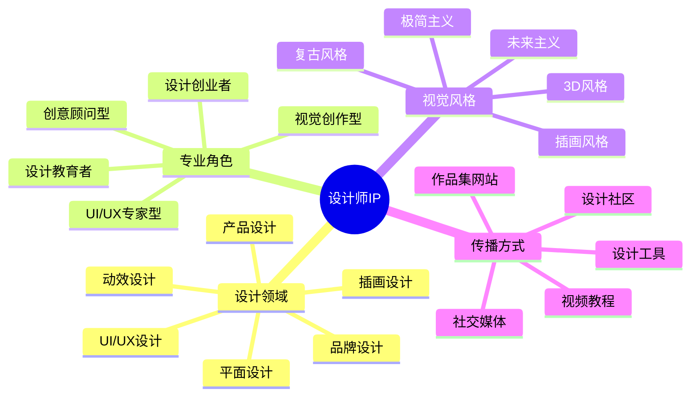

# 设计师IP定位指南

设计师IP是视觉创意领域的个人品牌，通过系统化定位可以在竞争激烈的设计行业中建立独特价值。本指南将帮助你打造有影响力的设计师IP。

## 设计师IP定位公式

**设计师IP = 设计领域 × 专业角色 × 视觉风格 × 传播方式**

## 常见设计师IP类型

### 1. 视觉创作型

- **定位特点**：以独特的视觉风格和创作能力为核心价值
- **典型案例**：
  - 插画师Momo Wang（兔朱迪创始人）- 童趣插画风格
  - 设计师Malika Favre - 极简主义色块风格
- **变现路径**：商业插画、艺术授权、周边产品、创意课程

### 2. UI/UX专家型

- **定位特点**：专注用户体验和界面设计的专业解决方案
- **典型案例**：
  - 余振华 - 产品设计思维导师
  - 设计师张嘉夫 - 交互设计专家
- **变现路径**：设计咨询、专业课程、设计工具、企业培训

### 3. 创意顾问型

- **定位特点**：结合设计思维与商业视角，提供战略性创意解决方案
- **典型案例**：
  - 李欣频 - 创意总监兼作家
  - 设计师Kevin - 品牌策略顾问
- **变现路径**：品牌咨询、创意工作坊、演讲分享、出版著作

### 4. 设计教育者型

- **定位特点**：专注设计知识传授和能力培养
- **典型案例**：
  - 站酷高高 - 设计教育者
  - 设计师夏小正 - 设计思维导师
- **变现路径**：在线课程、设计训练营、教材出版、设计社区

## 设计师IP定位步骤

### 第一步：选择设计领域

| 设计领域 | 市场需求 | 竞争程度 | 发展前景 |
|---------|---------|---------|---------|
| UI/UX设计 | 高 | 高 | 稳定增长 |
| 品牌设计 | 高 | 中高 | 稳定 |
| 插画设计 | 中高 | 高 | 稳定增长 |
| 产品设计 | 高 | 中 | 快速增长 |
| 空间设计 | 中 | 中 | 稳定 |
| 动效设计 | 中高 | 中 | 快速增长 |
| 游戏美术 | 高 | 中高 | 稳定增长 |

**选择建议**：
- 结合个人专业背景和兴趣
- 考虑市场需求和竞争程度
- 评估长期发展前景和变现潜力

### 第二步：确定专业角色

- **创作实践者**：专注于设计作品创作和项目实践
- **设计教育者**：专注于设计知识传授和方法论分享
- **设计评论家**：分析设计趋势和行业动态
- **设计顾问**：提供设计战略和解决方案咨询

### 第三步：打造视觉风格

- **极简主义**：简洁、留白、几何形状、有限色彩
- **复古风格**：怀旧元素、复古色调、纹理质感
- **未来主义**：科技感、渐变、霓虹色、动态效果
- **自然有机**：自然元素、有机形状、柔和色调
- **几何抽象**：几何形状、大胆色彩、结构化布局
- **手绘风格**：手工质感、不规则线条、个性表达

**风格一致性建立**：
- 创建个人视觉识别系统（色彩、字体、图形元素）
- 建立作品集风格指南
- 保持社交媒体视觉统一性

### 第四步：选择传播渠道

- **作品集平台**：Behance、Dribbble、站酷、花瓣
- **社交媒体**：Instagram、微博、小红书
- **专业社区**：设计师交流群、行业论坛
- **内容平台**：知乎专栏、Medium、设计类公众号
- **线下活动**：设计展览、分享会、工作坊

## 设计师IP差异化策略

1. **专业领域差异化**：聚焦特定设计细分领域（如医疗UI、儿童插画）
2. **视觉风格差异化**：建立独特的视觉语言和美学风格
3. **设计方法差异化**：开发独特的设计流程和方法论
4. **目标用户差异化**：专注服务特定行业或人群的设计需求
5. **跨界融合差异化**：将设计与其他领域结合（如设计×心理学）

## 设计师IP成长路径

| 阶段 | 粉丝规模 | 重点任务 | 变现方式 |
|------|---------|---------|---------|
| 起步期 | 0-5000 | 作品积累、风格探索 | 接单、平台分成 |
| 成长期 | 5000-30000 | 风格定型、社区建设 | 商业合作、课程 |
| 成熟期 | 3万+ | 品牌化运营、影响力扩展 | 品牌授权、咨询服务 |
| 扩张期 | 10万+ | 团队建设、商业模式升级 | 自有产品、IP授权 |

## 案例分析：插画师Momo Wang

### 定位要素
- **设计领域**：童趣插画、IP形象设计
- **专业角色**：视觉创作者、IP品牌创始人
- **视觉风格**：可爱、童趣、色彩鲜明、手绘质感
- **传播渠道**：Instagram、淘宝店铺、线下展览

### 成功因素
1. 创建独特IP形象"兔朱迪"，建立强烈视觉识别
2. 将插画延伸至多种产品，形成完整商业链
3. 线上线下结合的传播策略，增强粉丝互动
4. 与知名品牌合作，提升专业影响力

## 行动计划

1. **第1-30天**：定位与风格探索
   - 分析个人设计优势和兴趣
   - 研究市场需求和竞争情况
   - 尝试3-5种视觉风格，收集反馈

2. **第31-90天**：作品创作与风格定型
   - 创建10-15件代表作品
   - 建立个人视觉识别系统
   - 搭建基础作品集平台

3. **第91-180天**：渠道建设与社区培养
   - 选择2-3个核心社交平台定期更新
   - 参与设计社区互动和讨论
   - 尝试初步商业合作或接单

4. **第181-365天**：品牌建设与变现拓展
   - 完善个人品牌视觉系统
   - 开发初步变现产品或服务
   - 建立稳定的内容更新机制

## 设计师IP变现模式

### 1. 服务变现
- **商业设计服务**：品牌设计、UI/UX设计、插画定制
- **设计咨询**：设计审核、创意指导、品牌策略
- **企业培训**：设计思维工作坊、创意培训

### 2. 内容变现
- **设计课程**：在线视频课程、设计训练营
- **设计资源**：模板、素材、工具包
- **出版物**：设计书籍、教程、杂志专栏

### 3. 产品变现
- **设计周边**：印刷品、服饰、家居用品
- **数字产品**：字体、贴纸包、滤镜
- **原创IP授权**：形象授权、联名合作

### 4. 平台变现
- **社区运营**：设计师社区、会员订阅
- **活动策划**：设计展览、工作坊、分享会
- **内容创作者合作**：平台广告分成、赞助

## 设计师IP定位常见误区

1. **盲目跟风热门风格**：缺乏个人特色，难以在竞争中脱颖而出
2. **过度追求完美**：作品更新频率低，影响持续曝光
3. **忽视商业思维**：纯艺术导向，缺乏变现规划
4. **平台分散精力**：同时经营过多平台，无法形成影响力
5. **定位过于宽泛**：尝试覆盖所有设计领域，缺乏专业深度

## 资源与工具

- [Behance](https://www.behance.net/) - 设计师作品集平台
- 设计师品牌定位工具包
- 设计师变现模式分析

## 下一步

完成设计师IP定位后，建议前往内容创作章节学习如何创建高质量的设计内容，或探索变现策略了解更多商业化路径。 