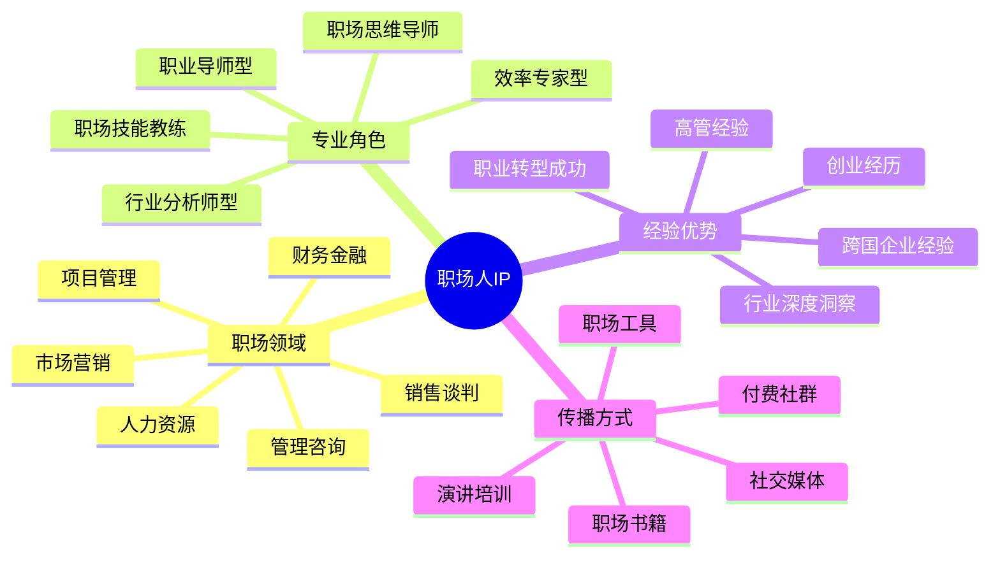

# 职场人IP定位指南

职场人IP是职业发展领域的个人品牌，通过系统化定位可以在竞争激烈的职场环境中建立独特价值。本指南将帮助你打造有影响力的职场人IP。

## 职场人IP定位公式

**职场人IP = 职场领域 × 专业角色 × 经验优势 × 传播方式**

## 常见职场人IP类型

### 1. 职业导师型

- **定位特点**：提供职业规划和发展路径指导
- **典型案例**：
  - 李尚龙 - 职场思维导师
  - 古典 - 生涯规划专家
- **变现路径**：职业咨询、生涯规划课程、职场书籍、企业培训

### 2. 效率专家型

- **定位特点**：专注工作效率提升和时间管理
- **典型案例**：
  - 萧秋水 - 时间管理专家
  - David Allen - GTD方法创始人
- **变现路径**：效率工具、时间管理课程、企业培训、咨询服务

### 3. 行业分析师型

- **定位特点**：深度解析行业趋势和职业机会
- **典型案例**：
  - 吴晓波 - 财经作家
  - 刘润 - 商业分析师
- **变现路径**：行业报告、付费专栏、企业咨询、演讲分享

### 4. 职场技能教练型

- **定位特点**：教授特定职场技能和能力提升方法
- **典型案例**：
  - 张萌 - 演讲表达教练
  - 刘媛媛 - 思维导图专家
- **变现路径**：技能培训、工具模板、线上课程、企业内训

## 职场人IP定位步骤

### 第一步：选择职场领域

| 职场领域 | 市场需求 | 竞争程度 | 发展前景 |
|---------|---------|---------|---------|
| 职业规划 | 高 | 中高 | 稳定增长 |
| 效率提升 | 高 | 高 | 稳定 |
| 领导力发展 | 高 | 中 | 稳定增长 |
| 职场沟通 | 高 | 中 | 稳定 |
| 求职面试 | 高 | 高 | 周期性 |
| 职场心理 | 中高 | 低 | 快速增长 |
| 职业转型 | 高 | 中 | 增长 |

**选择建议**：
- 结合个人职场经验和专长
- 考虑市场需求和竞争程度
- 评估长期发展前景和变现潜力

### 第二步：确定专业角色

- **导师型**：提供指导和建议的引路人
- **教练型**：注重能力培养和行动促进
- **分析师型**：提供洞察和趋势分析
- **顾问型**：解决特定职场问题和挑战
- **实践者型**：分享一线实战经验和案例

### 第三步：梳理经验优势

- **行业经验**：特定行业的深度经验和洞察
- **职能经验**：特定职能领域的专业知识
- **转型经验**：成功的职业转型或多领域经验
- **管理经验**：团队或组织管理的实践经验
- **国际经验**：跨文化工作或海外职场经验

**经验提炼方法**：
- 梳理职业生涯关键成就和转折点
- 总结解决过的重要职场问题和挑战
- 提炼个人职场成长的独特路径和方法

### 第四步：选择传播渠道

- **内容平台**：知乎、微信公众号、LinkedIn
- **视频平台**：B站、抖音、YouTube
- **社交媒体**：微博、小红书、Twitter
- **音频平台**：喜马拉雅、得到、播客
- **线下活动**：讲座、工作坊、沙龙

## 职场人IP差异化策略

1. **经验差异化**：基于独特职场经历建立差异（如外企高管、创业者）
2. **方法差异化**：开发独特的职场方法论和工具（如"3C晋升法"）
3. **行业差异化**：专注特定行业的职场发展（如医疗、教育、金融）
4. **人群差异化**：服务特定职场人群（如职场新人、女性管理者）
5. **问题差异化**：解决特定职场痛点（如职场人际关系、工作倦怠）

## 职场人IP成长路径

| 阶段 | 粉丝规模 | 重点任务 | 变现方式 |
|------|---------|---------|---------|
| 起步期 | 0-5000 | 内容积累、定位测试 | 接单、平台分成 |
| 成长期 | 5000-30000 | 方法体系化、社区建设 | 课程、咨询、赞助 |
| 成熟期 | 3万+ | 品牌化运营、产品开发 | 付费社区、企业合作 |
| 扩张期 | 10万+ | 团队建设、商业模式升级 | 培训体系、IP授权 |

## 案例分析：古典（生涯规划专家）

### 定位要素
- **职场领域**：职业生涯规划
- **专业角色**：职业导师、思想者
- **经验优势**：人力资源背景、生涯咨询经验
- **传播渠道**：图书、公众号、演讲、课程

### 成功因素
1. 创建"生涯咨询"这一细分领域，建立先发优势
2. 开发独特的生涯规划方法论和工具
3. 通过《拆掉思维里的墙》等畅销书建立影响力
4. 多元化变现：图书、课程、咨询、企业服务

## 行动计划

1. **第1-30天**：职场定位与内容规划
   - 梳理个人职场经验和专长
   - 研究市场需求和竞争情况
   - 确定初步定位和差异化点
   - 规划内容主题和系列

2. **第31-90天**：内容创作与平台建设
   - 创建5-10篇核心内容验证定位
   - 选择1-2个主要内容平台
   - 建立基础内容体系
   - 开始积累初步粉丝

3. **第91-180天**：方法论构建与社区培养
   - 开发个人职场方法论和工具
   - 建立初步粉丝社区
   - 尝试小型线上活动或分享
   - 收集用户反馈优化定位

4. **第181-365天**：产品开发与变现拓展
   - 设计初步付费产品或服务
   - 建立稳定的内容更新机制
   - 扩展传播渠道和影响力
   - 优化商业模式和变现路径

## 职场人IP变现模式

### 1. 知识变现
- **线上课程**：职场技能课程、成长训练营
- **付费专栏**：深度职场内容订阅
- **电子书籍**：职场指南、方法论手册

### 2. 服务变现
- **一对一咨询**：职业规划、晋升指导
- **企业培训**：团队效能提升、领导力发展
- **职场教练**：定制化职业发展辅导

### 3. 社群变现
- **会员社区**：高级职场学习社群
- **小班课程**：互动式职场能力培养
- **线下活动**：工作坊、训练营、沙龙

### 4. 工具变现
- **职场工具包**：模板、清单、工作表
- **评估系统**：职业倾向测评、能力评估
- **数字产品**：职场APP、效率软件

## 职场人IP定位常见误区

1. **缺乏实战经验**：理论大于实践，缺乏真实案例支撑
2. **过度承诺效果**：夸大成功可能性，制造不切实际期望
3. **同质化严重**：复制热门话题和方法，缺乏独特见解
4. **忽视目标人群**：内容不针对特定人群，缺乏针对性
5. **缺乏系统方法**：零散建议多，系统方法论少

## 资源与工具

- [LinkedIn](https://www.linkedin.com/) - 职场社交和内容分享平台
- 职场人IP变现指南
- 职业规划工具包

## 下一步

完成职场人IP定位后，建议前往内容创作章节学习如何创建高质量的职场内容，或探索变现策略了解更多商业化路径。 