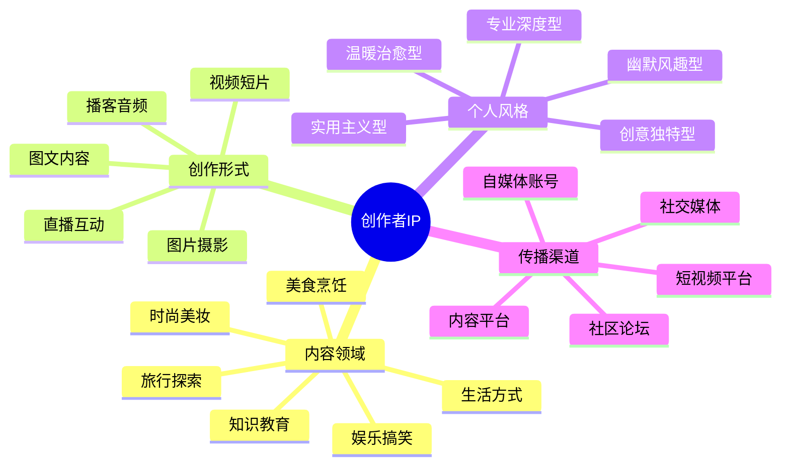

# 创作者IP定位指南

创作者IP是内容创作领域的个人品牌，通过系统化定位可以在竞争激烈的内容市场中建立独特价值。本指南将帮助你打造有影响力的创作者IP。

## 创作者IP定位公式

**创作者IP = 内容领域 × 创作形式 × 个人风格 × 传播渠道**

## 常见创作者IP类型

### 1. 内容创作者型

- **定位特点**：专注原创内容生产，以内容质量和创意为核心
- **典型案例**：
  - 李子柒 - 中国传统文化生活方式
  - 回形针PaperClip - 科普知识
- **变现路径**：广告合作、内容付费、周边产品、IP授权

### 2. 知识传播者型

- **定位特点**：将复杂知识简化，专注知识普及和教育
- **典型案例**：
  - 罗振宇 - 知识服务
  - 李永乐 - 科学教育
- **变现路径**：知识付费、课程、图书、演讲

### 3. 创意策划型

- **定位特点**：提供创意思路和策划方案，注重创新和概念设计
- **典型案例**：
  - 飞猪 - 创意营销
  - 马力 - 创意总监
- **变现路径**：创意咨询、策划服务、创意培训、品牌合作

### 4. 生活方式型

- **定位特点**：展示特定生活方式和价值观，影响粉丝生活选择
- **典型案例**：
  - 李佳琦 - 美妆生活
  - 小宅 - 极简生活
- **变现路径**：电商带货、品牌代言、生活方式产品、付费社区

## 创作者IP定位步骤

### 第一步：选择内容领域

| 内容领域 | 市场需求 | 竞争程度 | 发展前景 |
|---------|---------|---------|---------|
| 生活方式 | 高 | 高 | 稳定 |
| 知识教育 | 高 | 中高 | 稳定增长 |
| 娱乐搞笑 | 极高 | 极高 | 波动 |
| 美食烹饪 | 高 | 高 | 稳定 |
| 旅行探索 | 中高 | 中 | 恢复增长 |
| 科技数码 | 高 | 中高 | 稳定增长 |
| 财经投资 | 高 | 中 | 周期性 |

**选择建议**：
- 结合个人兴趣和专长
- 考虑市场需求和竞争程度
- 评估长期发展前景和变现潜力

### 第二步：确定创作形式

- **视频创作**：短视频、Vlog、纪录片、直播
- **图文创作**：文章、图文、漫画、图解
- **音频创作**：播客、有声书、音频节目
- **多媒体创作**：跨平台内容、互动式内容

**形式选择考量**：
- 个人表达优势（语言、视觉、文字）
- 目标受众的内容消费习惯
- 平台算法和推荐机制的偏好
- 内容类型与形式的匹配度

### 第三步：打造个人风格

- **表达风格**：幽默风趣、理性分析、温暖治愈、犀利批判
- **视觉风格**：色彩系统、画面美学、视觉识别元素
- **叙事风格**：故事化、数据化、对比式、问题解决式
- **互动风格**：与观众的互动方式和社区文化

**风格一致性建立**：
- 创建个人风格指南
- 设计统一的视觉元素和标识
- 形成特色化的内容结构和表达方式

### 第四步：选择传播渠道

- **短视频平台**：抖音、快手、视频号
- **长视频平台**：B站、YouTube
- **图文平台**：微信公众号、知乎、小红书
- **音频平台**：喜马拉雅、荔枝FM、网易云音乐
- **社交媒体**：微博、Instagram、Twitter

**渠道策略**：
- 主渠道+辅助渠道的组合策略
- 内容形式与平台特性的匹配
- 跨平台内容的差异化调整

## 创作者IP差异化策略

1. **内容差异化**：独特的内容主题或切入角度
2. **形式差异化**：创新的内容呈现形式和制作手法
3. **人格差异化**：鲜明的个人特质和表达风格
4. **专业差异化**：独特的专业背景和经验优势
5. **互动差异化**：特色的粉丝互动方式和社区文化

## 创作者IP成长路径

| 阶段 | 粉丝规模 | 重点任务 | 变现方式 |
|------|---------|---------|---------|
| 起步期 | 0-1万 | 内容定位、风格探索 | 平台分成、小型合作 |
| 成长期 | 1万-10万 | 内容体系化、粉丝运营 | 广告合作、内容付费 |
| 成熟期 | 10万-50万 | 团队建设、商业模式 | 品牌合作、自有产品 |
| 扩张期 | 50万+ | 多元业务、IP授权 | IP授权、产业链延伸 |

## 案例分析：李子柒（中国传统文化生活方式）

### 定位要素
- **内容领域**：中国传统文化与乡村生活
- **创作形式**：精美视频短片
- **个人风格**：唯美画面、平和节奏、无语言叙事
- **传播渠道**：YouTube、微博、抖音

### 成功因素
1. 独特的内容定位：传统文化与现代表达的结合
2. 精致的视觉美学：电影级画面质感和色彩美学
3. 跨文化传播策略：无语言障碍的视觉叙事
4. 完整的IP生态：从内容到产品的全产业链布局

## 行动计划

1. **第1-30天**：内容定位与风格探索
   - 确定内容领域和核心主题
   - 尝试不同创作形式和风格
   - 分析目标受众需求和偏好
   - 制定初步内容计划

2. **第31-90天**：内容创作与平台建设
   - 创建10-15个核心内容作品
   - 建立个人品牌视觉系统
   - 选择1-2个主要发布平台
   - 开始积累初步粉丝群体

3. **第91-180天**：内容体系化与粉丝运营
   - 形成系列化内容产品
   - 建立稳定的内容更新机制
   - 开发粉丝互动策略
   - 尝试初步商业合作

4. **第181-365天**：商业模式与团队建设
   - 探索多元化变现渠道
   - 建立初步创作团队
   - 开发自有产品或服务
   - 优化内容生产流程

## 创作者IP变现模式

### 1. 平台变现
- **平台分成**：平台广告分成、直播打赏
- **内容付费**：付费专栏、会员订阅
- **平台补贴**：创作者激励计划、平台扶持金

### 2. 商业合作
- **品牌广告**：内容植入、定制内容
- **代言推广**：品牌代言、产品推广
- **商业演出**：商业活动、演讲分享

### 3. 自有产品
- **实体产品**：周边商品、联名产品
- **数字产品**：电子书、模板工具
- **课程服务**：线上课程、培训服务

### 4. IP授权
- **形象授权**：IP形象商业使用
- **内容授权**：内容改编、出版
- **衍生开发**：IP衍生产品开发

## 创作者IP定位常见误区

1. **盲目跟风热点**：缺乏长期定位，频繁转换内容方向
2. **过度模仿成功者**：复制他人模式，缺乏个人特色
3. **内容同质化严重**：内容缺乏差异化和创新点
4. **忽视用户需求**：过度自我表达，忽略受众实际需求
5. **变现过早或过晚**：变现时机把握不当，影响长期发展

## 资源与工具

- 创作者经济报告
- 内容创作工具箱
- 创作者IP变现指南

## 下一步

完成创作者IP定位后，建议前往[内容创作指南](../content/path.md)学习如何创建高质量的内容，或探索变现策略了解更多商业化路径。 