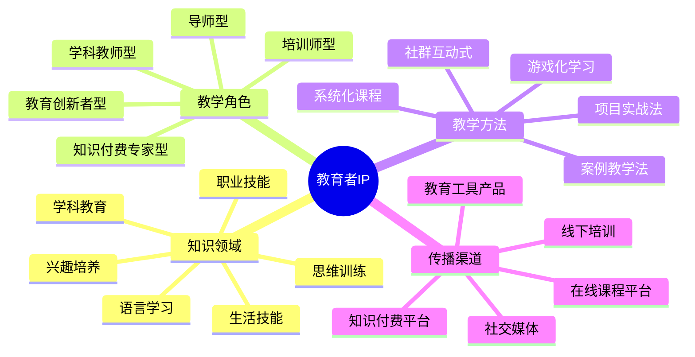

# 教育者IP定位指南

教育者IP是知识传播领域的个人品牌，通过系统化定位可以在竞争激烈的教育市场中建立独特价值。本指南将帮助你打造有影响力的教育者IP。

## 教育者IP定位公式

**教育者IP = 知识领域 × 教学角色 × 教学方法 × 传播渠道**

## 常见教育者IP类型

### 1. 知识付费专家型

- **定位特点**：将专业知识系统化、产品化，提供高价值知识服务
- **典型案例**：
  - 罗振宇 - 得到App创始人
  - 樊登 - 樊登读书会创始人
- **变现路径**：付费课程、知识订阅、图书出版、演讲分享

### 2. 培训师型

- **定位特点**：专注特定技能培训，注重实操和结果
- **典型案例**：
  - 刘媛媛 - 思维导图培训
  - 柴知道 - 英语学习
- **变现路径**：线上线下培训、实战营、工具包、咨询服务

### 3. 导师型

- **定位特点**：关注学习者全面成长，提供引导和陪伴
- **典型案例**：
  - 李笑来 - 投资与学习方法
  - 万维钢 - 精英日课
- **变现路径**：高端社群、长期订阅、一对一辅导、成长营

### 4. 学科教育型

- **定位特点**：专注特定学科或考试的教学
- **典型案例**：
  - 张雪峰 - 高考志愿填报
  - 宋鑫 - 考研英语
- **变现路径**：考试培训、题库资料、学习规划、家长咨询

## 教育者IP定位步骤

### 第一步：选择知识领域

| 知识领域 | 市场需求 | 竞争程度 | 发展前景 |
|---------|---------|---------|---------|
| 职业技能 | 高 | 中高 | 稳定增长 |
| 语言学习 | 高 | 高 | 稳定 |
| 考试培训 | 高 | 高 | 周期性 |
| 兴趣爱好 | 中高 | 中 | 增长 |
| 亲子教育 | 高 | 中 | 稳定增长 |
| 个人成长 | 高 | 中高 | 稳定 |
| 财商教育 | 高 | 中 | 增长 |

**选择建议**：
- 结合个人专业背景和教学经验
- 考虑市场需求和竞争程度
- 评估长期发展前景和变现潜力

### 第二步：确定教学角色

- **专家型**：以深厚的专业知识为核心价值
- **教练型**：注重实践指导和能力培养
- **引路人型**：提供方向指引和成长陪伴
- **分享者型**：以个人经验和案例为主要内容
- **研究者型**：专注知识探索和方法创新

### 第三步：打造教学方法

- **系统化教学**：建立完整的知识体系和学习路径
- **案例教学**：通过真实案例讲解知识点
- **互动式教学**：强调师生互动和参与体验
- **问题导向教学**：围绕问题设计学习内容
- **工具化教学**：提供实用工具和模板辅助学习

**方法差异化策略**：
- 开发独特的教学框架和模型
- 创新教学形式和互动方式
- 设计专属的学习工具和辅助材料

### 第四步：选择传播渠道

- **知识付费平台**：得到、知乎Live、荔枝微课
- **在线教育平台**：腾讯课堂、网易云课堂、慕课网
- **社交媒体平台**：微信公众号、B站、抖音
- **社群工具**：微信群、QQ群、飞书、Discord
- **线下渠道**：工作坊、讲座、培训营

## 教育者IP差异化策略

1. **知识差异化**：独特的知识领域或跨界组合
2. **方法差异化**：创新的教学方法和学习路径
3. **人格差异化**：鲜明的教学风格和个人特质
4. **工具差异化**：独创的学习工具和辅助系统
5. **服务差异化**：特色的学习支持和辅导方式

## 教育者IP成长路径

| 阶段 | 学员规模 | 重点任务 | 变现方式 |
|------|---------|---------|---------|
| 起步期 | 0-1000 | 内容积累、方法验证 | 小班课程、一对一 |
| 成长期 | 1000-1万 | 体系构建、品牌建设 | 系统课程、社群 |
| 成熟期 | 1万-5万 | 团队建设、产品矩阵 | 知识订阅、培训体系 |
| 扩张期 | 5万+ | 机构化运营、生态建设 | 教育品牌、多元业务 |

## 案例分析：罗振宇（得到App创始人）

### 定位要素
- **知识领域**：商业、认知升级、跨界知识
- **教学角色**：知识的"翻译官"和连接者
- **教学方法**：概念化、模型化、故事化
- **传播渠道**：App平台、音频节目、跨年演讲

### 成功因素
1. 创新的知识服务模式：碎片化学习+体系化内容
2. 独特的知识转化能力：将复杂知识简化为模型
3. 强大的内容生产体系：持续高质量的内容输出
4. 完整的知识服务生态：从内容到平台的全链路布局

## 行动计划

1. **第1-30天**：知识梳理与定位确认
   - 梳理个人知识体系和专长
   - 研究目标学习者需求
   - 确定初步定位和差异化点
   - 设计核心教学方法和框架

2. **第31-90天**：内容创作与初步教学
   - 开发3-5个核心教学内容
   - 建立基础知识体系框架
   - 尝试小规模教学验证
   - 收集学员反馈优化方法

3. **第91-180天**：体系构建与社群培养
   - 完善知识体系和课程结构
   - 建立学习者社群
   - 开发配套学习工具
   - 优化教学流程和体验

4. **第181-365天**：产品开发与规模扩展
   - 设计系统化课程产品
   - 建立助教或教学团队
   - 扩展传播渠道和影响力
   - 优化商业模式和收入结构

## 教育者IP变现模式

### 1. 内容变现
- **付费课程**：系统化在线课程
- **知识订阅**：会员制内容服务
- **数字产品**：电子书、音频课、工具包

### 2. 服务变现
- **一对一辅导**：高端个性化指导
- **小班教学**：互动式小班课程
- **企业培训**：为企业提供定制培训

### 3. 社群变现
- **学习社群**：付费学习社区
- **成长营**：集中式学习项目
- **导师计划**：长期成长辅导项目

### 4. 衍生变现
- **图书出版**：出版实体或电子书籍
- **演讲分享**：付费演讲和分享会
- **IP授权**：教学方法和内容授权

## 教育者IP定位常见误区

1. **知识面过宽**：缺乏专注和深度，难以建立专业壁垒
2. **过度承诺效果**：夸大学习成果，损害长期信任
3. **内容碎片化**：缺乏系统性，难以形成完整学习体验
4. **忽视学习体验**：只关注内容，忽略教学方法和互动
5. **变现过于激进**：过早过度变现，影响口碑和长期发展

## 资源与工具

- 知识付费行业报告
- 教学设计工具包
- 教育者IP变现指南

## 下一步

完成教育者IP定位后，建议前往内容创作章节学习如何创建高质量的教育内容，或探索变现策略了解更多商业化路径。 