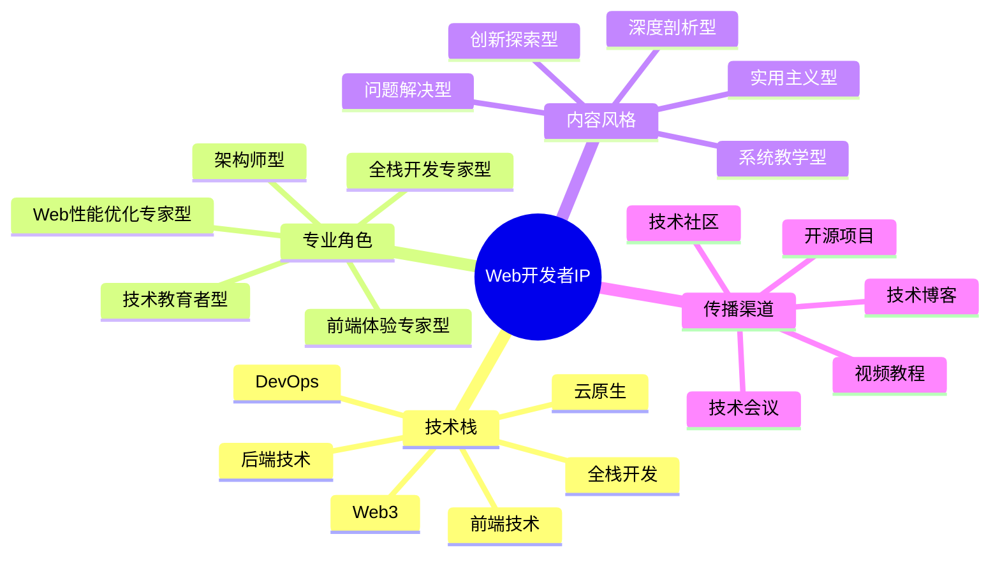

# Web开发者IP定位指南

Web开发者IP是互联网技术领域的个人品牌，通过系统化定位可以在竞争激烈的Web开发行业中建立独特价值。本指南将帮助你打造有影响力的Web开发者IP。

## Web开发者IP定位公式

**Web开发者IP = 技术栈 × 专业角色 × 内容风格 × 传播渠道**

## 常见Web开发者IP类型

### 1. 全栈开发专家型

- **定位特点**：精通前后端技术栈，提供端到端解决方案
- **典型案例**：
  - 尤雨溪（Vue.js创始人）- 前端框架专家
  - Dan Abramov - React核心开发者
- **变现路径**：技术咨询、高级课程、开源赞助、技术会议演讲

### 2. 前端体验专家型

- **定位特点**：专注用户界面和交互体验，结合设计思维
- **典型案例**：
  - 张鑫旭 - CSS专家
  - Sarah Drasner - 前端动效专家
- **变现路径**：UI框架、组件库、设计系统咨询、前端培训

### 3. Web性能优化专家型

- **定位特点**：专注网站性能优化和用户体验提升
- **典型案例**：
  - Steve Souders - 性能优化专家
  - Harry Roberts - CSS架构与性能专家
- **变现路径**：性能审计服务、优化工具开发、企业培训

### 4. Web安全专家型

- **定位特点**：专注Web应用安全和最佳实践
- **典型案例**：
  - Troy Hunt - 安全专家和Have I Been Pwned创始人
  - Scott Helme - 安全研究员
- **变现路径**：安全审计、漏洞检测工具、安全培训课程

## Web开发者IP定位步骤

### 第一步：选择技术栈方向

| 技术方向 | 市场需求 | 竞争程度 | 发展前景 |
|---------|---------|---------|---------|
| 前端开发 | 高 | 高 | 稳定增长 |
| 后端开发 | 高 | 中 | 稳定 |
| 全栈开发 | 高 | 中高 | 稳定增长 |
| DevOps | 高 | 中 | 快速增长 |
| Web3/区块链 | 波动 | 中 | 不确定 |
| 移动Web | 高 | 中高 | 稳定增长 |
| 低代码/无代码 | 增长中 | 低 | 快速增长 |

**选择建议**：
- 结合个人技术背景和兴趣
- 考虑市场需求和竞争程度
- 评估长期发展前景和变现潜力

### 第二步：确定专业角色

- **技术实践者**：分享实际项目经验和解决方案
- **技术教育者**：专注于知识传授和学习方法
- **技术评论家**：分析技术趋势和行业动态
- **工具开发者**：创建提升开发效率的工具和库
- **开源贡献者**：积极参与开源项目和社区建设

### 第三步：打造内容风格

- **深度剖析型**：深入技术原理和底层实现
- **实用指南型**：注重实际应用和问题解决
- **案例分析型**：通过真实项目讲解技术应用
- **比较研究型**：对比不同技术方案的优缺点
- **前沿探索型**：关注新技术和未来趋势

**风格一致性建立**：
- 创建个人技术内容模板
- 建立统一的代码示例风格
- 保持内容结构和表达方式的一致性

### 第四步：选择传播渠道

- **技术博客**：个人网站或平台专栏（如掘金、知乎）
- **视频平台**：B站、YouTube技术教程
- **社交媒体**：Twitter、LinkedIn技术分享
- **开源社区**：GitHub项目和技术文档
- **技术社区**：Stack Overflow、DEV.to等平台参与

## Web开发者IP差异化策略

1. **技术深度差异化**：在特定技术领域达到专家级水平
2. **内容形式差异化**：开发独特的技术内容表达方式（如可视化教程）
3. **应用场景差异化**：专注特定行业的Web开发解决方案
4. **教学方法差异化**：创新的技术教学方法和学习路径
5. **工具开发差异化**：创建解决特定问题的开发工具和库

## Web开发者IP成长路径

| 阶段 | 粉丝规模 | 重点任务 | 变现方式 |
|------|---------|---------|---------|
| 起步期 | 0-3000 | 技术积累、内容定位 | 接单、广告分成 |
| 成长期 | 3000-20000 | 内容体系化、社区建设 | 课程、咨询、赞助 |
| 成熟期 | 2万+ | 品牌化运营、产品开发 | 付费社区、企业合作 |
| 扩张期 | 10万+ | 团队建设、商业模式升级 | 自有产品、投资收益 |

## 案例分析：张鑫旭（CSS专家）

### 定位要素
- **技术栈**：CSS/HTML/JavaScript
- **专业角色**：前端技术专家、教育者
- **内容风格**：深入浅出、实例丰富、原理剖析
- **传播渠道**：个人博客、技术书籍、社交媒体

### 成功因素
1. 专注CSS这一细分领域，建立了极强的专业壁垒
2. 内容深入浅出，理论与实践结合，易于理解
3. 长期持续输出，建立了稳定的内容更新机制
4. 多元化变现：书籍、课程、咨询、演讲

## 行动计划

1. **第1-30天**：技术栈定位与内容规划
   - 评估个人技术优势
   - 研究市场需求和竞争情况
   - 确定初步定位和差异化点
   - 规划内容主题和系列

2. **第31-90天**：内容创作与平台建设
   - 创建5-10篇核心技术内容
   - 搭建个人博客或技术专栏
   - 建立代码仓库和示例项目
   - 开始在1-2个平台定期分享

3. **第91-180天**：社区参与与影响力扩展
   - 积极参与技术社区讨论
   - 开源项目贡献或创建
   - 扩展内容形式（如视频、图解）
   - 尝试初步技术咨询或课程

4. **第181-365天**：品牌建设与变现拓展
   - 完善个人技术品牌
   - 建立系统化内容产品
   - 开发初步变现渠道
   - 建立技术社区或学习小组

## Web开发者IP变现模式

### 1. 知识变现
- **技术课程**：在线视频课程、技术训练营
- **技术书籍**：出版技术书籍或电子书
- **技术讲座**：线上线下技术分享会

### 2. 服务变现
- **技术咨询**：代码审查、架构设计、性能优化
- **定制开发**：高端定制开发服务
- **企业培训**：为企业提供定制化技术培训

### 3. 产品变现
- **开发工具**：开发效率工具、插件、扩展
- **组件库**：UI组件、功能模块、模板系统
- **SaaS产品**：基于专业领域的软件服务

### 4. 社区变现
- **会员订阅**：高级内容会员、学习社区
- **赞助收入**：开源项目赞助、平台创作者计划
- **广告合作**：技术相关产品推广、联盟营销

## Web开发者IP定位常见误区

1. **技术范围过宽**：尝试覆盖所有Web技术，缺乏专业深度
2. **过度追求流行技术**：盲目跟风热门技术，忽视个人专长
3. **内容同质化严重**：缺乏个人见解和独特价值
4. **忽视基础技术**：只关注框架和工具，忽视底层原理
5. **更新频率不稳定**：缺乏持续输出，影响粉丝积累

## 资源与工具

- [GitHub](https://github.com/) - 代码托管和开源社区
- [DEV.to](https://dev.to/) - 开发者内容分享平台
- [CodePen](https://codepen.io/) - 前端代码分享平台
- Web开发者变现指南

## 下一步

完成Web开发者IP定位后，建议前往内容创作章节学习如何创建高质量的技术内容，或探索变现策略了解更多商业化路径。 