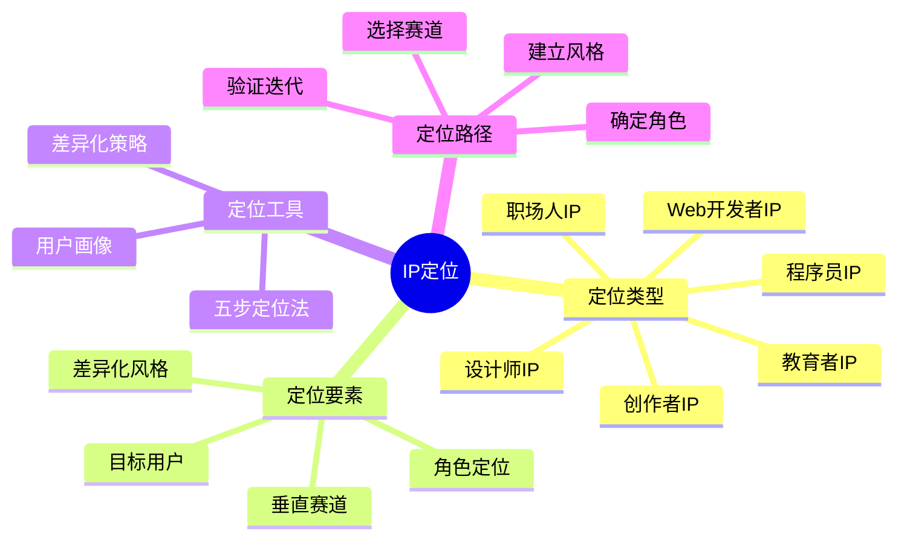

```mermaid
mindmap
  root((IP定位))
    定位类型
      程序员IP
      设计师IP
      职场人IP
      创作者IP
      教育者IP
      Web开发者IP
    定位要素
      垂直赛道
      角色定位
      差异化风格
      目标用户
    定位工具
      五步定位法
      差异化策略
      用户画像
    定位路径
      选择赛道
      确定角色
      建立风格
      验证迭代
```