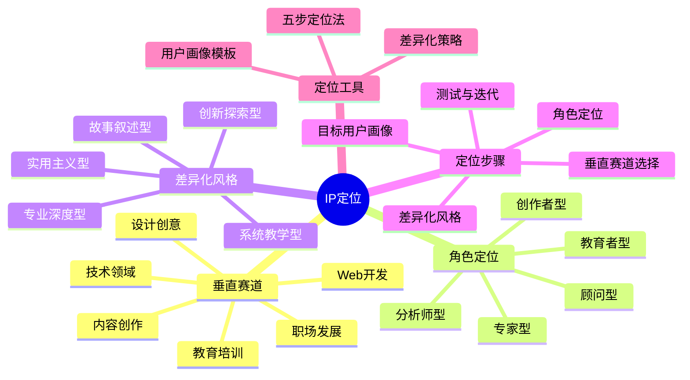

# IP定位路径

IP定位是创建个人品牌的基础和核心，它决定了你在市场中的独特位置和价值主张。本章节将帮助你找到最适合自己的IP定位。

## 定位公式

**IP定位 = 垂直赛道 × 角色定位 × 差异化风格**

## 定位步骤

1. **垂直赛道选择**：选择一个你有专业知识或热情的领域
2. **角色定位**：确定你在该领域中扮演的角色
3. **差异化风格**：建立独特的表达方式和个人特色
4. **目标用户画像**：明确你服务的人群特征
5. **测试与迭代**：通过内容验证定位效果并持续优化

## 定位类型

- [程序员IP定位](./01-coder.md) - 技术专家、开发者教育者、科技评论家
- [设计师IP定位](./02-designer.md) - 视觉创作者、UI/UX专家、创意顾问
- [职场人IP定位](./03-professional.md) - 职业导师、效率专家、行业分析师
- [创作者IP定位](./04-creator.md) - 内容创作者、知识传播者、创意策划
- [教育者IP定位](./05-educator.md) - 知识付费专家、培训师、导师
- [Web开发者IP定位](./06-web.md) - 全栈开发专家、前端体验专家、Web性能优化专家

## 定位工具

- [五步定位法](./tools/five-step-positioning.md) - 系统化确定你的IP定位
- [差异化策略](./tools/differentiation-strategy.md) - 如何在竞争中脱颖而出
- [用户画像模板](./tools/user-persona-template.md) - 创建详细的目标用户画像

## 定位案例

查看[成功IP定位案例](../cases/positioning-cases.md)获取灵感和参考。

## 下一步

完成定位后，请前往[内容创作](../content/path.md)章节，学习如何基于定位创作有价值的内容。 