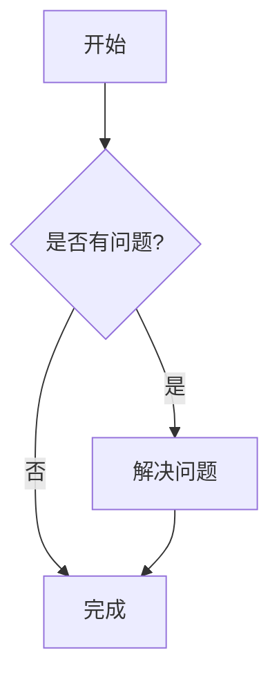

# Mermaid Renderer

这个包提供了在 VitePress 中渲染 Mermaid 图表的功能。它支持两种渲染模式：

1. 客户端渲染（默认）：通过 CDN 加载 Mermaid 库，在浏览器中渲染图表
2. 本地渲染：使用本地 Mermaid 库文件，在浏览器中渲染图表

## 安装

```bash
pnpm add @code-road/mermaid-renderer
```

## 使用方法

在 VitePress 配置文件中引入并使用：

```js
import { withMermaidRenderer } from '@code-road/mermaid-renderer'

export default withMermaidRenderer({
  // 你的 VitePress 配置
  title: '我的文档',
  description: '使用 Mermaid 图表的文档'
}, {
  // Mermaid 渲染器配置选项
  useCDN: true, // 是否使用 CDN 加载 Mermaid，默认为 true
  cdnURL: 'https://cdn.jsdelivr.net/npm/mermaid@11.4.1/dist/mermaid.min.js', // Mermaid CDN URL
  inlineCSS: false, // 是否内联 CSS，默认为 false
  mermaid: {
    // Mermaid 配置选项
    theme: 'default'
  }
})
```

## 在 Markdown 中使用

在 Markdown 文件中，你可以使用 Mermaid 代码块来创建图表：

````markdown

````

## 手动触发渲染

在某些情况下，特别是在页面刷新时，可能需要手动触发 Mermaid 图表的渲染。这个包提供了一个辅助函数来解决这个问题：

```js
import { renderMermaidDiagrams } from '@code-road/mermaid-renderer'

// 在 Vue 组件中使用
import { onMounted } from 'vue'

export default {
  setup() {
    onMounted(() => {
      // 手动触发 Mermaid 图表渲染
      renderMermaidDiagrams()
    })
  }
}
```

你也可以在特定事件或条件下调用这个函数，例如：

```js
// 在页面加载完成后触发
window.addEventListener('load', () => {
  renderMermaidDiagrams()
})

// 或者在自定义事件中触发
document.addEventListener('my-custom-event', () => {
  renderMermaidDiagrams()
})
```

## 配置选项

### `useCDN`

- 类型: `boolean`
- 默认值: `true`

是否使用 CDN 加载 Mermaid 库。如果设置为 `false`，将使用本地 Mermaid 库文件（位于 `/js/mermaid.min.js`）。

当设置为 `false` 时，构建脚本会自动将 Mermaid 库文件复制到 `docs/public/js` 目录下，确保在生产环境中可用。

### `cdnURL`

- 类型: `string`
- 默认值: `'https://cdn.jsdelivr.net/npm/mermaid@11.4.1/dist/mermaid.min.js'`

Mermaid 库的 CDN URL。仅在 `useCDN` 为 `true` 时使用。

### `inlineCSS`

- 类型: `boolean`
- 默认值: `false`

是否将 CSS 样式内联到 HTML 中。如果设置为 `false`，将使用外部 CSS 文件。

### `mermaid`

- 类型: `object`
- 默认值: `{}`

Mermaid 库的配置选项。详细配置请参考 [Mermaid 官方文档](https://mermaid.js.org/config/schema-docs/config.html)。

## 本地渲染模式

当 `useCDN` 设置为 `false` 时，组件将使用本地 Mermaid 库文件进行渲染。这种模式的优点包括：

1. 不依赖外部 CDN，适合在内网或离线环境使用
2. 可以确保使用特定版本的 Mermaid 库
3. 减少对外部资源的依赖，提高页面加载速度和稳定性

使用本地渲染模式时，构建脚本会自动执行以下操作：

1. 将 Mermaid 库文件复制到 `docs/public/js` 目录
2. 将 CSS 文件复制到 `docs/public/css` 目录
3. 在 HTML 中添加对本地 Mermaid 库文件的引用

如果在页面加载时未找到 Mermaid 库，客户端脚本会尝试动态加载本地库文件。

## 注意事项

1. 如果你的图表很复杂，可能需要调整 Mermaid 配置选项以获得更好的渲染效果。
2. 如果你使用暗黑模式，图表会自动适应主题。
3. 如果在页面刷新时图表不显示，可以尝试使用 `renderMermaidDiagrams` 函数手动触发渲染。
4. 在使用本地渲染模式时，确保已正确运行构建脚本，以便将必要的文件复制到正确的位置。

## 许可证

MIT 